# PantryMind — Complete Project Documentation
*Auto-generated by Antigravity · 2024-07-30*

---

## 1. PROJECT OVERVIEW
PantryMind is an intelligent grocery inventory management application built to automate receipt scanning and tracking. It is a multi-agent AI life management system designed to manage household inventory, receipts, meal planning, and finances, all through natural language, with a governed human-in-the-loop layer. The core problem it solves is the mental load of household management—preventing food waste through expiry tracking, automating grocery restocking, and offering deep financial and nutritional insights. The core workflow involves: scanning a receipt (via client-side OCR) → extracting items into the pantry inventory → consulting the AI chef for meal planning based on what's available → logging consumption/nutrition → tracking the associated financial expenses and grocery runs.

---

## 2. TECH STACK

### 2.1 Backend
| Package | Version | Purpose |
|---------|---------|---------|
| fastapi | 0.115.0 | High-performance async web framework for API routing |
| uvicorn[standard] | 0.30.0 | ASGI web server to run FastAPI |
| python-dotenv | 1.0.1 | Loading environment variables from .env files |
| python-multipart | 0.0.9 | Handling form data and file uploads |
| pydantic | 2.8.0 | Data validation and settings management |
| google-cloud-documentai | >=2.30.0 | Google Cloud Document AI client library |
| google-cloud-storage | >=2.18.0 | Google Cloud Storage client library |
| google-generativeai | >=0.8.0 | Google Gemini API client library |
| google-genai | >=0.8.0 | Google Gemini API client library |
| motor | >=3.5.0 | Asynchronous MongoDB driver for Python |
| pymongo | >=4.8.0 | Synchronous MongoDB driver (dependency of Motor) |
| certifi | >=2024.0 | Provides Mozilla's carefully curated collection of Root Certificates for validating SSL/TLS certificates |
| pulp | >=2.8.0 | Linear programming for nutritional meal optimization |
| pandas | >=2.2.0 | Data manipulation for TimesFM forecasting pipelines |
| numpy | >=1.26.0 | Numerical computing for forecasting and ML operations |
| fastmcp | >=0.4.0 | Model Context Protocol integration for tool sharing |
| httpx | >=0.27.0 | Async HTTP client for external API requests |
| Pillow | >=10.4.0 | Image processing for receipt handling |
| python-dateutil | >=2.9.0 | Advanced datetime parsing |
| google-adk | >=1.0.0 | Agent Development Kit for building the AI agents |
| google-adk[vertexai] | | Vertex AI plugins for the ADK |
| google-cloud-aiplatform | >=1.60.0 | Vertex AI Python SDK for Gemini and ML models |

### 2.2 Frontend
| Package | Version | Purpose |
|---------|---------|---------|
| @vitejs/plugin-react | ^6.0.2 | Vite plugin for React fast refresh |
| electron | ^42.3.2 | Desktop application packaging |
| electron-builder | ^26.8.1 | Distributing and building Electron apps |
| html2canvas | ^1.4.1 | Capturing DOM elements as images |
| lucide-react | ^1.17.0 | Icon library for the UI |
| react-router-dom | ^7.16.0 | Client-side routing |
| recharts | ^3.8.1 | Composable charting library for analytics |
| typescript | ~6.0.2 | Static typing for frontend codebase |
| vite | ^8.0.12 | Lightning fast frontend build tool |

### 2.3 Infrastructure & Services
- **Service name**: MongoDB Atlas
  - **What it does in this project**: Serves as the primary database and vector store.
  - **Where credentials are set**: `MONGODB_URI` in `.env`
  - **Which file initializes or calls it**: `services/db_service.py`
- **Service name**: Google Cloud Vertex AI
  - **What it does in this project**: Provides Gemini models for agents, OCR fallback, embedding generation, and image generation.
  - **Where credentials are set**: `GOOGLE_CLOUD_PROJECT`, `GOOGLE_CLOUD_LOCATION` in `.env` (and optionally `GOOGLE_APPLICATION_CREDENTIALS` for service account auth).
  - **Which file initializes or calls it**: `main.py`, `adk/memory/vector_memory.py`, `config/vertex_ai.py`, `services/image_service.py`, `services/prompt_agent.py`.
- **Service name**: Google Cloud Storage
  - **What it does in this project**: Stores processed receipts and audio files.
  - **Where credentials are set**: `GCS_BUCKET_NAME` in `.env`
  - **Which file initializes or calls it**: `main.py` (mentioned in comments, but direct usage for receipt image storage not found in provided code snippets).
- **Service name**: Vertex AI TimesFM
  - **What it does in this project**: Time-series foundation model used for spending forecasts.
  - **Where credentials are set**: `GOOGLE_CLOUD_PROJECT`, `GOOGLE_CLOUD_LOCATION` in `.env`
  - **Which file initializes or calls it**: [ ] NOT YET IMPLEMENTED (mentioned in `docs/PROJECT_DOCS.md` but no direct code usage found).
- **Service name**: Open-Meteo
  - **What it does in this project**: Provides weather data for contextual meal planning.
  - **Where credentials are set**: No API key needed. User location via `USER_LATITUDE`, `USER_LONGITUDE`, `USER_CITY` in `.env`.
  - **Which file initializes or calls it**: `services/weather_service.py`.

---

## 3. ENVIRONMENT VARIABLES
| Variable | Required | Default | Used In | Purpose |
|----------|----------|---------|---------|---------|
| MONGODB_URI | Yes | N/A | `services/db_service.py`, `adk/mcp/mongodb_mcp.py`, `scripts/*.py`, `mcp_healthcheck.py` | Connection string for MongoDB Atlas |
| MONGODB_DATABASE | Yes | `finmind` | `services/db_service.py`, `adk/mcp/mongodb_mcp.py`, `scripts/*.py`, `mcp_healthcheck.py` | Target database name |
| GOOGLE_CLOUD_PROJECT | Yes | N/A | `main.py`, `adk/memory/vector_memory.py`, `config/vertex_ai.py`, `services/image_service.py`, `services/prompt_agent.py`, `scratch/*.py` | GCP Project ID for Vertex AI |
| GOOGLE_CLOUD_LOCATION | Yes | `us-central1` | `main.py`, `adk/memory/vector_memory.py`, `config/vertex_ai.py`, `services/image_service.py`, `services/prompt_agent.py`, `scratch/*.py` | GCP Region for Vertex AI |
| GOOGLE_APPLICATION_CREDENTIALS | No | `path/to/service-account.json` | GCP Auth | Path to service account JSON (commented out in `.env`) |
| DOC_AI_EXPENSE_PROCESSOR_ID | Yes | `your-expense-parser-processor-id` | `receipt_agent` (legacy) | Document AI processor ID for expense parsing |
| DOC_AI_INVOICE_PROCESSOR_ID | Yes | `your-invoice-parser-processor-id` | `receipt_agent` (legacy) | Document AI processor ID for invoice parsing |
| GCS_BUCKET_NAME | Yes | `pantrymind-receipts` | `gcs_service.py` (not found in provided code) | Bucket for receipt storage |
| GEMINI_BACKEND | Yes | `vertex` | `main.py` | Switches between Vertex and AI Studio |
| GEMINI_MODEL | Yes | `gemini-3.1-pro` | `main.py`, `services/chat_service.py`, `services/medical_agent.py`, `services/prompt_agent.py`, `services/smart_expiry_agent.py`, `adk/memory/episodic_memory.py`, `adk/patterns/reflexion.py` | Base model for general tasks |
| GEMINI_API_KEY | No | N/A | `main.py`, `adk/memory/episodic_memory.py`, `adk/patterns/reflexion.py`, `adk/tools/receipt_tools.py`, `agents/ordering_agent.py`, `scratch/*.py`, `services/chat_service.py`, `services/finance_chat_service.py`, `services/kitchen_chat_service.py`, `services/llm_client.py`, `services/medical_agent.py`, `services/prompt_agent.py`, `services/smart_expiry_agent.py` | AI Studio fallback API key |
| GEMINI_MODEL_OCR | Yes | `gemini-3.1-pro` | `main.py` | Model used for receipt parsing |
| GEMINI_MODEL_CHAT | Yes | `gemini-3.1-pro` | `services/chat_service.py` | Model for generic chat |
| GEMINI_MODEL_KITCHEN | Yes | `gemini-3.1-pro` | `main.py`, `adk/agents/kitchen_agent.py`, `services/kitchen_chat_service.py` | High-reasoning model for dietary math |
| GEMINI_MODEL_EMBEDDING | Yes | `gemini-embedding-2` | `adk/memory/vector_memory.py` | Vector embedding model |
| ORCHESTRATOR_MODEL | Yes | `gemini-3.1-pro` | `adk/orchestrator.py` | Model for user intent routing |
| PANTRY_MODEL | Yes | `gemini-3.1-pro` | `adk/agents/pantry_agent.py`, `adk/agents/shopping_agent.py` | Model for inventory operations |
| KITCHEN_MODEL | Yes | `gemini-3.1-pro` | `adk/agents/kitchen_agent.py`, `adk/patterns/reflexion.py` | Standard kitchen ops model |
| FINANCE_MODEL | Yes | `gemini-3.1-pro` | `adk/agents/finance_agent.py`, `adk/memory/episodic_memory.py`, `adk/patterns/reflexion.py` | Financial calculation model |
| RECEIPT_MODEL | Yes | `gemini-3.1-pro` | `adk/agents/receipt_agent.py`, `adk/tools/receipt_tools.py` | Receipt structuring model |
| MONGODB_MCP_COMMAND | No | `npx` | `adk/mcp/mongodb_mcp.py` | Command used to launch the official MongoDB MCP server |
| MONGODB_MCP_ARGS | No | `-y,mongodb-mcp-server@latest` | `adk/mcp/mongodb_mcp.py` | MongoDB MCP package args; the connection URI is passed securely through `MDB_MCP_CONNECTION_STRING` |
| APP_ENV | Yes | `development` | `main.py`, `adk/runner.py`, `frontend/electron/main.js` | Sets debug modes |
| APP_PORT | Yes | `8000` | `main.py`, `frontend/electron/main.js` | Port for FastAPI |
| CORS_ORIGINS | Yes | `http://localhost:5173` | `main.py` | Allowed origins for frontend |
| IMAGEN_MODEL | Yes | `imagen-3.0-fast-generate-001` | `main.py`, `services/image_service.py` | Model for generic image generation |
| USER_LATITUDE | Yes | `13.0827` | `services/weather_service.py` | User location for climate context |
| USER_LONGITUDE | Yes | `80.2707` | `services/weather_service.py` | User location for climate context |
| USER_CITY | Yes | `Chennai` | `services/weather_service.py` | Display name for location |
| ENABLE_ACTION_APPROVALS | No | `true` | `adk/governance/action_policy.py` | Enable/disable human approval for agent actions |
| MAX_AUTO_ACTION_VALUE_INR | No | `250` | `adk/governance/action_policy.py` | Max INR value for auto-approved financial actions |
| ALLOW_DESTRUCTIVE_MCP_TOOLS | No | `false` | `adk/governance/action_policy.py` | Allow/block destructive MongoDB operations |
| LOW_CONFIDENCE_APPROVAL_THRESHOLD | No | `0.72` | `adk/governance/action_policy.py` | Confidence threshold for requiring approval |
| SUMMARY_VECTOR_INDEX_NAME | No | `conversation_summary_index` | `adk/memory/episodic_memory.py` | Name of the Atlas Vector Search index for conversation summaries |
| VECTOR_INDEX_NAME | No | `inventory_vector_index` | `adk/memory/vector_memory.py` | Name of the Atlas Vector Search index for inventory embeddings |
| EMBEDDING_MODEL | No | `text-embedding-004` | `adk/memory/vector_memory.py` | Model for generating text embeddings |
| USDA_API_KEY | No | N/A | `services/usda_nutrition.py` | API key for USDA FoodData Central |
| DEMO_USER_ID | No | `demo_user_001` | `services/auth.py` | Default user ID for demo/local dev |

---

## 4. PROJECT FOLDER STRUCTURE
```
pantrymind-desktop/
├── adk/                 ← Core Google ADK agent framework integrations
│   ├── agents/          ← Implementations of specific domain agents (Kitchen, Finance, etc)
│   ├── demo/            ← Demo-specific utilities like the evidence logger
│   ├── governance/      ← Policy engine and approval workflow for agent actions
│   ├── memory/          ← Components for agent memory (episodic, vector search)
│   ├── mcp/             ← MongoDB Model Context Protocol (MCP) toolset integration
│   ├── patterns/        ← Agent design patterns like Reflexion
│   ├── proactive/       ← Background monitors for expiry and budget
│   └── tools/           ← Shared tool implementations for ADK agents
├── agents/              ← Legacy/standard agent definitions (pre-ADK or non-ADK)
├── config/              ← Configuration files (e.g., Vertex AI setup)
├── data/                ← Datasets (Nutrition DB, Expiry Rules, Carbon KB, product images)
├── docs/                ← Project documentation (this file)
├── frontend/            ← React + Vite frontend application
│   ├── electron/        ← Electron-specific files for desktop app packaging
│   ├── public/          ← Static assets and images for the frontend
│   └── src/             ← React components, pages, and API hooks
├── middleware/          ← FastAPI middleware for error handling
├── routers/             ← FastAPI route definitions for API endpoints
├── schemas/             ← Pydantic models for request/response validation
├── scripts/             ← Database seeding, index creation, and utility scripts
├── services/            ← Business logic (DB access, Chat Services, LLM client, image service, weather)
├── scratch/             ← Temporary scripts and development utilities
├── tests/               ← Pytest test suites
└── main.py              ← FastAPI application entry point
```

---

## 5. DATABASE — MONGODB ATLAS

### 5.1 Connection
- **Connection string pattern**: `mongodb+srv://<user>:<password>@cluster0.nsmkibp.mongodb.net/finmind?retryWrites=true&w=majority&maxPoolSize=50&serverSelectionTimeoutMS=5000`
- **Driver used**: `motor.motor_asyncio`
- **Database name**: `finmind`

### 5.2 Collections

#### Collection: `inventory`
| Field | Type | Required | Description |
|-------|------|----------|-------------|
| _id | ObjectId | Yes | Unique item ID |
| user_id | str/ObjectId | Yes | Owner of the item |
| name | str | Yes | Name of the product |
| normalized_name | str | No | Clean generic name (e.g., 'chicken breast') |
| brand | str | No | Brand name if visible |
| category | str | Yes | Primary category (e.g., PRODUCE, DAIRY_EGGS) |
| sub_category | str | No | Specific sub-category (e.g., leafy_greens, poultry) |
| dietary_flag | str | Yes | Dietary classification (VEG, NON_VEG, SEAFOOD, DAIRY, EGG, NA) |
| is_perishable | bool | Yes | True if item spoils quickly |
| is_packed_product | bool | Yes | True if item is packaged (for enrichment) |
| quantity | float | Yes | Amount remaining |
| unit | str | Yes | Unit of quantity (pcs, g, ml, kg, L) |
| cost_per_unit | float | Yes | Price paid per unit |
| store | str | No | Where it was purchased |
| status | str | Yes | Freshness status (fresh, expiring, expired, critical, N/A) |
| purchase_date | ISODate | Yes | Date added to inventory |
| created_at | ISODate | Yes | Timestamp of creation |
| shelf_life_days | int | No | Total estimated shelf life in days |
| safe_days | int | No | Conservative safe usage days |
| safety_factor_applied | float | No | Safety factor used for safe_expiry_date |
| expiry_date | ISODate | No | Calculated or stated expiration (max) |
| safe_expiry_date | ISODate | No | Conservative safe expiry date |
| storage_note | str | No | Human-readable storage tip |
| track_as_warranty | bool | No | True if item should be tracked as warranty |
| source | str | No | How item was added (e.g., receipt_scan, demo_seed) |
| consumed_quantity | float | No | Quantity already consumed (for tracking) |
| is_consumed | bool | Yes | True if item is fully consumed/discarded |
| enrichment_status | str | No | Status of external data enrichment (pending, enriched, not_found, n/a) |
| image_url | str | No | URL to product image |
| embedding | list[float] | No | Vector embedding for semantic search |

**Indexes for `inventory`:**
- `user_status`: `[("user_id", ASCENDING), ("status", ASCENDING)]`
- `user_expiry`: `[("user_id", ASCENDING), ("expiry_date", ASCENDING)]`
- `user_category`: `[("user_id", ASCENDING), ("category", ASCENDING)]`
- `user_name`: `[("user_id", ASCENDING), ("name", ASCENDING)]`
- `user_status_expiry`: `[("user_id", ASCENDING), ("status", ASCENDING), ("expiry_date", ASCENDING)]` (partial filter: `{"status": {"$in": ["fresh", "expiring"]}}`)
- `inventory_item_text`: `[("item_name", TEXT), ("normalized_name", TEXT)]`
- `inventory_category_date`: `[("category", ASCENDING), ("purchase_date", DESCENDING)]`
- `inventory_status`: `[("status", ASCENDING)]`
- `inventory_dietary_flag`: `[("dietary_flag", ASCENDING)]`
- `inventory_safe_expiry`: `[("safe_expiry_date", ASCENDING)]`
- `inventory_active_category_expiry`: `[("is_consumed", ASCENDING), ("category", ASCENDING), ("safe_expiry_date", ASCENDING)]`

#### Collection: `receipts`
| Field | Type | Required | Description |
|-------|------|----------|-------------|
| _id | ObjectId | Yes | Unique receipt ID |
| user_id | str/ObjectId | Yes | Owner of the receipt |
| store | str | Yes | Merchant name |
| date | ISODate | Yes | Date of purchase |
| total | float | Yes | Grand total receipt amount |
| subtotal | float | No | Subtotal before taxes |
| taxes | dict/float | No | Tax breakdown (e.g., {CGST: float, SGST: float, IGST: float} or total float) |
| item_count | int | No | Number of items extracted |
| status | str | No | Processing status (e.g., processed) |
| engine | str | No | AI engine used for extraction (e.g., gemini-vision-flash) |

**Indexes for `receipts`:**
- `user_date`: `[("user_id", ASCENDING), ("date", DESCENDING)]`
- `receipts_date`: `[("receipt_date", DESCENDING)]`

#### Collection: `financial_ledger`
| Field | Type | Required | Description |
|-------|------|----------|-------------|
| _id | ObjectId | Yes | Transaction ID |
| user_id | str/ObjectId | Yes | Owner of the transaction |
| date | ISODate | Yes | Transaction date |
| amount | float | Yes | Transaction amount |
| category | str | Yes | Category (e.g., Groceries, Dining Out, Salary) |
| description | str | Yes | Memo or platform name |
| type | str | Yes | 'expense' or 'income' |
| merchant | str | No | Merchant name (from `tools/behavior_tools.py`) |
| receipt_id | ObjectId | No | Reference to associated receipt |
| items_summary | list[dict] | No | Summary of items in transaction (e.g., [{"name": "item"}]) |
| source | str | No | Source of the transaction (e.g., ai_ordering) |

**Indexes for `financial_ledger`:**
- `user_type_date`: `[("user_id", ASCENDING), ("type", ASCENDING), ("date", DESCENDING)]`
- `user_category_date`: `[("user_id", ASCENDING), ("category", ASCENDING), ("date", DESCENDING)]`
- `user_date`: `[("user_id", ASCENDING), ("date", DESCENDING)]`
- `ledger_date`: `[("date", DESCENDING)]`

#### Collection: `warranties`
| Field | Type | Required | Description |
|-------|------|----------|-------------|
| _id | ObjectId | Yes | Unique warranty ID |
| user_id | str/ObjectId | Yes | Owner of the warranty |
| product | str | Yes | Product name |
| brand | str | No | Brand name |
| category | str | Yes | Product category (e.g., Electronics, Appliances) |
| purchase_date | ISODate | Yes | Date of purchase |
| warranty_end | ISODate | Yes | Warranty expiry date |
| receipt_url | str | No | URL to associated receipt image |
| status | str | No | Warranty status (e.g., active, expired) |
| warranty_months | int | Yes | Duration of warranty in months |
| gcs_invoice_uri | str | No | GCS URI of the stored invoice image |
| alerted | bool | No | True if user has been alerted about expiry |
| created_at | ISODate | Yes | Timestamp of creation |
| alerted_at | ISODate | No | Timestamp when alert was sent |

**Indexes for `warranties`:**
- `user_expiry`: `[("user_id", ASCENDING), ("expiry_date", ASCENDING)]`
- `warranty_expiry`: `[("expiry_date", ASCENDING)]`

#### Collection: `carbon_log`
| Field | Type | Required | Description |
|-------|------|----------|-------------|
| _id | ObjectId | Yes | Unique log ID |
| user_id | str/ObjectId | Yes | Owner of the log |
| month | str | No | Month key (YYYY-MM) |
| total_co2_kg | float | Yes | Total CO2 equivalent for the entry |
| breakdown | dict | No | CO2 breakdown by category |
| receipt_id | str | No | Reference to associated receipt |
| date | ISODate | Yes | Date of the log entry |
| items | list[dict] | No | List of items and their individual impacts |
| avg_impact_level | str | No | Overall impact level (e.g., very_high, low) |
| created_at | ISODate | Yes | Timestamp of creation |

**Indexes for `carbon_log`:**
- `user_date`: `[("user_id", ASCENDING), ("date", DESCENDING)]`
- `carbon_date`: `[("date", DESCENDING)]`

#### Collection: `nutrition_log`
| Field | Type | Required | Description |
|-------|------|----------|-------------|
| _id | ObjectId | Yes | Unique log ID |
| user_id | str/ObjectId | Yes | Owner of the log |
| item | str | Yes | Name of the food item |
| calories | float | Yes | Total calories consumed |
| protein_g | float | Yes | Total protein in grams |
| carbs_g | float | Yes | Total carbohydrates in grams |
| fat_g | float | Yes | Total fat in grams |
| date | ISODate | Yes | Date of consumption |
| created_at | ISODate | Yes | Timestamp of creation |
| quantity_grams | float | No | Quantity consumed in grams |
| target_calories | int | No | Daily target calories |
| meals_logged | list[dict] | No | List of meals logged for the day |

**Indexes for `nutrition_log`:**
- `user_date`: `[("user_id", ASCENDING), ("date", DESCENDING)]`
- `nutrition_date`: `[("date", DESCENDING)]`

#### Collection: `consumption_history`
| Field | Type | Required | Description |
|-------|------|----------|-------------|
| _id | ObjectId | Yes | Unique log ID |
| user_id | str/ObjectId | Yes | Owner of the log |
| item_name | str | Yes | Name of the item consumed |
| month_key | str | Yes | Month key (YYYY-MM) |
| consumed_qty | float | Yes | Quantity consumed |
| date | ISODate | Yes | Date of consumption |
| item_id | ObjectId | No | Reference to inventory item |
| unit | str | No | Unit of quantity |
| reason | str | No | Reason for consumption (e.g., consumed) |
| quantity_kg | float | No | Quantity consumed in kilograms |

**Indexes for `consumption_history`:**
- `user_date`: `[("user_id", ASCENDING), ("date", DESCENDING)]`
- `consumption_month_item`: `[("month_key", ASCENDING), ("item_name", ASCENDING)]`

#### Collection: `restock_predictions`
| Field | Type | Required | Description |
|-------|------|----------|-------------|
| _id | ObjectId | Yes | Unique prediction ID |
| item_name | str | Yes | Name of the item |
| current_qty_kg | float | Yes | Current quantity in kg |
| daily_rate_kg | float | Yes | Average daily consumption rate in kg |
| predicted_empty_date | ISODate | Yes | Predicted date when item will run out |
| days_until_empty | float | Yes | Days remaining until depletion |
| confidence | str | Yes | Confidence level of prediction (none, low, medium, high) |
| updated_at | ISODate | Yes | Last update timestamp |

**Indexes for `restock_predictions`:**
- `restock_depletion`: `[("predicted_empty_date", ASCENDING)]`

#### Collection: `user_profile`
| Field | Type | Required | Description |
|-------|------|----------|-------------|
| _id | ObjectId | Yes | Unique profile ID |
| user_id | str | Yes | Unique user identifier |
| name | str | No | User's display name |
| monthly_salary | float | No | Gross monthly salary in INR |
| tax_regime | str | No | 'new' or 'old' tax regime preference |
| updated_at | ISODate | No | Last update timestamp |
| monthly_food_budget | float | No | User's monthly food budget |
| dietary_preference | str | No | User's dietary preference (e.g., VEG) |
| calorie_target | int | No | User's daily calorie target |
| household_size | int | No | Number of people in household |
| preferred_cuisine | list[str] | No | List of preferred cuisines |
| created_at | ISODate | No | Timestamp of creation |
| allergies | list[str] | No | List of user allergies |
| dislikes | list[str] | No | List of disliked ingredients |

**Indexes for `user_profile`:**
- `user_id_unique`: `[("user_id", ASCENDING)]` (unique)

#### Collection: `behavior_snapshots`
| Field | Type | Required | Description |
|-------|------|----------|-------------|
| _id | ObjectId | Yes | Unique snapshot ID |
| week_start | str | Yes | Start date of the week (YYYY-MM-DD) |
| week_end | str | Yes | End date of the week (YYYY-MM-DD) |
| total_spent | float | Yes | Total spending for the week |
| transaction_count | int | Yes | Number of transactions |
| by_day_of_week | list[dict] | Yes | Spending breakdown by day |
| by_category | list[dict] | Yes | Spending breakdown by category |
| top_merchants | list[dict] | Yes | Top merchants by spending |
| created_at | ISODate | Yes | Timestamp of creation |

**Indexes for `behavior_snapshots`:**
- `behavior_week`: `[("week_key", DESCENDING)]`

#### Collection: `conversation_history`
| Field | Type | Required | Description |
|-------|------|----------|-------------|
| _id | ObjectId | Yes | Unique turn ID |
| session_id | str | Yes | ID of the conversation session |
| role | str | Yes | 'user' or 'assistant' |
| content | str | Yes | Message content |
| timestamp | ISODate | Yes | Timestamp of the message |
| metadata | dict | No | Additional metadata (e.g., tools called) |

**Indexes for `conversation_history`:**
- `chat_session_timeline`: `[("session_id", ASCENDING), ("timestamp", ASCENDING)]`

#### Collection: `medical_conditions`
| Field | Type | Required | Description |
|-------|------|----------|-------------|
| _id | ObjectId | Yes | Unique condition ID |
| user_id | str | Yes | Owner of the condition |
| condition_name | str | Yes | Name of the medical condition |
| researched | bool | Yes | True if AI research is complete |
| foods_to_avoid | list[str] | Yes | List of foods to avoid |
| foods_to_eat | list[str] | Yes | List of recommended foods |
| medicines | list[dict] | Yes | List of medicines (name, purpose, dosage) |
| treatments | list[str] | Yes | List of treatments/lifestyle changes |
| dietary_notes | str | Yes | Summary of dietary guidelines |
| created_at | ISODate | Yes | Timestamp of creation |
| research_source | str | No | AI model used for research |
| researched_at | ISODate | No | Timestamp of research completion |
| error | str | No | Error message if research failed |

**Indexes for `medical_conditions`:**
- `medical_user_condition`: `[("user_id", ASCENDING), ("condition_name", ASCENDING)]` (unique)

#### Collection: `cloud_images`
| Field | Type | Required | Description |
|-------|------|----------|-------------|
| _id | ObjectId | Yes | Unique image ID |
| name | str | Yes | Item name associated with image |
| slug | str | Yes | URL-friendly slug for image retrieval |
| image_base64 | str | Yes | Base64 encoded image data |
| content_type | str | Yes | MIME type of the image |

**Indexes for `cloud_images`:**
- No explicit indexes defined in provided scripts.

#### Collection: `pending_actions`
| Field | Type | Required | Description |
|-------|------|----------|-------------|
| _id | ObjectId | Yes | Unique action ID |
| user_id | str | Yes | User requesting the action |
| session_id | str | Yes | ADK session ID |
| agent_name | str | Yes | Agent proposing the action |
| action_type | str | Yes | Type of action (e.g., insert_one, update_one) |
| risk_level | str | Yes | Policy-assigned risk level (low, medium, high, critical) |
| status | str | Yes | Current status (pending, approved, rejected, executed) |
| summary | str | Yes | Brief summary of the action |
| tool_calls | list[dict] | Yes | List of tool calls to be executed |
| diff_preview | dict | Yes | Preview of changes (e.g., {"insert": document}) |
| confidence | float | Yes | Agent's confidence in the action |
| created_at | ISODate | Yes | Timestamp of creation |
| expires_at | ISODate | Yes | When the action expires if not acted upon |
| approved_at | ISODate | No | Timestamp of approval |
| rejected_at | ISODate | No | Timestamp of rejection |
| executed_at | ISODate | No | Timestamp of execution |

**Indexes for `pending_actions`:**
- No explicit indexes defined in provided scripts.

#### Collection: `agent_traces`
| Field | Type | Required | Description |
|-------|------|----------|-------------|
| _id | ObjectId | Yes | Unique trace event ID |
| session_id | str | Yes | ADK session ID |
| ts | ISODate | Yes | Timestamp of the event |
| event_type | str | Yes | Type of event (e.g., session_start, tool_call) |
| agent | str | Yes | Agent or component emitting the event |
| data | dict | Yes | Arbitrary event payload |

**Indexes for `agent_traces`:**
- No explicit indexes defined in provided scripts.

#### Collection: `conversation_summaries`
| Field | Type | Required | Description |
|-------|------|----------|-------------|
| _id | ObjectId | Yes | Unique summary ID |
| user_id | str | Yes | User associated with the session |
| session_id | str | Yes | ID of the summarized conversation session |
| summary | str | Yes | 2-3 sentence summary of the conversation |
| key_facts | list[str] | Yes | Key facts about user preferences/situation |
| embedding | list[float] | Yes | Vector embedding of the summary |
| session_type | str | Yes | Type of session (pantry, kitchen, finance, mixed) |
| created_at | ISODate | Yes | Timestamp of summary creation |

**Indexes for `conversation_summaries`:**
- No explicit indexes defined in provided scripts.

#### Collection: `user_preferences`
| Field | Type | Required | Description |
|-------|------|----------|-------------|
| _id | ObjectId | Yes | Unique preference ID |
| user_id | str | Yes | User identifier |
| learned_facts_history | list[dict] | Yes | Array of learned facts with session_id and date |
| last_updated | ISODate | Yes | Last update timestamp |

**Indexes for `user_preferences`:**
- No explicit indexes defined in provided scripts.

#### Collection: `user_kitchen_profiles`
| Field | Type | Required | Description |
|-------|------|----------|-------------|
| _id | ObjectId | Yes | Unique profile ID |
| user_id | str | Yes | User identifier |
| calorie_target | int | Yes | User's daily calorie target |
| dietary_preference | str | Yes | User's dietary preference (e.g., NON_VEG) |
| macro_split | dict | Yes | Target macro split (protein_pct, carb_pct, fat_pct) |
| allergies | list[str] | Yes | List of user allergies |
| dislikes | list[str] | Yes | List of disliked ingredients |
| meal_history_last_7_days | list[list[str]] | Yes | List of meal names from recent history |
| is_default | bool | Yes | True if this is a default profile |

**Indexes for `user_kitchen_profiles`:**
- No explicit indexes defined in provided scripts.

#### Collection: `shopping_list`
| Field | Type | Required | Description |
|-------|------|----------|-------------|
| _id | ObjectId | Yes | Unique item ID |
| user_id | str | Yes | User identifier |
| item_name | str | Yes | Name of the item to buy |
| quantity | str | No | Suggested quantity |
| reason | str | No | Reason for adding to list |
| source | str | Yes | Source (e.g., ai_chef) |
| is_purchased | bool | Yes | True if item has been purchased |
| added_at | ISODate | Yes | Timestamp when added to list |

**Indexes for `shopping_list`:**
- No explicit indexes defined in provided scripts.

#### Collection: `meal_plans`
| Field | Type | Required | Description |
|-------|------|----------|-------------|
| _id | ObjectId | Yes | Unique meal plan ID |
| user_id | str | Yes | User identifier |
| created_at | ISODate | Yes | Timestamp of meal plan creation |
| meal_names | list[str] | Yes | Names of meals in the plan |

**Indexes for `meal_plans`:**
- No explicit indexes defined in provided scripts.

### 5.3 MongoDB Atlas Vector Search Index
- **Index name**: `inventory_vector_index`
  - **Collection it is on**: `inventory`
  - **Path (field name)**: `embedding`
  - **numDimensions**: `768`
  - **Similarity metric**: `cosine`
  - **Filter fields**: `is_consumed`, `status`, `category`, `dietary_flag`
- **Index name**: `conversation_summary_index`
  - **Collection it is on**: `conversation_summaries`
  - **Path (field name)**: `embedding`
  - **numDimensions**: `768`
  - **Similarity metric**: `cosine`
  - **Filter fields**: `user_id`, `session_type`

---

## 6. BACKEND — FASTAPI

### 6.1 Application Entry Point
- **File name and path**: `main.py` (D:/pantrymind-desktop/main.py)
- **How the app is started**: `uvicorn main:app --host 0.0.0.0 --port 8000 --reload`
- **Middleware registered**:
  - `CORSMiddleware`
  - `global_exception_handler` (for `Exception`)
  - `validation_exception_handler` (for `RequestValidationError`)
- **Router registration**:
  - `agent_router` (prefix: `/api/agent`)
  - `proactive_router` (prefix: `/api/proactive`)
  - `approvals_router` (prefix: `/api/approvals`)
  - `traces_router` (prefix: `/api/traces`)
  - Additionally, routes for `/api/receipts`, `/api/inventory`, `/api/dashboard`, `/api/finance`, `/api/analytics`, `/api/user`, `/api/medical`, `/api/images` are defined directly in `main.py`.

### 6.2 API Endpoints — Full Route Table
| Method | Path | Router File | Handler Function | Auth Required | Description |
|--------|------|-------------|-----------------|---------------|-------------|
| GET | `/health` | `main.py` | `health_check` | No | Health check — verifies MongoDB connectivity. |
| POST | `/api/receipts/upload-image` | `main.py` | `upload_receipt_image` | Yes | Accept an image file, extract structured data via Gemini Vision, apply expiry rules locally, and persist to MongoDB concurrently. |
| POST | `/api/chat` | `main.py` | `chat` | Yes | Send a natural language message to the PantryMind AI. (Legacy, replaced by `/api/agent/chat`) |
| GET | `/api/chat/history/{session_id}` | `main.py` | `get_chat_history` | Yes | Retrieve conversation history for a session. (Legacy, replaced by `/api/agent/sessions/{session_id}/history`) |
| POST | `/api/kitchen/chat` | `main.py` | `handle_kitchen_chat` | Yes | Handle kitchen-specific chat requests. (Legacy, replaced by `/api/agent/chat`) |
| GET | `/api/kitchen/chat/history/{session_id}` | `main.py` | `get_kitchen_chat_history` | No | Retrieve kitchen chat history for a session. (Legacy, replaced by `/api/agent/sessions/{session_id}/history`) |
| GET | `/api/system/agent-status` | `main.py` | `get_agent_status` | No | Get the current live status of the background monitoring agent. |
| GET | `/api/inventory` | `main.py` | `get_inventory` | Yes | Retrieve current inventory, optionally filtered by category. |
| POST | `/api/inventory` | `main.py` | `add_inventory_item` | Yes | Add a new item to the inventory. |
| PUT | `/api/inventory/{item_id}` | `main.py` | `update_inventory_item` | Yes | Update an existing inventory item by its ObjectId. |
| DELETE | `/api/inventory/{item_id}` | `main.py` | `delete_inventory_item` | Yes | Delete an inventory item by its ObjectId. |
| POST | `/api/inventory/bulk-delete` | `main.py` | `bulk_delete_inventory_items` | Yes | Delete multiple inventory items by their ObjectIds. |
| POST | `/api/inventory/consume` | `main.py` | `consume_item` | Yes | Mark an item as consumed — decrements inventory and logs to history. |
| GET | `/api/dashboard/stats` | `main.py` | `get_dashboard_stats` | Yes | Aggregate dashboard statistics from multiple collections in parallel. |
| GET | `/api/receipts` | `main.py` | `get_receipts` | Yes | Return all receipts sorted by date descending. |
| POST | `/api/finance/chat` | `main.py` | `finance_chat` | Yes | Send a natural language finance question to the PantryMind Finance Agent. (Legacy, replaced by `/api/agent/chat`) |
| GET | `/api/finance/chat/history/{session_id}` | `main.py` | `get_finance_chat_history` | Yes | Retrieve finance chat history for a given session ID. (Legacy, replaced by `/api/agent/sessions/{session_id}/history`) |
| GET | `/api/finance/transactions` | `main.py` | `get_finance_transactions` | Yes | Return all financial ledger entries sorted by date descending. |
| POST | `/api/finance/set-salary` | `main.py` | `set_salary` | No | Set or update the user's salary and tax regime preference. |
| POST | `/api/finance/transaction` | `main.py` | `create_finance_transaction` | Yes | Log a manual transaction to the financial ledger. |
| GET | `/api/finance/summary` | `main.py` | `get_financial_summary` | Yes | Get financial summary: monthly spending, income, and category breakdown. |
| GET | `/api/analytics/carbon` | `main.py` | `get_carbon_footprint` | Yes | Get carbon footprint entries sorted by month. |
| GET | `/api/analytics/nutrition` | `main.py` | `get_nutrition_report` | Yes | Get nutrition log entries sorted by date. |
| GET | `/api/analytics/restock` | `main.py` | `get_restock_alerts` | Yes | Items likely to run out soon (low quantity or expiring). |
| GET | `/api/analytics/behavior` | `main.py` | `get_behavior_insights` | Yes | Spending patterns from financial ledger. |
| GET | `/api/user/profile` | `main.py` | `get_user_profile` | No | Get the user profile. |
| GET | `/api/analytics/warranties` | `main.py` | `get_warranties` | No | Get all warranties from the warranties collection. |
| POST | `/api/inventory/categorize` | `main.py` | `categorize_inventory` | No | Re-categorize inventory items that have generic categories. |
| POST | `/api/inventory/estimate-expiry` | `main.py` | `estimate_expiry_batch` | No | Estimate expiry dates for items missing them using Gemini AI. |
| GET | `/api/images/cloud/{slug}` | `main.py` | `get_cloud_image` | No | Serve a product image from the cloud database cache. |
| GET | `/api/medical/conditions` | `main.py` | `get_medical_conditions` | No | List all medical conditions for a user. |
| POST | `/api/medical/conditions` | `main.py` | `add_medical_condition` | No | Add a new medical condition and trigger AI research. |
| DELETE | `/api/medical/conditions/{condition_id}` | `main.py` | `delete_medical_condition` | No | Delete a medical condition. |
| GET | `/api/medical/inventory-check` | `main.py` | `run_inventory_safety_check` | No | Run 2nd-line-of-defence inventory safety scan against medical restrictions. |
| GET | `/api/medical/restrictions` | `main.py` | `get_restrictions` | No | Get aggregated dietary restrictions from all conditions. |
| GET | `/{full_path:path}` | `main.py` | `serve_spa` | No | SPA fallback — serve index.html for all unmatched routes. |
| POST | `/api/agent/chat` | `routers/agent.py` | `agent_chat_stream` | Yes | Unified streaming agent endpoint for ADK. |
| GET | `/api/agent/sessions/{session_id}/history` | `routers/agent.py` | `get_session_history` | No | Get full conversation history for an ADK session. |
| POST | `/api/proactive/scan-expiry` | `routers/proactive.py` | `trigger_expiry_scan` | No | Manually trigger the daily expiry scan. |
| POST | `/api/proactive/scan-budget` | `routers/proactive.py` | `trigger_budget_scan` | No | Manually trigger the monthly budget scan. |
| GET | `/api/approvals` | `routers/approvals.py` | `list_approvals` | No | List pending actions for a user. |
| GET | `/api/approvals/{action_id}` | `routers/approvals.py` | `get_approval` | No | Get a specific action by ID. |
| POST | `/api/approvals/{action_id}/approve` | `routers/approvals.py` | `approve_action` | No | Approve a pending action. |
| POST | `/api/approvals/{action_id}/reject` | `routers/approvals.py` | `reject_action` | No | Reject a pending action. |
| POST | `/api/approvals/{action_id}/execute` | `routers/approvals.py` | `execute_action` | No | Execute an approved action. |
| GET | `/api/traces/{session_id}` | `routers/traces.py` | `get_trace` | No | Returns the event trace for an agent session. |
| GET | `/api/traces` | `routers/traces.py` | `list_recent_traces` | No | Returns the most recent session IDs with traces in MongoDB. |

### 6.3 Authentication & Middleware
- **Auth method**: Custom header-based authentication. The `get_current_user` dependency function checks for `Authorization: Bearer <user_id>` or `X-User-Id` headers.
- **Where tokens are verified**: `services/auth.py` (`get_current_user` function).
- **Which routes are protected**: Most API routes that involve user-specific data (e.g., `/api/inventory`, `/api/dashboard/stats`, `/api/finance/chat`) use `Depends(get_current_user)`. Routes like `/health`, `/api/system/agent-status`, and static file serving are not protected.
- **CORS origins allowed**: Configured via the `CORS_ORIGINS` environment variable. Defaults to `http://localhost:5173` for frontend development, or allows all origins (`*`) if `CORS_ORIGINS` is not set, with a regex fallback for `http://localhost` on any port.

---

*Auto-generated by Antigravity · 2024-07-30*

---

# PantryMind — Complete Project Documentation
*Auto-generated by Antigravity · 2024-07-30*

---

## 7. AI AGENTS

### Agent: `pantrymind_orchestrator`

#### 7.1.1 Identity
- File path: `adk/orchestrator.py`
- Model used: `gemini-3.1-pro` (configured via `ORCHESTRATOR_MODEL` environment variable)
- Vertex AI or Google AI Studio?: Vertex AI (default, configurable via `GEMINI_BACKEND`)
- Temperature and generation config values: Not explicitly set in `LlmAgent` constructor, uses model default.

#### 7.1.2 System Prompt
```
You are PantryMind's central AI orchestrator. You are the first point of contact
for every user message.

## YOUR ONLY JOB: PLAN AND ROUTE

Before doing anything else, write a brief plan:
PLAN: [step 1 → step 2 → step 3]

Then immediately transfer to the right specialist.

## ROUTING RULES (strict — do not answer domain questions yourself)

RECEIPT SCANNING:
  Keywords: "scan", "receipt", "uploaded", "image", "photo", "bought", "purchase"
  → transfer_to_agent("receipt_agent")

PANTRY / INVENTORY:
  Keywords: "have", "pantry", "fridge", "expiring", "stock", "inventory", 
            "what do I have", "spoiling", "fresh", "expired"
  → transfer_to_agent("pantry_agent")

COOKING / MEALS:
  Keywords: "cook", "recipe", "meal", "breakfast", "lunch", "dinner", "snack",
            "protein", "calories", "diet", "healthy", "ingredients", "Chef Mira"
  → transfer_to_agent("kitchen_chef_agent")

FINANCE / MONEY:
  Keywords: "spend", "spent", "budget", "money", "expense", "cost", "price", 
            "income", "salary", "ledger", "how much", "afford"
  → transfer_to_agent("finance_agent")

SHOPPING / GROCERY LIST:
  Keywords: "buy", "shopping", "groceries", "what to buy", "shopping list",
            "running out", "need to get", "out of stock", "restock", "store"
  → transfer_to_agent("shopping_list_agent")

## CROSS-DOMAIN QUERIES
If a query spans multiple domains (e.g., "Plan a cheap dinner using what's expiring"):
  PLAN: [1] Transfer to pantry_agent to get expiring items → [2] Transfer to 
        kitchen_chef_agent with those items → [3] Transfer to finance_agent 
        for budget check

CROSS-DOMAIN — Cheap Dinner Using Expiring Items:
  Example: "what should I cook tonight with what's expiring, keep it budget-friendly?"
  PLAN: [1] pantry_agent → get expiring items
        [2] kitchen_chef_agent → plan meal using those items
        [3] finance_agent → confirm cost within food budget

Transfer sequentially — complete each step before the next.

## WHAT YOU NEVER DO
- Never answer inventory, recipe, or finance questions yourself
- Never call MongoDB tools yourself — the sub-agents do that
- Never skip the PLAN step
- Never transfer to more than one agent simultaneously

## GREETING
If the user just says "hi" or asks what you can do:
Tell them PantryMind can: scan receipts, track pantry/expiry, plan meals with AI 
optimization, and track household finances — all in one conversation.
```

#### 7.1.3 Tools / Function Declarations
The `pantrymind_orchestrator` agent does not declare any explicit tools. It uses the built-in ADK capability `transfer_to_agent` for delegation.

#### 7.1.4 Tool Implementation
N/A (no explicit tools).

#### 7.1.5 Agentic Loop
1. **User message received**: The `run_agent_streaming` function in `adk/runner.py` receives the user's message.
2. **Context injected**: No specific dynamic context is explicitly injected into the orchestrator's prompt beyond the static system instruction.
3. **Tools called in what order**: The orchestrator's primary "tool" is `transfer_to_agent`. It first formulates a `PLAN` based on the user's query.
4. **How tool results are fed back**: After forming a plan, it calls `transfer_to_agent("sub_agent_name")` to delegate the task.
5. **Final response extracted**: The orchestrator's "response" is typically a delegation to a sub-agent. If the user asks a general greeting, it provides an introductory text.

#### 7.1.6 API Endpoint
- Route path and method: `POST /api/agent/chat`
- Request body schema: `message: str`, `user_id: str`, `session_id: str`, `image: UploadFile` (optional)
- Response schema: Server-Sent Events (SSE) stream with events of type `token`, `tool_call`, `agent`, `done`, `error`.
- Frontend page/component that calls this endpoint: `frontend/src/components/ChatAssistant.jsx`

### Agent: `pantry_agent`

#### 7.2.1 Identity
- File path: `adk/agents/pantry_agent.py`
- Model used: `gemini-3.1-pro` (configured via `PANTRY_MODEL` environment variable)
- Vertex AI or Google AI Studio?: Vertex AI (default, configurable via `GEMINI_BACKEND`)
- Temperature and generation config values: Not explicitly set.

#### 7.2.2 System Prompt
```
You are the PantryMind Pantry Specialist. You manage the user's household inventory.

## YOUR TOOLS
You have access to MongoDB MCP tools to query and update the `inventory` collection.

## KEY COLLECTION SCHEMA
inventory documents have these fields:
  name, category, sub_category, dietary_flag, quantity, unit,
  purchase_date, expiry_date, safe_expiry_date, status, is_consumed,
  embedding (vector, 768 dims)

STATUS VALUES: "Fresh", "Expiring Soon", "Critical", "Expired", "N/A"
DIETARY FLAGS: "VEG", "NON_VEG", "VEGAN", "DAIRY", "SEAFOOD", "EGG", "NA"
CATEGORIES: "PRODUCE", "MEAT_SEAFOOD", "DAIRY_EGGS", "FROZEN", "BAKERY",
            "BEVERAGES", "PANTRY_DRY", "SNACKS", "CONDIMENTS", "HOUSEHOLD",
            "PERSONAL_CARE", "CLOTHING", "ELECTRONICS", "MEDICATIONS"

## HOW TO QUERY
To find expiring items:
  find(collection="inventory", filter={"status": {"$in": ["Expiring Soon","Critical"]}, 
       "is_consumed": false})

To find items by category:
  find(collection="inventory", filter={"category": "MEAT_SEAFOOD", "is_consumed": false})

To find by dietary flag:
  find(collection="inventory", filter={"dietary_flag": "NON_VEG", "is_consumed": false})

## YOUR JOB
- Answer questions about what's in the pantry
- Report what's expiring and when
- Report category breakdowns
- Update quantities when user confirms consumption
- NEVER delete items — mark is_consumed: true instead

## SEMANTIC SEARCH (use for natural language ingredient queries)
For open-ended queries use semantic_pantry_search():
  - "what can I make for a Thai curry?"
  - "find me protein that's expiring"
  - "anything for a quick breakfast?"
  - "ingredients for pasta"

Call: semantic_pantry_search(query="Thai curry ingredients", limit=10)

Items with score > 0.75 are strongly relevant.
Items with score < 0.60 are borderline — mention with lower confidence.

Use find() (MongoDB MCP) for structured filters (by status, category, dietary_flag).
Use semantic_pantry_search() for open-ended, natural language ingredient queries.
Never use both for the same query — pick the right tool.
```

#### 7.2.3 Tools / Function Declarations
| Tool Name | Description | Parameters | Returns |
|-----------|-------------|------------|---------|
| `find` | Query documents with filter + projection | `collection: str`, `filter: dict`, `projection: dict`, `limit: int`, `sort: list` | `list[dict]` |
| `aggregate` | Run aggregation pipelines | `collection: str`, `pipeline: list[dict]` | `list[dict]` |
| `count` | Count matching documents | `collection: str`, `filter: dict` | `int` |
| `distinct` | Get distinct field values | `collection: str`, `field: str`, `filter: dict` | `list` |
| `listCollections` | List all collections | `{}` | `list[dict]` |
| `listIndexes` | List indexes on a collection | `collection: str` | `list[dict]` |
| `updateOne` | Update a single document in a MongoDB collection. | `collection: str`, `query: dict`, `update: dict` | `str` |
| `calculate_expiry_for_item` | Calculates expiry dates for a single item based on predefined rules. | `item: dict` | `dict` |
| `get_status_badge` | Returns a status badge string for an item's freshness. | `status: str` | `str` |
| `format_inventory_for_agent` | Formats a list of inventory items into a human-readable string for the agent. | `inventory: list` | `str` |
| `semantic_pantry_search` | Performs Atlas Vector Search over inventory using a natural language query. | `query: str`, `limit: int`, `only_unconsumed: bool`, `status_filter: list`, `dietary_filter: str` | `list[dict]` |
| `get_smart_inventory_context` | Returns inventory as pre-processed, LLM-optimised context. | `db: Any`, `user_id: str` | `dict` |

**Exact JSON for `semantic_pantry_search` (example, as it's a FunctionTool, not MCP):**
```json
{
  "name": "semantic_pantry_search",
  "description": "Performs Atlas Vector Search over inventory using a natural language query.\n\nCalled by Pantry Agent and Kitchen Chef for open-ended ingredient queries:\n  \"ingredients for Thai curry\"\n  \"quick protein that's expiring\"\n  \"something for a smoothie\"\n\nReturns items ranked by cosine similarity, each with a `score` field.\nItems with score > 0.75 are strongly relevant.\nItems with score < 0.60 should be ignored.\n\nstatus_filter example: [\"Fresh\", \"Expiring Soon\"]\ndietary_filter example: \"VEG\"",
  "parameters": {
    "type": "OBJECT",
    "properties": {
      "query": {
        "type": "STRING"
      },
      "limit": {
        "type": "INTEGER"
      },
      "only_unconsumed": {
        "type": "BOOLEAN"
      },
      "status_filter": {
        "type": "ARRAY",
        "items": {
          "type": "STRING"
        }
      },
      "dietary_filter": {
        "type": "STRING"
      }
    },
    "required": [
      "query"
    ]
  }
}
```

#### 7.2.4 Tool Implementation
- `create_mongodb_readonly_toolset()`: Defined in `adk/mcp/mongodb_mcp.py`. It creates an `MCPToolset` instance configured with `--readOnly` flag, exposing `find`, `aggregate`, `count`, `distinct`, `listCollections`, `listIndexes` operations on the MongoDB database. It queries collections like `inventory`, `financial_ledger`, `receipts`, etc.
- `create_governed_update_one()`: Defined in `adk/mcp/mongodb_mcp.py`. This is a wrapper around the `updateOne` MCP tool. It first calls `sanitize_document` (from `adk/governance/tool_sanitizer.py`) to clean the document, then `evaluate_action_policy` (from `adk/governance/action_policy.py`) to check if the action requires approval. If approval is needed, it calls `create_pending_action` (from `adk/governance/pending_actions.py`) and returns a message to the user. If auto-approved, it directly executes the `db_service.update_one` on the specified collection (e.g., `inventory`).
- `calculate_expiry_for_item()`: Defined in `adk/tools/pantry_tools.py`. This is a placeholder function that currently just returns the input `item` dictionary.
- `get_status_badge()`: Defined in `adk/tools/pantry_tools.py`. This is a placeholder function that currently just returns the input `status` string.
- `format_inventory_for_agent()`: Defined in `adk/tools/pantry_tools.py`. This is a placeholder function that currently just returns the string representation of the input `inventory` list.
- `semantic_pantry_search()`: Defined in `adk/memory/vector_memory.py`.
    - Queries MongoDB Atlas `inventory` collection.
    - Uses the `$vectorSearch` aggregation pipeline:
    ```json
    {
        "$vectorSearch": {
            "index":         "inventory_vector_index",
            "path":          "embedding",
            "queryVector":   <query_vector>,
            "numCandidates": 150,
            "limit":         <limit>,
            "filter":        <pre_filter>
        }
    }
    ```
    - Returns a list of matching inventory items, each with a `score` field indicating cosine similarity.
- `get_smart_inventory_context()`: Defined in `adk/tools/smart_inventory.py`.
    - Queries MongoDB `inventory` collection with filter `{"user_id": user_id, "status": {"$in": ["fresh", "expiring"]}, "quantity": {"$gt": 0}}`.
    - Sorts by `expiry_date` ascending.
    - Returns a dictionary with `status`, `summary`, `categories`, `expiring_soon` items, `total_items`, and a `prompt_context` string.

#### 7.2.5 Agentic Loop
1. **User message received**: The orchestrator delegates to the `pantry_agent`.
2. **Context injected**: The `PANTRY_SYSTEM_PROMPT` is provided, along with the schema of the `inventory` collection.
3. **Tools called in what order**:
    - If the query is open-ended (e.g., "Thai curry ingredients"), `semantic_pantry_search()` is called.
    - If the query is structured (e.g., "expiring items"), `find()` (via MCP) is called.
    - If the user requests to update an item, `create_governed_update_one()` is called.
4. **How tool results are fed back**: The results from MongoDB queries or other tools are returned to the agent as JSON strings, which the agent then processes and synthesizes into a natural language response.
5. **Final response extracted**: The agent generates a human-readable response summarizing the inventory status, search results, or confirmation of updates.

#### 7.2.6 API Endpoint
- Route path and method: `POST /api/agent/chat`
- Request body schema: `message: str`, `user_id: str`, `session_id: str`
- Response schema: Server-Sent Events (SSE) stream.
- Frontend page/component that calls this endpoint: `frontend/src/components/ChatAssistant.jsx`

### Agent: `kitchen_chef_agent`

#### 7.3.1 Identity
- File path: `adk/agents/kitchen_agent.py`
- Model used: `gemini-3.1-pro` (configured via `KITCHEN_MODEL` environment variable)
- Vertex AI or Google AI Studio?: Vertex AI (default, configurable via `GEMINI_BACKEND`)
- Temperature and generation config values: Not explicitly set.

#### 7.3.2 System Prompt
```
You are the PantryMind AI Chef — expert in Indian and international
culinary arts and clinical nutrition.

PRIMARY WORKFLOW:
1. ALWAYS call get_smart_inventory_context() first. No exceptions.
2. Plan the meal ONLY from confirmed available ingredients.
3. If a critical ingredient is missing, call simulate_platform_order()
   ONCE with ALL missing items — never multiple times.
4. ALWAYS conclude by calling finalize_meal_plan().

EMPTY PANTRY HANDLING:
If get_smart_inventory_context() returns fewer than 3 items, say:
"Your pantry is looking sparse. Here's what I can work with: [list].
Scan a receipt to add more ingredients first."

MACRO VALIDATION:
Before suggesting any plan with specific targets, check:
  minimum_calories = (protein_g * 4) + (carbs_g * 4) + (fat_g * 9)
If minimum_calories > calorie_target, respond ONLY with this exact
structure — no other text:

<choice>
{"options": [
  {"id": "A", "label": "Increase calorie target to <minimum_calories>"},
  {"id": "B", "label": "Reduce protein to fit <calorie_target>"},
  {"id": "C", "label": "Let me recalculate the best fit for you"}
], "message": "Your targets require at least <minimum_calories> kcal."}
</choice>

TOOL FAILURE RECOVERY:
- get_smart_inventory_context() fails → "Can't read your pantry right now.
  Please list your available ingredients manually."
- simulate_platform_order() fails → "Couldn't place that order. Continue
  with available ingredients and add missing ones manually."
- finalize_meal_plan() fails → Log internally, still show the meal plan.

NORMAL RESPONSE FORMAT:
## [Meal Name]
**Prep:** X min | **Cook:** Y min | **Calories:** ~Z kcal

### Ingredients (from your pantry)
- [item] — [amount]

### Instructions
1. [step]

### Nutrition
| Protein | Carbs | Fat | Fiber |
|---------|-------|-----|-------|
| Xg      | Xg    | Xg  | Xg    |
```

#### 7.3.3 Tools / Function Declarations
| Tool Name | Description | Parameters | Returns |
|-----------|-------------|------------|---------|
| `find` | Query documents with filter + projection | `collection: str`, `filter: dict`, `projection: dict`, `limit: int`, `sort: list` | `list[dict]` |
| `aggregate` | Run aggregation pipelines | `collection: str`, `pipeline: list[dict]` | `list[dict]` |
| `count` | Count matching documents | `collection: str`, `filter: dict` | `int` |
| `distinct` | Get distinct field values | `collection: str`, `field: str`, `filter: dict` | `list` |
| `listCollections` | List all collections | `{}` | `list[dict]` |
| `listIndexes` | List indexes on a collection | `collection: str` | `list[dict]` |
| `run_meal_optimizer` | Wraps the existing PuLP meal optimizer from services/meal_optimizer.py (ADK calls this as a FunctionTool — must be synchronous or wrapped). Returns exact gram portions for each ingredient that hit the macro targets. | `available_items: list`, `calorie_target: int`, `protein_min_grams: float`, `dietary_preference: str`, `meal_type: str` | `dict` |
| `get_nutrition_for_items` | [ ] NOT YET IMPLEMENTED (placeholder in `adk/tools/kitchen_tools.py`) | `items: list` | `dict` |
| `build_macro_role_query` | Returns the MongoDB find() filter for a given macro nutritional role. | `role: str`, `dietary_preference: str` | `dict` |
| `finalize_meal_plan` | Validates and potentially corrects the meal plan before returning to the user. | `user_query: str`, `draft_meal_plan: str` | `str` |
| `get_smart_inventory_context` | Returns inventory as pre-processed, LLM-optimised context. | `db: Any`, `user_id: str` | `dict` |

**Exact JSON for `run_meal_optimizer`:**
```json
{
  "name": "run_meal_optimizer",
  "description": "Wraps the existing PuLP meal optimizer from services/meal_optimizer.py.\nADK calls this as a FunctionTool — must be synchronous or wrapped.\n\nReturns exact gram portions for each ingredient that hit the macro targets.",
  "parameters": {
    "type": "OBJECT",
    "properties": {
      "available_items": {
        "type": "ARRAY",
        "items": {
          "type": "OBJECT"
        }
      },
      "calorie_target": {
        "type": "INTEGER"
      },
      "protein_min_grams": {
        "type": "NUMBER"
      },
      "dietary_preference": {
        "type": "STRING"
      },
      "meal_type": {
        "type": "STRING"
      }
    },
    "required": [
      "available_items",
      "calorie_target"
    ]
  }
}
```

#### 7.3.4 Tool Implementation
- `create_mongodb_readonly_toolset()`: Defined in `adk/mcp/mongodb_mcp.py`. Provides read-only access to MongoDB collections.
- `run_meal_optimizer()`: Defined in `adk/tools/kitchen_tools.py`, which wraps `services/meal_optimizer.py`'s `run_meal_optimizer`.
    - Queries `inventory` (implicitly via `available_items` argument).
    - Uses PuLP to solve a linear programming problem for meal optimization.
    - Returns a dictionary with `success`, `meal_type`, `portions`, `nutrition`, and `targets_met`.
- `get_nutrition_for_items()`: Defined in `adk/tools/kitchen_tools.py`. This is a placeholder function that currently returns an empty dictionary.
- `build_macro_role_query()`: Defined in `adk/tools/kitchen_tools.py`.
    - Returns a MongoDB filter dictionary for the `inventory` collection based on the specified macro `role` (e.g., "protein", "carbs") and `dietary_preference`.
    - Example filter for "protein": `{"category": {"$in": ["MEAT_SEAFOOD", "DAIRY_EGGS"]}, "is_consumed": false}`.
- `finalize_meal_plan()`: Defined in `adk/patterns/reflexion.py`. This is a Reflexion step that validates the draft meal plan against the user's query and domain-specific checklist. It returns either the original draft or a corrected version.
- `get_smart_inventory_context()`: Defined in `adk/tools/smart_inventory.py`. Queries MongoDB `inventory` collection. Returns a dictionary with `status`, `summary`, `categories`, `expiring_soon` items, `total_items`, and a `prompt_context` string.

#### 7.3.5 Agentic Loop
1. **User message received**: The orchestrator delegates to the `kitchen_chef_agent`.
2. **Context injected**: The `KITCHEN_SYSTEM_PROMPT` is provided.
3. **Tools called in what order**:
    - `get_smart_inventory_context()` is always called first to get available ingredients.
    - Based on the user's request (e.g., "plan dinner"), `run_meal_optimizer()` is called with available ingredients and target macros.
    - If `run_meal_optimizer()` indicates impossible targets, the agent outputs a `<choice>` block.
    - Finally, `finalize_meal_plan()` is called to validate the generated meal plan.
4. **How tool results are fed back**: Tool results (e.g., optimized portions, nutrition data) are returned as JSON strings, which the agent uses to construct the final recipe or meal plan.
5. **Final response extracted**: The agent generates a structured meal plan or recipe, often including nutrition summaries and cooking instructions.

#### 7.3.6 API Endpoint
- Route path and method: `POST /api/agent/chat`
- Request body schema: `message: str`, `user_id: str`, `session_id: str`
- Response schema: Server-Sent Events (SSE) stream.
- Frontend page/component that calls this endpoint: `frontend/src/components/ChatAssistant.jsx` (specifically for kitchen-related queries).

### Agent: `finance_agent`

#### 7.4.1 Identity
- File path: `adk/agents/finance_agent.py`
- Model used: `gemini-3.1-pro` (configured via `FINANCE_MODEL` environment variable)
- Vertex AI or Google AI Studio?: Vertex AI (default, configurable via `GEMINI_BACKEND`)
- Temperature and generation config values: Not explicitly set.

#### 7.4.2 System Prompt
```
You are the PantryMind Finance Analyst. You answer spending questions using the
financial_ledger collection.

## COLLECTION: financial_ledger
Fields: type ("expense"/"income"), amount, category, date (ISODate), 
        description, receipt_id

## QUERY PATTERNS

Monthly spend:
  aggregate(collection="financial_ledger", pipeline=[
    {"$match": {"type": "expense", "user_id": "<your_user_id>", "date": {"$gte": <month_start>, "$lte": <now>}}},
    {"$group": {"_id": "$category", "total": {"$sum": "$amount"}}},
    {"$sort": {"total": -1}}
  ])

Total this month:
  aggregate(collection="financial_ledger", pipeline=[
    {"$match": {"type": "expense", "user_id": "<your_user_id>", "date": {"$gte": <month_start>}}},
    {"$group": {"_id": null, "grand_total": {"$sum": "$amount"}}}
  ])

## RULES
- Always call parse_date_range() first to convert natural language to ISO dates
- ALWAYS include "user_id": "<the_user_id_provided>" in every $match or query you execute to prevent cross-account data leaks.
- Always call aggregate() with $match + $group, never find() for totals
- Use ₹ (INR) for amounts unless data shows otherwise
- Keep answers to 2-3 sentences with the key number up front
- Never guess at amounts — always query first

## MANDATORY VALIDATION
After constructing your answer:
  1. Call validate_finance_response(user_query=<question>, draft_response=<your answer>)
  2. Return whatever it returns.

This ensures amounts are in ₹, date ranges are explicit, and numbers are accurate.
```

#### 7.4.3 Tools / Function Declarations
| Tool Name | Description | Parameters | Returns |
|-----------|-------------|------------|---------|
| `find` | Query documents with filter + projection | `collection: str`, `filter: dict`, `projection: dict`, `limit: int`, `sort: list` | `list[dict]` |
| `aggregate` | Run aggregation pipelines | `collection: str`, `pipeline: list[dict]` | `list[dict]` |
| `count` | Count matching documents | `collection: str`, `filter: dict` | `int` |
| `distinct` | Get distinct field values | `collection: str`, `field: str`, `filter: dict` | `list` |
| `listCollections` | List all collections | `{}` | `list[dict]` |
| `listIndexes` | List indexes on a collection | `collection: str` | `list[dict]` |
| `parse_date_range` | Converts natural language date expressions to ISO date strings for MongoDB queries. | `natural_date: str` | `dict` |
| `compute_budget_summary` | Computes disposable income and spend rate. | `monthly_salary: float`, `spent_this_month: float` | `dict` |
| `compare_period_totals` | Compares spending totals between two periods. | `this_period: float`, `last_period: float` | `dict` |
| `validate_finance_response` | Validates the finance response for correct currency, date ranges, and mathematical accuracy before returning to the user. | `user_query: str`, `draft_response: str` | `str` |

**Exact JSON for `parse_date_range`:**
```json
{
  "name": "parse_date_range",
  "description": "Converts natural language date expressions to ISO date strings for MongoDB queries.\n\nThe Finance Agent calls this before building any aggregate() pipeline.\n\nInput:  \"this month\" | \"last month\" | \"last 30 days\" | \"last 7 days\" | \"YYYY-MM\"\nOutput: {\"start\": \"2026-06-01T00:00:00Z\", \"end\": \"2026-06-06T23:59:59Z\"}",
  "parameters": {
    "type": "OBJECT",
    "properties": {
      "natural_date": {
        "type": "STRING"
      }
    },
    "required": [
      "natural_date"
    ]
  }
}
```

#### 7.4.4 Tool Implementation
- `create_mongodb_readonly_toolset()`: Defined in `adk/mcp/mongodb_mcp.py`. Provides read-only access to MongoDB collections, primarily `financial_ledger`.
- `parse_date_range()`: Defined in `adk/tools/finance_tools.py`. Converts natural language date strings (e.g., "this month", "last 30 days") into ISO-formatted `start` and `end` date strings.
- `compute_budget_summary()`: Defined in `adk/tools/finance_tools.py`. Calculates disposable income, spend rate, daily burn rate, and projected monthly spending based on provided salary and spent amounts.
- `compare_period_totals()`: Defined in `adk/tools/finance_tools.py`. Calculates the difference between two financial totals.
- `validate_finance_response()`: Defined in `adk/patterns/reflexion.py`. This is a Reflexion step that validates the finance response for accuracy, currency, and date ranges.

#### 7.4.5 Agentic Loop
1. **User message received**: The orchestrator delegates to the `finance_agent`.
2. **Context injected**: The `FINANCE_SYSTEM_PROMPT` is provided, along with the schema of the `financial_ledger` collection.
3. **Tools called in what order**:
    - `parse_date_range()` is typically called first to standardize date inputs.
    - `aggregate()` (via MCP) is used to query the `financial_ledger` for spending data.
    - `compute_budget_summary()` or `compare_period_totals()` are called to process the aggregated data.
    - Finally, `validate_finance_response()` is called to ensure the quality of the response.
4. **How tool results are fed back**: The results from MongoDB queries and other tools are returned as JSON strings, which the agent uses to formulate a concise financial summary.
5. **Final response extracted**: The agent generates a human-readable response, often starting with the key financial figure and a brief insight.

#### 7.4.6 API Endpoint
- Route path and method: `POST /api/agent/chat`
- Request body schema: `message: str`, `user_id: str`, `session_id: str`
- Response schema: Server-Sent Events (SSE) stream.
- Frontend page/component that calls this endpoint: `frontend/src/components/ChatAssistant.jsx` (for finance-related queries) and `frontend/src/components/FinanceChatAssistant.jsx` (for dedicated finance chat).

### Agent: `receipt_agent`

#### 7.5.1 Identity
- File path: `adk/agents/receipt_agent.py`
- Model used: `gemini-3.1-pro` (configured via `RECEIPT_MODEL` environment variable)
- Vertex AI or Google AI Studio?: Vertex AI (default, configurable via `GEMINI_BACKEND`)
- Temperature and generation config values: Not explicitly set.

#### 7.5.2 System Prompt
```
You are the PantryMind Receipt Scanner. You process uploaded receipt images and 
populate the inventory and financial ledger.

## WORKFLOW (always in this exact order)
1. Call parse_receipt_image(image_data) to extract items + receipt total
2. Call calculate_expiry_batch(items) to add expiry dates to each item
3. Call build_inventory_documents(items) to shape for MongoDB
4. Call insertMany(collection="inventory", documents=<inventory_docs>)
5. Call build_ledger_entry(receipt_meta) to shape the expense entry
6. Call insertOne(collection="financial_ledger", document=<ledger_entry>)
7. Call insertOne(collection="receipts", document=<receipt_meta>)
8. Report to user: "Scanned ✅ — X items added to inventory. ₹Y logged as expense."

## CRITICAL RULES
- Always complete ALL steps before reporting success
- If parse_receipt_image fails, report the error and stop (do not write partial data)
- Each item must have: name, category, sub_category, dietary_flag, quantity, unit,
  purchase_date, expiry_date, safe_expiry_date, status, is_consumed (false), source ("receipt_scan")
- The ledger entry type must be "expense" and category "groceries" by default
```

#### 7.5.3 Tools / Function Declarations
| Tool Name | Description | Parameters | Returns |
|-----------|-------------|------------|---------|
| `find` | Query documents with filter + projection | `collection: str`, `filter: dict`, `projection: dict`, `limit: int`, `sort: list` | `list[dict]` |
| `aggregate` | Run aggregation pipelines | `collection: str`, `pipeline: list[dict]` | `list[dict]` |
| `count` | Count matching documents | `collection: str`, `filter: dict` | `int` |
| `distinct` | Get distinct field values | `collection: str`, `field: str`, `filter: dict` | `list` |
| `listCollections` | List all collections | `{}` | `list[dict]` |
| `listIndexes` | List indexes on a collection | `collection: str` | `list[dict]` |
| `insertOne` | Insert a single document into a MongoDB collection. | `collection: str`, `document: dict` | `str` |
| `insertMany` | Insert multiple documents into a MongoDB collection. | `collection: str`, `documents: list[dict]` | `str` |
| `parse_receipt_image` | Calls Gemini 3.1 Flash Vision to extract items from receipt image. | `image_bytes_b64: str` | `dict` |
| `calculate_expiry_batch` | Adds expiry_date, safe_expiry_date, and status to each item. | `items: list` | `list` |
| `build_inventory_documents` | Shapes items for MongoDB insertMany. | `items: list` | `list` |
| `build_ledger_entry` | Shapes receipt total for ledger. | `receipt_meta: dict` | `dict` |

**Exact JSON for `parse_receipt_image`:**
```json
{
  "name": "parse_receipt_image",
  "description": "Calls Gemini 3.1 Flash Vision to extract items from receipt image.\nimage_bytes_b64: base64-encoded JPEG bytes",
  "parameters": {
    "type": "OBJECT",
    "properties": {
      "image_bytes_b64": {
        "type": "STRING"
      }
    },
    "required": [
      "image_bytes_b64"
    ]
  }
}
```

#### 7.5.4 Tool Implementation
- `create_mongodb_readonly_toolset()`: Defined in `adk/mcp/mongodb_mcp.py`. Provides read-only access to MongoDB collections.
- `create_governed_insert_one()`: Defined in `adk/mcp/mongodb_mcp.py`. This is a wrapper around the `insertOne` MCP tool. It applies `sanitize_document` and `evaluate_action_policy`. If approval is required, it creates a `pending_action`. If auto-approved, it executes `db_service.insert_one` on the specified collection (e.g., `receipts`, `financial_ledger`).
- `create_governed_insert_many()`: Defined in `adk/mcp/mongodb_mcp.py`. Similar to `create_governed_insert_one` but for `insertMany` operations, primarily used for `inventory` items.
- `parse_receipt_image()`: Defined in `adk/tools/receipt_tools.py`. Calls `gemini_client.aio.models.generate_content` with the `RECEIPT_OCR_PROMPT` and the base64-decoded image data. Returns a dictionary with `receipt_meta` and `items`.
- `calculate_expiry_batch()`: Defined in `adk/tools/receipt_tools.py`. Iterates through extracted items and applies expiry rules from `data/expiry_rules.py` to calculate `expiry_date`, `safe_expiry_date`, and `status`.
- `build_inventory_documents()`: Defined in `adk/tools/receipt_tools.py`. Prepares the item documents for insertion into `inventory`, including generating `embedding` vectors using `adk.memory.vector_memory.embed_text`.
- `build_ledger_entry()`: Defined in `adk/tools/receipt_tools.py`. Formats the `receipt_meta` into a document suitable for the `financial_ledger` collection.

#### 7.5.5 Agentic Loop
1. **User message received**: The orchestrator delegates to the `receipt_agent` when an image is uploaded or keywords like "scan receipt" are used.
2. **Context injected**: The `RECEIPT_SYSTEM_PROMPT` is provided.
3. **Tools called in what order**: The agent strictly follows the workflow defined in its system prompt:
    - `parse_receipt_image()`
    - `calculate_expiry_batch()`
    - `build_inventory_documents()`
    - `insertMany()` (governed) for `inventory`
    - `build_ledger_entry()`
    - `insertOne()` (governed) for `financial_ledger`
    - `insertOne()` (governed) for `receipts`
4. **How tool results are fed back**: Results from each tool call are used as input for subsequent tools or to build the final response.
5. **Final response extracted**: The agent reports the success of the scanning and insertion process, including the number of items added and the total expense logged.

#### 7.5.6 API Endpoint
- Route path and method: `POST /api/agent/chat` (with `image` multipart form data)
- Request body schema: `message: str`, `user_id: str`, `session_id: str`, `image: UploadFile`
- Response schema: Server-Sent Events (SSE) stream.
- Frontend page/component that calls this endpoint: `frontend/src/components/ScanReceiptModal.jsx` (which triggers the `uploadReceiptImage` API call, which then routes to the ADK agent).

### Agent: `shopping_list_agent`

#### 7.6.1 Identity
- File path: `adk/agents/shopping_agent.py`
- Model used: `gemini-3.1-pro` (configured via `PANTRY_MODEL` environment variable)
- Vertex AI or Google AI Studio?: Vertex AI (default, configurable via `GEMINI_BACKEND`)
- Temperature and generation config values: Not explicitly set.

#### 7.6.2 System Prompt
```
You are PantryMind's Smart Shopper. You generate actionable, prioritized shopping
lists based on what's depleted, what expiring items need replacing, what's needed
for upcoming meals, and what fits the remaining food budget.

## WORKFLOW (always in this exact order)
1. find(collection="inventory", filter={"is_consumed": false})
   → get current stock
2. find(collection="user_profile", filter={})
   → get monthly_food_budget and dietary_preference
3. aggregate(collection="financial_ledger", pipeline=[
     {"$match": {"type": "expense", "category": "groceries",
                 "date": {"$gte": "<month_start>"}}},
     {"$group": {"_id": null, "total": {"$sum": "$amount"}}}
   ])
   → compute remaining budget = monthly_food_budget − total
4. Call compute_ingredient_gaps(current_inventory, dietary_preference)
   → get what's missing or low
5. Call estimate_grocery_cost(gap_items)
   → get ₹ estimates
6. Call prioritize_shopping_list(priced_items, remaining_budget)
   → get priority tiers
7. Call format_shopping_list(prioritized)
   → return formatted list to user

## OUTPUT FORMAT
Always return:
🛒 SHOPPING LIST — [DD Mon YYYY]
Food budget remaining: ₹X
PRIORITY 1 — Must Buy:
[ ] Item — ₹X (qty: X unit) · reason: depleted/expiring/meal-required
PRIORITY 2 — Restock Soon:
[ ] Item — ₹X
PRIORITY 3 — Nice to Have:
[ ] Item — ₹X
Estimated total (P1): ₹X
Estimated total (P1+P2): ₹X

## PRIORITY RULES
P1 — item is depleted (qty=0), status=Critical/Expired, or needed for meal plan
P2 — item quantity < 30% of normal threshold (see STAPLE_THRESHOLDS in tools)
P3 — item is getting low but not critical

## BUDGET CONSTRAINT
If P1+P2 total > remaining_budget: show P1 only with a note.
Never suggest more than the user can afford.
```

#### 7.6.3 Tools / Function Declarations
| Tool Name | Description | Parameters | Returns |
|-----------|-------------|------------|---------|
| `find` | Query documents with filter + projection | `collection: str`, `filter: dict`, `projection: dict`, `limit: int`, `sort: list` | `list[dict]` |
| `aggregate` | Run aggregation pipelines | `collection: str`, `pipeline: list[dict]` | `list[dict]` |
| `count` | Count matching documents | `collection: str`, `filter: dict` | `int` |
| `distinct` | Get distinct field values | `collection: str`, `field: str`, `filter: dict` | `list` |
| `listCollections` | List all collections | `{}` | `list[dict]` |
| `listIndexes` | List indexes on a collection | `collection: str` | `list[dict]` |
| `compute_ingredient_gaps` | Identifies what's missing or critically low. | `current_inventory: list`, `dietary_preference: str`, `meal_plan_requirements: list` | `list` |
| `estimate_grocery_cost` | Adds estimated ₹ cost to each shopping list item. | `items: list` | `dict` |
| `prioritize_shopping_list` | Splits items into priority tiers, drops P2/P3 if budget is tight. | `items: list`, `remaining_budget: float` | `dict` |
| `format_shopping_list` | Formats the shopping list as a printable string. | `prioritized: dict` | `str` |

**Exact JSON for `compute_ingredient_gaps`:**
```json
{
  "name": "compute_ingredient_gaps",
  "description": "Identifies what's missing or critically low.\n\nReturns list of dicts:\n{item, reason, current_qty, suggested_qty, unit, priority}\nReasons: \"depleted\", \"low\", \"expiring_replacement\", \"meal_plan_required\"",
  "parameters": {
    "type": "OBJECT",
    "properties": {
      "current_inventory": {
        "type": "ARRAY",
        "items": {
          "type": "OBJECT"
        }
      },
      "dietary_preference": {
        "type": "STRING"
      },
      "meal_plan_requirements": {
        "type": "ARRAY",
        "items": {
          "type": "OBJECT"
        }
      }
    },
    "required": [
      "current_inventory"
    ]
  }
}
```

#### 7.6.4 Tool Implementation
- `create_mongodb_readonly_toolset()`: Defined in `adk/mcp/mongodb_mcp.py`. Provides read-only access to MongoDB collections, including `inventory`, `user_profile`, and `financial_ledger`.
- `compute_ingredient_gaps()`: Defined in `adk/tools/shopping_tools.py`. Compares current inventory against `STAPLE_THRESHOLDS` and expiring items to identify gaps.
- `estimate_grocery_cost()`: Defined in `adk/tools/shopping_tools.py`. Uses `PRICE_DB` to assign estimated costs to shopping list items.
- `prioritize_shopping_list()`: Defined in `adk/tools/shopping_tools.py`. Organizes items into Priority 1, 2, and 3 based on urgency and budget constraints.
- `format_shopping_list()`: Defined in `adk/tools/shopping_tools.py`. Formats the prioritized list into a human-readable Markdown string.

#### 7.6.5 Agentic Loop
1. **User message received**: The orchestrator delegates to the `shopping_list_agent`.
2. **Context injected**: The `SHOPPING_SYSTEM_PROMPT` is provided.
3. **Tools called in what order**: The agent follows the workflow in its system prompt:
    - `find()` (via MCP) on `inventory` to get current stock.
    - `find()` (via MCP) on `user_profile` to get budget.
    - `aggregate()` (via MCP) on `financial_ledger` to calculate spent amount.
    - `compute_ingredient_gaps()`
    - `estimate_grocery_cost()`
    - `prioritize_shopping_list()`
    - `format_shopping_list()`
4. **How tool results are fed back**: Results from each step are passed to the next tool or used to build the final response.
5. **Final response extracted**: The agent returns a formatted shopping list, categorized by priority and including estimated costs and budget notes.

#### 7.6.6 API Endpoint
- Route path and method: `POST /api/agent/chat`
- Request body schema: `message: str`, `user_id: str`, `session_id: str`
- Response schema: Server-Sent Events (SSE) stream.
- Frontend page/component that calls this endpoint: `frontend/src/components/ChatAssistant.jsx` (for shopping list queries).

### Agent: `ordering_agent`

#### 7.7.1 Identity
- File path: `agents/ordering_agent.py`
- Model used: `gemini-3.1-pro` (hardcoded in `run_ordering_agent` function)
- Vertex AI or Google AI Studio?: Vertex AI (default, configurable via `GEMINI_BACKEND`)
- Temperature and generation config values: `temperature=0.3`

#### 7.7.2 System Prompt
```
You are the PantryMind Ordering Agent, an autonomous assistant responsible for purchasing ingredients.
When you receive a list of items to order, you must use the `simulate_platform_order` tool to simulate the purchase.
You will receive the missing ingredients and the preferred platform (or default to Instacart).
Call the tool, and then report back the exact summary string returned by the tool to the user.
Be concise and professional.
```

#### 7.7.3 Tools / Function Declarations
| Tool Name | Description | Parameters | Returns |
|-----------|-------------|------------|---------|
| `simulate_platform_order` | Simulate ordering items, add them to inventory, and log the transaction in the financial ledger. | `items: list[dict]`, `platform: str` | `dict` |

**Exact JSON for `simulate_platform_order`:**
```json
{
  "name": "simulate_platform_order",
  "description": "Simulate ordering items, add them to inventory, and log the transaction in the financial ledger.",
  "parameters": {
    "type": "OBJECT",
    "properties": {
      "items": {
        "type": "ARRAY",
        "items": {
          "type": "OBJECT",
          "properties": {
            "name": {
              "type": "STRING"
            },
            "category": {
              "type": "STRING"
            },
            "quantity": {
              "type": "STRING"
            },
            "unit": {
              "type": "STRING"
            }
          }
        },
        "description": "List of ingredients to order."
      },
      "platform": {
        "type": "STRING",
        "description": "The platform to use, e.g. Instacart, Amazon Fresh. Defaults to Instacart."
      }
    },
    "required": [
      "items"
    ]
  }
}
```

#### 7.7.4 Tool Implementation
- `simulate_platform_order()`: Defined in `agents/ordering_tools.py`.
    - It orchestrates two sub-functions: `_add_items_to_inventory` and `_record_purchase_in_ledger`.
    - `_add_items_to_inventory`: Inserts new items into the `inventory` collection.
    - `_record_purchase_in_ledger`: Inserts an expense entry into the `financial_ledger` collection.
    - Returns a dictionary indicating `success`, `message`, `items_added`, and `inventory_ids`.

#### 7.7.5 Agentic Loop
1. **User message received**: This agent is not directly invoked by a user message to the orchestrator. Instead, it's called by the `KitchenChatService` (which is a non-ADK service) via the `delegate_to_ordering_agent` tool.
2. **Context injected**: The `ORDERING_SYSTEM_PROMPT` is provided.
3. **Tools called in what order**: The agent calls `simulate_platform_order` with the list of items to order.
4. **How tool results are fed back**: The result from `simulate_platform_order` is returned to the calling `KitchenChatService`.
5. **Final response extracted**: The agent's response is the summary string returned by the `simulate_platform_order` tool.

#### 7.7.6 API Endpoint
- Route path and method: Not a direct user-facing API endpoint. It's an internal agent that is invoked by other services/agents.
- Request body schema: N/A
- Response schema: N/A
- Frontend page/component that calls this endpoint: Indirectly, via the `Kitchen` page's interaction with `KitchenChatService` when an order is confirmed.

### Agent: `analytics_agent`

#### 7.8.1 Identity
- File path: `agents/analytics_agent.py`
- Model used: `gemini-3.1-pro` (hardcoded in agent definition)
- Vertex AI or Google AI Studio?: Vertex AI (default, configurable via `GEMINI_BACKEND`)
- Temperature and generation config values: Not explicitly set.

#### 7.8.2 System Prompt
```
You are the **Analytics Agent** of PantryMind — a multi-domain analytics
engine that provides insights across five feature areas.  You operate in
**ReAct mode**: reason about the user's query, determine which domain(s)
it touches, call the appropriate tools, and synthesise a comprehensive
response.

═══════════════════════════════════════════════════════════════════════════
DOMAIN 1: WARRANTY TRACKING 🛡️
═══════════════════════════════════════════════════════════════════════════

Tools: `add_warranty`, `get_expiring_warranties`, `get_warranty_by_item`

• **Add warranty** — Record a warranty for a purchased item:
  item_name, brand, purchase_date, warranty_months, receipt_id (optional),
  warranty_card_image (optional).
• **Expiring warranties** — List warranties expiring within N days
  (default: 30).  Show urgency with traffic-light indicators.
• **Warranty lookup** — Find warranty details for a specific item.

Response format:
| Item | Brand | Purchase Date | Warranty Ends | Days Left | Status |
|------|-------|---------------|---------------|-----------|--------|

• Proactively remind: "Your [item] warranty expires in X days. File any
  claims before [date]."

═══════════════════════════════════════════════════════════════════════════
DOMAIN 2: BEHAVIOR ANALYTICS 📊
═══════════════════════════════════════════════════════════════════════════

Tools: `generate_weekly_snapshot`, `get_spending_by_day_of_week`,
       `get_category_trend`, `generate_insights_report`

• **Weekly snapshot** — Spending summary for the past 7 days vs. previous
  week.  Include percentage change.
• **Day-of-week patterns** — Which days the user spends most (impulse
  weekends vs. planned weekdays).
• **Category trends** — How spending in a category has changed over the
  past N weeks/months.  Identify spikes.
• **Insights report** — AI-generated narrative with:
  - Top 3 spending categories
  - Unusual patterns or anomalies
  - Month-over-month comparison
  - Actionable recommendations

Format insights as a narrative with Markdown headers, not just tables.
Use comparative language: "Your grocery spending is **23% higher** than
last month, primarily driven by increased dairy purchases."

═══════════════════════════════════════════════════════════════════════════
DOMAIN 3: CARBON FOOTPRINT 🌱
═══════════════════════════════════════════════════════════════════════════

Tools: `lookup_carbon_footprint`, `log_carbon_impact`, `get_carbon_summary`,
       `suggest_green_swaps`

• **Lookup carbon** — Get the carbon footprint (kg CO₂e) for a food or
  product.  Uses lifecycle assessment data (farm to shelf).
• **Log impact** — Record the carbon impact of a purchase or consumption
  event.
• **Carbon summary** — Monthly/weekly carbon footprint breakdown by
  category with comparison to Indian average household.
• **Green swaps** — Suggest lower-carbon alternatives for high-impact
  items.  E.g. "Swap beef (27 kg CO₂e/kg) for paneer (3.2 kg CO₂e/kg)".

Response format for summaries:
  - Use a bar-chart style with emoji blocks for visual impact:
    🟩🟩🟩🟩🟩🟩🟩⬜⬜⬜  70% of target
  - Show carbon budget vs. actual
  - Compare to national average

═══════════════════════════════════════════════════════════════════════════
DOMAIN 4: NUTRITION TRACKING 🥗
═══════════════════════════════════════════════════════════════════════════

Tools: `lookup_nutrition`, `log_nutrition_intake`, `get_weekly_nutrition`,
       `generate_nutrition_report`, `check_deficiencies`

• **Lookup nutrition** — Get macros and micros for a food item (per 100g
  and per serving).  Uses IFCT (Indian Food Composition Tables) data.
• **Log intake** — Record what the user ate with quantity.  Auto-links to
  consumption events from the Inventory Agent.
• **Weekly nutrition** — Aggregate macro/micro intake for the past 7 days.
• **Nutrition report** — Detailed report comparing intake to RDA (ICMR
  2020 guidelines for Indian adults).
• **Check deficiencies** — Flag nutrients consistently below 70% of RDA
  over the past 2 weeks.  Suggest foods to address gaps.

Response format for reports:
| Nutrient  | Intake | RDA    | % Met | Status |
|-----------|--------|--------|-------|--------|
| Protein   | 45g    | 55g    | 82%   | 🟡     |
| Iron      | 8mg    | 17mg   | 47%   | 🔴     |
| Vitamin C | 95mg   | 65mg   | 146%  | 🟢     |

For deficiencies, suggest **specific Indian foods** rich in the missing
nutrient (e.g. "For iron: ragi/nachni, jaggery, spinach, rajma").

═══════════════════════════════════════════════════════════════════════════
DOMAIN 5: SMART RESTOCKING 🛒
═══════════════════════════════════════════════════════════════════════════

Tools: `calculate_consumption_rate`, `predict_depletion`,
       `get_restock_alerts`, `generate_shopping_list`

• **Consumption rate** — Calculate how fast the user goes through an item
  (units/day or units/week) based on consumption history.
• **Predict depletion** — Given current quantity and consumption rate,
  predict when an item will run out.
• **Restock alerts** — Items predicted to run out within N days (default:
  7).  Sorted by urgency.
• **Shopping list** — AI-generated shopping list based on:
  - Items predicted to deplete soon
  - Regular purchase patterns (e.g. weekly milk)
  - Upcoming meal plan requirements (from session state)
  - Estimated total cost in INR

Response format for restock alerts:
| Item | Current Qty | Daily Usage | Days Left | Restock By |
|------|-------------|-------------|-----------|------------|

Shopping lists should be grouped by store section and include estimated
costs.

─── CROSS-DOMAIN QUERIES ──────────────────────────────────────────────────

When a query spans multiple domains:
1. Identify all relevant domains
2. Call tools from each domain
3. Synthesise a unified response with clear section headers
4. Highlight connections: "The item depleting fastest (rice) also has the
   highest carbon footprint — consider switching to millets."

─── GENERAL RULES ──────────────────────────────────────────────────────────

• Always cite data sources when using scientific/nutritional data.
• Use Indian-context references (ICMR guidelines, Indian food names,
  INR currency, kg CO₂e metrics).
• Percentages should always be relative to a clear baseline.
• Trends need at least 2 data points — don't extrapolate from single
  observations.
• If insufficient data exists for a meaningful analysis, say so clearly
  and suggest what the user should track to enable it.
```

#### 7.8.3 Tools / Function Declarations
| Tool Name | Description | Parameters | Returns |
|-----------|-------------|------------|---------|
| `add_warranty` | Add a new product warranty to the tracker. | `item_name: str`, `purchase_date: str`, `warranty_months: int`, `gcs_invoice_uri: str`, `category: str` | `dict` |
| `get_expiring_warranties` | Get warranties expiring within the next N days. | `days_ahead: int` | `list[dict]` |
| `get_warranty_by_item` | Look up warranty details for a specific product. | `item_name: str` | `dict` or `None` |
| `generate_weekly_snapshot` | Generate a comprehensive weekly spending behaviour snapshot. | | `dict` |
| `get_spending_by_day_of_week` | Get average spending grouped by day of the week. | `days: int` | `list[dict]` |
| `get_category_trend` | Get month-over-month spending trends by category. | `months: int` | `list[dict]` |
| `generate_insights_report` | Generate a natural-language insights report from a behaviour snapshot. | `snapshot: dict` | `str` |
| `lookup_carbon_footprint` | Look up the CO₂ equivalent emissions per kg for a food item. | `item_name: str` | `dict` |
| `log_carbon_impact` | Calculate and store CO₂ impact for all items in a receipt. | `receipt_id: str`, `items: list[dict]` | `dict` |
| `get_carbon_summary` | Get aggregated carbon footprint summary for a period. | `period: str` | `dict` |
| `suggest_green_swaps` | Suggest a lower-carbon alternative for a high-impact food item. | `item_name: str` | `dict` or `None` |
| `lookup_nutrition` | Look up per-100g nutritional data for a food item. | `item_name: str` | `dict` |
| `log_nutrition_intake` | Log a food intake event with calculated macronutrients. | `item_name: str`, `quantity_grams: float`, `date: str` | `dict` |
| `get_weekly_nutrition` | Aggregate nutrition intake for the last 7 days. | | `dict` |
| `generate_nutrition_report` | Generate a human-readable weekly nutrition report using Gemini. | | `str` |
| `check_deficiencies` | Check daily average intake against Recommended Daily Allowances. | `daily_avg: dict` | `dict` |
| `calculate_consumption_rate` | Calculate the average daily consumption rate for an item. | `item_name: str`, `lookback_days: int` | `dict` |
| `predict_depletion` | Predict when an inventory item will be depleted. | `item_name: str`, `current_qty: float` | `dict` |
| `get_restock_alerts` | Get items predicted to run out within N days. | `days_ahead: int` | `list[dict]` |
| `generate_shopping_list` | Generate a shopping list of items predicted to run out within 7 days. | | `list[dict]` |

**Exact JSON for `generate_insights_report`:**
```json
{
  "name": "generate_insights_report",
  "description": "Generate a natural-language insights report from a behaviour snapshot.\n\nCall this tool after generate_weekly_snapshot to produce a human-readable\nsummary. Uses the Gemini model (via ADK tool_context) to generate\nnarrative insights from the raw data.\n\nArgs:\n    snapshot: The dict returned by generate_weekly_snapshot.\n    tool_context: ADK tool context (used to access Gemini model).\n\nReturns:\n    str — a multi-paragraph natural-language report with actionable insights.",
  "parameters": {
    "type": "OBJECT",
    "properties": {
      "snapshot": {
        "type": "OBJECT"
      }
    },
    "required": [
      "snapshot"
    ]
  }
}
```

#### 7.8.4 Tool Implementation
- `add_warranty()`: Defined in `tools/warranty_tools.py`. Inserts a document into the `warranties` collection.
- `get_expiring_warranties()`: Defined in `tools/warranty_tools.py`. Queries the `warranties` collection.
- `get_warranty_by_item()`: Defined in `tools/warranty_tools.py`. Queries the `warranties` collection.
- `generate_weekly_snapshot()`: Defined in `tools/behavior_tools.py`. Aggregates `financial_ledger` data and inserts a document into `behavior_snapshots`.
- `get_spending_by_day_of_week()`: Defined in `tools/behavior_tools.py`. Aggregates `financial_ledger` data.
- `get_category_trend()`: Defined in `tools/behavior_tools.py`. Aggregates `financial_ledger` data.
- `generate_insights_report()`: Defined in `tools/behavior_tools.py`. Uses Gemini to generate a report from a snapshot.
- `lookup_carbon_footprint()`: Defined in `tools/carbon_tools.py`. Uses `services.carbon_service.CarbonService` to get CO2e data.
- `log_carbon_impact()`: Defined in `tools/carbon_tools.py`. Inserts a document into `carbon_log`.
- `get_carbon_summary()`: Defined in `tools/carbon_tools.py`. Aggregates `carbon_log` data.
- `suggest_green_swaps()`: Defined in `tools/carbon_tools.py`. Uses `services.carbon_service.CarbonService` to suggest alternatives.
- `lookup_nutrition()`: Defined in `tools/nutrition_tools.py`. Uses `services.nutrition_service.NutritionService` to get macro data.
- `log_nutrition_intake()`: Defined in `tools/nutrition_tools.py`. Inserts a document into `nutrition_log`.
- `get_weekly_nutrition()`: Defined in `tools/nutrition_tools.py`. Aggregates `nutrition_log` data.
- `check_deficiencies()`: Defined in `tools/nutrition_tools.py`. Uses `services.nutrition_service.NutritionService` to check RDA compliance.
- `generate_nutrition_report()`: Defined in `tools/nutrition_tools.py`. Uses Gemini to generate a report.
- `calculate_consumption_rate()`: Defined in `tools/restock_tools.py`. Aggregates `consumption_history` data.
- `predict_depletion()`: Defined in `tools/restock_tools.py`. Uses `calculate_consumption_rate` to predict depletion.
- `get_restock_alerts()`: Defined in `tools/restock_tools.py`. Queries `restock_predictions` collection.
- `generate_shopping_list()`: Defined in `tools/restock_tools.py`. Queries `restock_predictions` collection.

#### 7.8.5 Agentic Loop
1. **User message received**: The orchestrator delegates to the `analytics_agent`.
2. **Context injected**: The `ANALYTICS_INSTRUCTION` is provided.
3. **Tools called in what order**: The agent operates in ReAct mode, reasoning about the user's query to determine which domain(s) are relevant. It then calls the appropriate tools from the five domains (Warranty, Behavior, Carbon, Nutrition, Restocking) in a sequence determined by its reasoning. For example, a request for a "weekly spending report" would trigger `generate_weekly_snapshot` and then `generate_insights_report`.
4. **How tool results are fed back**: Tool results are used to build a comprehensive, unified response, often highlighting connections between different analytical domains.
5. **Final response extracted**: The agent synthesizes a multi-paragraph response, often using Markdown headers and comparative language, to provide actionable insights.

#### 7.8.6 API Endpoint
- Route path and method: `POST /api/agent/chat`
- Request body schema: `message: str`, `user_id: str`, `session_id: str`
- Response schema: Server-Sent Events (SSE) stream.
- Frontend page/component that calls this endpoint: `frontend/src/components/ChatAssistant.jsx` (for analytics-related queries).

### Agent: `inventory_agent`
[ ] NOT YET IMPLEMENTED (The `adk/orchestrator.py` uses `pantry_agent` for inventory, while `agents/root_agent.py` references `inventory_agent`. The `adk` structure is the primary one for the hackathon.)

### Agent: `financial_agent`
[ ] NOT YET IMPLEMENTED (The `adk/orchestrator.py` uses `finance_agent` for financial queries, while `agents/root_agent.py` references `financial_agent`. The `adk` structure is the primary one for the hackathon.)

### Agent: `dietary_agent`
[ ] NOT YET IMPLEMENTED (The `adk/orchestrator.py` uses `kitchen_chef_agent` for meal planning, while `agents/root_agent.py` references `dietary_agent`. The `adk` structure is the primary one for the hackathon.)

### Agent: `expiry_agent`
[ ] NOT YET IMPLEMENTED (The `adk/orchestrator.py` does not directly include an `expiry_agent` in its sub-agents, but `agents/root_agent.py` references one. The `adk` structure is the primary one for the hackathon. Expiry logic is handled by `pantry_agent` and `receipt_agent` tools.)

### Agent: `ingestion_agent`
[ ] NOT YET IMPLEMENTED (File `agents/ingestion_agent.py` is not provided in the codebase.)

---

## 8. MCP TOOLS & SHARED TOOL LAYER

### 8.1 MCP Server(s)
- Server name: `@mongodb-js/mcp-server-mongodb`
- File path: `adk/mcp/mongodb_mcp.py` (launched via `npx` command)
- Transport type: Stdio (Standard I/O)
- All tools exposed: `find`, `aggregate`, `insertOne`, `insertMany`, `updateOne`, `updateMany`, `deleteOne`, `replaceOne`, `count`, `distinct`, `createIndex`, `listCollections`, `listIndexes`.
- Which agents consume this server:
    - `pantry_agent` (via `create_mongodb_readonly_toolset` and `create_governed_update_one`)
    - `kitchen_chef_agent` (via `create_mongodb_readonly_toolset`)
    - `finance_agent` (via `create_mongodb_readonly_toolset`)
    - `receipt_agent` (via `create_mongodb_readonly_toolset`, `create_governed_insert_one`, `create_governed_insert_many`)
    - `shopping_list_agent` (via `create_mongodb_readonly_toolset`)

### 8.2 Shared Tool Registry
| Tool Function | File | Called By Agent(s) | DB Collections Touched |
|---------------|------|-------------------|------------------------|
| `find` | `adk/mcp/mongodb_mcp.py` | Pantry, Kitchen, Finance, Receipt, Shopping | All collections |
| `aggregate` | `adk/mcp/mongodb_mcp.py` | Pantry, Kitchen, Finance, Receipt, Shopping | All collections |
| `count` | `adk/mcp/mongodb_mcp.py` | Pantry, Kitchen, Finance, Receipt, Shopping | All collections |
| `distinct` | `adk/mcp/mongodb_mcp.py` | Pantry, Kitchen, Finance, Receipt, Shopping | All collections |
| `listCollections` | `adk/mcp/mongodb_mcp.py` | Pantry, Kitchen, Finance, Receipt, Shopping | All collections |
| `listIndexes` | `adk/mcp/mongodb_mcp.py` | Pantry, Kitchen, Finance, Receipt, Shopping | All collections |
| `insertOne` | `adk/mcp/mongodb_mcp.py` | Receipt | `receipts`, `financial_ledger`, `pending_actions`, `notifications` |
| `insertMany` | `adk/mcp/mongodb_mcp.py` | Receipt | `inventory`, `pending_actions`, `notifications` |
| `updateOne` | `adk/mcp/mongodb_mcp.py` | Pantry | `inventory`, `pending_actions`, `notifications` |
| `parse_date_range` | `adk/tools/finance_tools.py` | Finance | None |
| `compute_budget_summary` | `adk/tools/finance_tools.py` | Finance | None |
| `compare_period_totals` | `adk/tools/finance_tools.py` | Finance | None |
| `validate_finance_response` | `adk/patterns/reflexion.py` | Finance | None |
| `run_meal_optimizer` | `adk/tools/kitchen_tools.py` (wraps `services/meal_optimizer.py`) | Kitchen | None (uses `nutrition_data` passed in) |
| `get_nutrition_for_items` | `adk/tools/kitchen_tools.py` | Kitchen | None (placeholder) |
| `build_macro_role_query` | `adk/tools/kitchen_tools.py` | Kitchen | None (builds filter) |
| `finalize_meal_plan` | `adk/patterns/reflexion.py` | Kitchen | None |
| `get_smart_inventory_context` | `adk/tools/smart_inventory.py` | Pantry, Kitchen | `inventory` |
| `calculate_expiry_for_item` | `adk/tools/pantry_tools.py` | Pantry | None (placeholder) |
| `get_status_badge` | `adk/tools/pantry_tools.py` | Pantry | None (placeholder) |
| `format_inventory_for_agent` | `adk/tools/pantry_tools.py` | Pantry | None (placeholder) |
| `semantic_pantry_search` | `adk/memory/vector_memory.py` | Pantry | `inventory` |
| `parse_receipt_image` | `adk/tools/receipt_tools.py` | Receipt | None (calls Gemini Vision) |
| `calculate_expiry_batch` | `adk/tools/receipt_tools.py` | Receipt | None (uses `data/expiry_rules.py`) |
| `build_inventory_documents` | `adk/tools/receipt_tools.py` | Receipt | None (generates embeddings) |
| `build_ledger_entry` | `adk/tools/receipt_tools.py` | Receipt | None (formats data) |
| `compute_ingredient_gaps` | `adk/tools/shopping_tools.py` | Shopping | None (uses inventory data) |
| `estimate_grocery_cost` | `adk/tools/shopping_tools.py` | Shopping | None (uses `PRICE_DB`) |
| `prioritize_shopping_list` | `adk/tools/shopping_tools.py` | Shopping | None |
| `format_shopping_list` | `adk/tools/shopping_tools.py` | Shopping | None |
| `simulate_platform_order` | `agents/ordering_tools.py` | Ordering (called by KitchenChatService) | `inventory`, `financial_ledger` |

### 8.3 Tool Data Flow Diagram

**Scenario 1: User asks "What ingredients do I have that would work for a Thai curry?"**
```mermaid
graph TD
    A[User Message: "Thai curry ingredients?"] --> B(Orchestrator Agent)
    B --> C{Transfer to Pantry Agent}
    C --> D[Pantry Agent]
    D --> E(Tool Call: semantic_pantry_search)
    E --> F[adk/memory/vector_memory.py: semantic_pantry_search]
    F --> G[MongoDB Atlas: inventory collection]
    G --> H[Vector Search Index: pantry_semantic]
    H --> I[Returns relevant items with scores]
    I --> F
    F --> D
    D --> J[Pantry Agent synthesizes response]
    J --> K[Response to User: "You have coconut milk, green curry paste, jasmine rice..."]
```

**Scenario 2: User asks "Add 2 kg of chicken to my pantry" (Governed Write)**
```mermaid
graph TD
    A[User Message: "Add 2 kg of chicken"] --> B(Orchestrator Agent)
    B --> C{Transfer to Pantry Agent}
    C --> D[Pantry Agent]
    D --> E(Tool Call: create_governed_update_one)
    E --> F[adk/mcp/mongodb_mcp.py: create_governed_update_one]
    F --> G{Sanitize Document}
    G --> H{Evaluate Action Policy}
    H -- "Status: requires_approval" --> I[adk/governance/pending_actions.py: create_pending_action]
    I --> J[MongoDB Atlas: pending_actions collection]
    J --> K[Frontend: Approval Inbox pops up]
    K -- "User Clicks Approve" --> L[API Call: /api/approvals/{action_id}/execute]
    L --> M[adk/governance/approval_executor.py: execute_approved_action]
    M --> N[db_service.update_one on inventory]
    N --> O[MongoDB Atlas: inventory collection]
    O --> P[Pantry Agent receives execution confirmation]
    P --> Q[Response to User: "2 kg of chicken added to your pantry."]
```

**Scenario 3: User uploads a receipt image**
```mermaid
graph TD
    A[User Uploads Image + Message: "Scan this receipt"] --> B(Frontend: ScanReceiptModal)
    B --> C(API Call: POST /api/receipts/upload-image)
    C --> D(main.py: upload_receipt_image)
    D --> E(ADK Runner: run_agent_streaming with image_data)
    E --> F(Orchestrator Agent)
    F --> G{Transfer to Receipt Agent}
    G --> H[Receipt Agent]
    H --> I(Tool Call: parse_receipt_image)
    I --> J[adk/tools/receipt_tools.py: parse_receipt_image]
    J --> K(Gemini Vision Model)
    K --> L[Returns structured JSON of items]
    L --> J
    J --> H
    H --> M(Tool Call: calculate_expiry_batch)
    M --> N[adk/tools/receipt_tools.py: calculate_expiry_batch]
    N --> O[data/expiry_rules.py]
    O --> P[Returns items with expiry dates]
    P --> N
    N --> H
    H --> Q(Tool Call: build_inventory_documents)
    Q --> R[adk/tools/receipt_tools.py: build_inventory_documents]
    R --> S[adk/memory/vector_memory.py: embed_text]
    S --> T[Returns items with embeddings]
    T --> R
    R --> H
    H --> U(Tool Call: create_governed_insert_many for inventory)
    U --> V(Tool Call: create_governed_insert_one for financial_ledger)
    V --> W(Tool Call: create_governed_insert_one for receipts)
    W --> X[Governance Layer: Pending Actions]
    X --> Y[MongoDB Atlas: inventory, financial_ledger, receipts]
    Y --> Z[Response to User: "Scanned ✅ — X items added..."]
```

---

## 9. VERTEX AI INTEGRATIONS

### 9.1 `gemini-3.1-pro`

- Exact model string: `gemini-3.1-pro`
- Which file initializes or calls it:
    - `main.py`: `_gemini_client` initialization (default if `GEMINI_BACKEND` is `vertex`).
    - `adk/orchestrator.py`: `create_pantry_mind_orchestrator` (via `ORCHESTRATOR_MODEL` env var).
    - `adk/agents/pantry_agent.py`: `create_pantry_agent` (via `PANTRY_MODEL` env var).
    - `adk/agents/kitchen_agent.py`: `create_kitchen_agent` (via `KITCHEN_MODEL` env var).
    - `adk/agents/finance_agent.py`: `create_finance_agent` (via `FINANCE_MODEL` env var).
    - `adk/agents/receipt_agent.py`: `create_receipt_agent` (via `RECEIPT_MODEL` env var).
    - `adk/agents/shopping_agent.py`: `create_shopping_agent` (via `PANTRY_MODEL` env var).
    - `services/chat_service.py`: `ChatService` constructor (via `GEMINI_MODEL_CHAT` or `GEMINI_MODEL` env vars).
    - `services/medical_agent.py`: `research_condition`, `check_inventory_safety`.
    - `services/prompt_agent.py`: `generate_image_prompt`.
    - `services/smart_expiry_agent.py`: `estimate_expiry_with_ai`.
- Input format: Multimodal (Text + Image for OCR), Text for chat and other tasks.
- Output format: Text, JSON (constrained decoding).
- How the response is processed: Parsed via `json.loads` for structured output, or used directly as text.
- Which feature/agent uses it: Orchestrator for routing, ChatService for general chat, Receipt Agent for OCR, Medical Agent for condition research and safety checks, Prompt Agent for image prompt generation, Smart Expiry Agent for expiry estimation.
- Estimated cost per call: Highly variable based on token count and image input. Generally cost-effective for its capabilities.

### 9.2 `gemini-3.1-pro`

- Exact model string: `gemini-3.1-pro`
- Which file initializes or calls it:
    - `agents/ordering_agent.py`: `run_ordering_agent` (hardcoded).
    - `services/kitchen_chat_service.py`: `KitchenChatService` (as `active_model` for complex queries).
- Input format: Text.
- Output format: Text, JSON (constrained decoding).
- How the response is processed: Parsed via `json.loads` for tool calls, or used directly as text.
- Which feature/agent uses it: Ordering Agent for simulating purchases, Kitchen Chat Service for complex meal planning and recipe generation.
- Estimated cost per call: Higher than Flash models, token-based.

### 9.3 `gemini-3.1-flash-lite`

- Exact model string: `gemini-3.1-flash-lite`
- Which file initializes or calls it:
    - `main.py`: `FinanceChatService` initialization (hardcoded).
    - `adk/patterns/reflexion.py`: `apply_reflexion` (default for finance domain).
    - `adk/memory/episodic_memory.py`: `summarize_and_store_session`.
    - `services/finance_chat_service.py`: `FinanceChatService` constructor (hardcoded).
- Input format: Text.
- Output format: Text, JSON (constrained decoding).
- How the response is processed: Parsed via `json.loads` for tool calls or structured output, or used directly as text.
- Which feature/agent uses it: Finance Chat Service for cost-efficient structured financial queries, Reflexion for validation, Episodic Memory for session summarization.
- Estimated cost per call: Very low, optimized for cost-efficiency on structured tasks.

### 9.4 `gemini-embedding-2`

- Exact model string: `gemini-embedding-2` (configured via `GEMINI_MODEL_EMBEDDING` env var)
- Which file initializes or calls it:
    - `adk/memory/vector_memory.py`: `_get_model` (used by `embed_text`, `embed_query`).
- Input format: Text.
- Output format: List of floats (768-dimensional vector).
- How the response is processed: Stored in MongoDB Atlas for vector search.
- Which feature/agent uses it: Semantic pantry search, episodic memory for RAG.
- Estimated cost per call: Embedding pricing (per 1000 characters).

### 9.5 `imagen-3.0-fast-generate-001`

- Exact model string: `imagen-3.0-fast-generate-001` (configured via `IMAGEN_MODEL` env var)
- Which file initializes or calls it:
    - `main.py`: `image_generation_daemon` (calls `_generate_single_item_image`).
    - `services/image_service.py`: `generate_product_image_data`.
- Input format: Text prompt.
- Output format: Image bytes (PNG/WEBP).
- How the response is processed: Image bytes are resized, converted to WEBP, and stored in the local filesystem (`frontend/public/product-images/generated`) or a cloud DB cache (`cloud_images` collection).
- Which feature/agent uses it: Product image generation for inventory items.
- Estimated cost per call: Image generation pricing (per image).

---

## 10. RECEIPT SCANNING PIPELINE

The receipt scanning pipeline is a multi-stage process involving frontend image preprocessing, backend AI extraction, and a governed data persistence flow:

1.  **Image Selection & Preprocessing (Frontend)**:
    *   The user uploads or drags a receipt image in `frontend/src/components/ScanReceiptModal.jsx`.
    *   The image is then passed to `frontend/src/utils/imageUtils.js`'s `compressReceiptImage` function. This function scales the image to a `maxWidth` of 1200px, applies `contrast(1.15)` and `brightness(1.05)` filters (useful for thermal paper receipts), and converts it to JPEG format with `quality=0.82`.

2.  **Image Upload (Frontend to Backend)**:
    *   The compressed image (as a `Blob`) is sent via `FormData` to the backend using `frontend/src/services/api.js`'s `uploadReceiptImage` function.
    *   This hits the `POST /api/receipts/upload-image` endpoint in `main.py`.

3.  **AI Extraction (Backend - `main.py` & `adk/agents/receipt_agent.py`)**:
    *   The `upload_receipt_image` handler in `main.py` reads the `UploadFile` as `image_bytes`.
    *   This `image_bytes` is then passed to the ADK runner's `run_agent_streaming` function (in `adk/runner.py`).
    *   The `pantrymind_orchestrator` (from `adk/orchestrator.py`) identifies the intent as "RECEIPT SCANNING" and delegates to the `receipt_agent`.
    *   The `receipt_agent` (from `adk/agents/receipt_agent.py`) executes its workflow:
        *   It calls the `parse_receipt_image(image_bytes_b64)` tool (from `adk/tools/receipt_tools.py`).
        *   `parse_receipt_image` then makes a call to `gemini_client.aio.models.generate_content` using the `RECEIPT_OCR_PROMPT` and the image data (multimodal input). The model used is `gemini-3.1-pro` (or `RECEIPT_MODEL` env var).
        *   Gemini returns a structured JSON object containing `receipt_meta` (store name, date, total) and an array of `items` (name, quantity, price, category, etc.).

4.  **Data Enrichment & Transformation (Backend - `receipt_agent` tools)**:
    *   The `receipt_agent` then calls `calculate_expiry_batch(items)` (from `adk/tools/receipt_tools.py`). This function applies predefined expiry rules (from `data/expiry_rules.py`) to each item, calculating `expiry_date`, `safe_expiry_date`, and `status`.
    *   Next, `build_inventory_documents(items)` (from `adk/tools/receipt_tools.py`) is called. This function prepares the items for insertion into MongoDB, including generating a vector `embedding` for each item's text representation using `adk.memory.vector_memory.embed_text` (which uses `gemini-embedding-2`).
    *   The `receipt_meta` is transformed into a `financial_ledger` entry using `build_ledger_entry(receipt_meta)`.

5.  **Governed Data Persistence (Backend - `receipt_agent` & Governance Layer)**:
    *   The `receipt_agent` attempts to persist the data using governed write tools:
        *   `create_governed_insert_many("receipt_agent", ...)` for the `inventory` items.
        *   `create_governed_insert_one("receipt_agent", ...)` for the `financial_ledger` entry.
        *   `create_governed_insert_one("receipt_agent", ...)` for the `receipts` record itself.
    *   These governed tools (defined in `adk/mcp/mongodb_mcp.py`) first call `sanitize_document` (from `adk/governance/tool_sanitizer.py`) for validation and then `evaluate_action_policy` (from `adk/governance/action_policy.py`).
    *   For `inventory`, `financial_ledger`, and `receipts` collections, the policy typically returns `"requires_approval"`.
    *   A `pending_action` is created in the `pending_actions` MongoDB collection (via `adk/governance/pending_actions.py`).

6.  **Human-in-the-Loop Approval (Frontend & Backend)**:
    *   The `frontend/src/components/ApprovalInbox.jsx` component polls for pending actions and displays them to the user.
    *   When the user clicks "Approve", an API call is made to `POST /api/approvals/{action_id}/approve` and then `POST /api/approvals/{action_id}/execute`.
    *   The `execute_approved_action` function (from `adk/governance/approval_executor.py`) then safely replays the original tool calls using `services.db_service.MongoDBService` to perform the actual `insert_many` and `insert_one` operations on MongoDB.

7.  **MongoDB Atlas Storage**:
    *   The extracted and enriched data is finally persisted to the `inventory`, `financial_ledger`, and `receipts` collections in MongoDB Atlas.

8.  **Background Enrichment Tasks (`main.py`)**:
    *   After successful insertion, `main.py` enqueues several background tasks for each newly added inventory item:
        *   `enrich_packed_items_background`: For packed products, fetches additional nutritional data from Open Food Facts (`services/enrichment_service.py`).
        *   `_generate_single_item_image`: Generates a product image using Imagen 4 if one doesn't exist (`services/image_service.py`).
        *   `_categorize_single_item`: Auto-categorizes generic items using Gemini (`main.py`).
        *   `_estimate_single_item_expiry`: Estimates expiry for items missing it using Gemini (`services/smart_expiry_agent.py`).

9.  **Response to Frontend**:
    *   The `upload_receipt_image` endpoint in `main.py` returns a success response with a summary of the extracted items and data.

---

## 11. SMART CATEGORIZATION & EXPIRY SYSTEM

### 11.1 Category Taxonomy

The system uses a hierarchical category taxonomy for grocery items, primarily defined in `main.py`'s `RECEIPT_EXTRACTION_PROMPT` and `adk/agents/pantry_agent.py`'s `PANTRY_SYSTEM_PROMPT`, and further refined in `adk/agents/kitchen_tools/macro_roles.py`.

**PRIMARY CATEGORIES:**
- `PRODUCE`: Fresh fruits and vegetables
    - Sub-categories: `leafy_greens`, `root_vegetables`, `tomatoes_peppers`, `tropical_fruits`, `citrus_fruits`, `berries`, `mushrooms`, `herbs`, `onion_garlic`, `gourd_vegetables`
- `MEAT_SEAFOOD`: All raw/fresh meat, poultry, fish, shellfish
    - Sub-categories: `poultry`, `red_meat`, `pork`, `seafood_fish`, `seafood_shellfish`, `processed_deli`, `eggs_in_meat_section`
- `DAIRY_EGGS`: Milk, cheese, yogurt, butter, cream, eggs
    - Sub-categories: `milk`, `hard_cheese`, `soft_cheese`, `yogurt`, `butter_cream`, `eggs`, `condensed_milk`
- `FROZEN`: Frozen meals, frozen meat, ice cream, frozen veg
    - Sub-categories: `frozen_meat`, `frozen_meals`, `ice_cream`, `frozen_vegetables`, `frozen_seafood`
- `BAKERY`: Bread, buns, cakes, pastries, cookies (fresh/unpackaged)
    - Sub-categories: `bread`, `pastry`, `cakes`, `rusk_biscuits`
- `BEVERAGES`: Juice, soda, water, tea, coffee, alcohol, energy drinks
    - Sub-categories: `juice_fresh`, `juice_packed`, `soda_carbonated`, `water`, `alcohol_beer`, `alcohol_spirits`, `hot_beverage`, `energy_drinks`
- `PANTRY_DRY`: Rice, pasta, flour, sugar, lentils, canned goods, oils, spices
    - Sub-categories: `rice_pasta`, `flour`, `legumes_pulses`, `canned_goods`, `spices_masala`, `oil`, `sugar_salt`, `pickles_preserves`, `instant_food`
- `SNACKS`: Chips, crackers, packaged cookies, candy, nuts (packaged)
    - Sub-categories: `chips_crisps`, `cookies_biscuits`, `namkeen`, `nuts_dried_fruits`, `chocolate_candy`
- `CONDIMENTS`: Ketchup, sauces, dressings, pickles, spreads, jams
    - Sub-categories: `ketchup_sauces`, `mayonnaise`, `vinegar_mustard`, `spread_butter`
- `HOUSEHOLD`: Cleaning products, detergents, paper goods, trash bags
- `PERSONAL_CARE`: Soap, shampoo, toothpaste, cosmetics, hygiene products
    - Sub-categories: `toiletries`, `toothpaste`, `soap`
- `CLOTHING`: Any apparel, footwear, accessories, fabric items
- `ELECTRONICS`: Gadgets, batteries, cables, light bulbs, small appliances
    - Sub-categories: `batteries`
- `MEDICATIONS`: Medicines, vitamins, supplements, first aid
- `BABY_PRODUCTS`: Baby food, diapers, baby care items
    - Sub-categories: `baby_food`, `formula`, `diapers`
- `PET_SUPPLIES`: Pet food, pet care products
    - Sub-categories: `pet_food_dry`, `pet_food_wet`
- `OTHER`: Anything that does not fit above

**DIETARY FLAGS:**
- `VEG`
- `VEGAN`
- `NON_VEG`
- `SEAFOOD`
- `DAIRY`
- `EGG`
- `MIXED`
- `NA` (Not Applicable for non-food items)

### 11.2 Expiry Rules Dataset

```python
EXPIRY_DATASET = {

    # =========================================================
    # PRODUCE
    # =========================================================
    "PRODUCE": {
        "_meta": {
            "safety_factor_default": 0.50,  # Show 50% of shelf life as safe
            "reasoning": "Fresh produce degrades rapidly; conservative dates prevent food poisoning"
        },
        "leafy_greens": {
            # Spinach, lettuce, coriander, mint, curry leaves, methi
            "shelf_life_days": 5,
            "safety_factor": 0.50,
            "safe_days": 2,
            "storage_note": "Refrigerate in damp cloth or airtight container"
        },
        "root_vegetables": {
            # Potato, carrot, beetroot, radish, turnip, yam
            "shelf_life_days": 21,
            "safety_factor": 0.60,
            "safe_days": 13,
            "storage_note": "Store in cool, dark, dry place. Don't refrigerate potatoes."
        },
        "tomatoes_peppers": {
            # Tomatoes, capsicum, chilies, brinjal
            "shelf_life_days": 7,
            "safety_factor": 0.50,
            "safe_days": 3,
            "storage_note": "Room temperature until ripe, then refrigerate"
        },
        "tropical_fruits": {
            # Mango, papaya, banana, guava, chikoo
            "shelf_life_days": 5,
            "safety_factor": 0.50,
            "safe_days": 2,
            "storage_note": "Store at room temperature; refrigerate once cut"
        },
        "citrus_fruits": {
            # Orange, lemon, mosambi, grapefruit
            "shelf_life_days": 14,
            "safety_factor": 0.60,
            "safe_days": 8,
            "storage_note": "Room temperature for up to 1 week, then refrigerate"
        },
        "berries": {
            # Strawberries, grapes, blueberries
            "shelf_life_days": 5,
            "safety_factor": 0.50,
            "safe_days": 2,
            "storage_note": "Refrigerate immediately, wash only before eating"
        },
        "mushrooms": {
            "shelf_life_days": 5,
            "safety_factor": 0.50,
            "safe_days": 2,
            "storage_note": "Refrigerate in paper bag, never in plastic"
        },
        "herbs": {
            # Fresh coriander, mint, basil
            "shelf_life_days": 5,
            "safety_factor": 0.50,
            "safe_days": 2,
            "storage_note": "Store like flowers in a glass of water, cover loosely"
        },
        "onion_garlic": {
            # Onion, garlic, ginger, shallots
            "shelf_life_days": 30,
            "safety_factor": 0.65,
            "safe_days": 20,
            "storage_note": "Store in cool, dry, well-ventilated place"
        },
        "gourd_vegetables": {
            # Lauki, tinda, turai, karela, bhindi, peas
            "shelf_life_days": 7,
            "safety_factor": 0.55,
            "safe_days": 4,
            "storage_note": "Refrigerate in produce drawer"
        },
        "default": {
            "shelf_life_days": 7,
            "safety_factor": 0.50,
            "safe_days": 3,
            "storage_note": "Refrigerate and consume promptly"
        }
    },

    # =========================================================
    # MEAT & SEAFOOD  
    # =========================================================
    "MEAT_SEAFOOD": {
        "_meta": {
            "safety_factor_default": 0.50,
            "reasoning": "Raw meat is a high-risk category; 50% safety margin prevents serious illness"
        },
        "poultry": {
            # Chicken (all cuts), turkey, duck
            "shelf_life_days": 2,
            "safety_factor": 0.50,
            "safe_days": 1,
            "storage_note": "Refrigerate immediately; cook within 24hr or freeze"
        },
        "red_meat": {
            # Mutton, lamb, beef (where applicable), goat
            "shelf_life_days": 4,
            "safety_factor": 0.50,
            "safe_days": 2,
            "storage_note": "Refrigerate at 0-4°C; freeze if not using within 2 days"
        },
        "pork": {
            # Pork chops, bacon, ham
            "shelf_life_days": 3,
            "safety_factor": 0.50,
            "safe_days": 1,
            "storage_note": "Keep refrigerated below 4°C; best consumed same day"
        },
        "seafood_fish": {
            # Salmon, tuna, rohu, pomfret, kingfish, catla
            "shelf_life_days": 2,
            "safety_factor": 0.50,
            "safe_days": 1,
            "storage_note": "Most perishable protein; cook same day or freeze immediately"
        },
        "seafood_shellfish": {
            # Prawns, shrimp, crab, lobster, mussels
            "shelf_life_days": 1,
            "safety_factor": 0.50,
            "safe_days": 1,
            "storage_note": "CRITICAL: Cook within 24 hours of purchase or freeze"
        },
        "processed_deli": {
            # Salami, pepperoni, sausages, hot dogs, sliced deli meat
            "shelf_life_days": 7,
            "safety_factor": 0.55,
            "safe_days": 4,
            "storage_note": "Once opened, consume within 3-5 days; keep sealed"
        },
        "default": {
            "shelf_life_days": 2,
            "safety_factor": 0.50,
            "safe_days": 1,
            "storage_note": "Refrigerate and cook as soon as possible"
        }
    },

    # =========================================================
    # DAIRY & EGGS
    # =========================================================
    "DAIRY_EGGS": {
        "_meta": {
            "safety_factor_default": 0.55,
            "reasoning": "Dairy safety varies widely by type; eggs last longer than liquid dairy"
        },
        "milk": {
            # Full fat, toned, skimmed, plant-based (oat/almond/soy)
            "shelf_life_days": 7,
            "safety_factor": 0.50,
            "safe_days": 3,
            "storage_note": "Keep refrigerated at all times; never leave at room temperature"
        },
        "hard_cheese": {
            # Cheddar, parmesan, gouda, processed cheese blocks
            "shelf_life_days": 45,
            "safety_factor": 0.65,
            "safe_days": 29,
            "storage_note": "Wrap in parchment paper; refrigerate below 4°C"
        },
        "soft_cheese": {
            # Paneer, ricotta, cottage cheese, cream cheese, mozzarella
            "shelf_life_days": 5,
            "safety_factor": 0.55,
            "safe_days": 3,
            "storage_note": "Store in airtight container with water; highly perishable"
        },
        "yogurt": {
            # Curd, Greek yogurt, flavored yogurt, lassi
            "shelf_life_days": 10,
            "safety_factor": 0.50,
            "safe_days": 5,
            "storage_note": "Keep refrigerated; do not freeze plain yogurt"
        },
        "butter_cream": {
            # Butter, margarine, heavy cream, whipping cream, ghee
            "shelf_life_days": 30,
            "safety_factor": 0.65,
            "safe_days": 20,
            "storage_note": "Refrigerate butter; ghee can be stored at room temp"
        },
        "eggs": {
            "shelf_life_days": 21,
            "safety_factor": 0.60,
            "safe_days": 13,
            "storage_note": "Refrigerate; place in coldest part of fridge, not door"
        },
        "condensed_milk": {
            "shelf_life_days": 14,
            "safety_factor": 0.60,
            "safe_days": 8,
            "storage_note": "Once opened, refrigerate and consume within 2 weeks"
        },
        "default": {
            "shelf_life_days": 7,
            "safety_factor": 0.55,
            "safe_days": 4,
            "storage_note": "Refrigerate promptly"
        }
    },

    # =========================================================
    # FROZEN
    # =========================================================
    "FROZEN": {
        "_meta": {
            "safety_factor_default": 0.75,
            "reasoning": "Frozen items have much longer shelf life; 75% of max is generous but safe"
        },
        "frozen_meat": {
            # Frozen chicken, frozen mutton, frozen fish
            "shelf_life_days": 120,
            "safety_factor": 0.75,
            "safe_days": 90,
            "storage_note": "Keep at -18°C; do not refreeze after thawing"
        },
        "frozen_meals": {
            # Ready-to-eat frozen meals, frozen parathas, samosas
            "shelf_life_days": 90,
            "safety_factor": 0.75,
            "safe_days": 67,
            "storage_note": "Check package date; maintain continuous freezer storage"
        },
        "ice_cream": {
            "shelf_life_days": 60,
            "safety_factor": 0.75,
            "safe_days": 45,
            "storage_note": "Store at -18°C; texture degrades with temperature fluctuations"
        },
        "frozen_vegetables": {
            # Frozen peas, corn, mixed veg
            "shelf_life_days": 180,
            "safety_factor": 0.75,
            "safe_days": 135,
            "storage_note": "Keep frozen; high vitamin retention when cooked directly from frozen"
        },
        "frozen_seafood": {
            "shelf_life_days": 90,
            "safety_factor": 0.75,
            "safe_days": 67,
            "storage_note": "Keep frozen; thaw in refrigerator overnight, never at room temperature"
        },
        "default": {
            "shelf_life_days": 90,
            "safety_factor": 0.75,
            "safe_days": 67,
            "storage_note": "Keep frozen at -18°C"
        }
    },

    # =========================================================
    # BAKERY
    # =========================================================
    "BAKERY": {
        "_meta": {
            "safety_factor_default": 0.60,
            "reasoning": "Baked goods stale before becoming dangerous; early alert prevents waste"
        },
        "bread": {
            # White bread, brown bread, whole wheat, buns, rolls
            "shelf_life_days": 7,
            "safety_factor": 0.60,
            "safe_days": 4,
            "storage_note": "Keep in breadbox or paper bag; refrigerating dries it out"
        },
        "pastry": {
            # Croissants, danishes, puffs
            "shelf_life_days": 2,
            "safety_factor": 0.55,
            "safe_days": 1,
            "storage_note": "Best consumed same day; refrigerate for next day only"
        },
        "cakes": {
            "shelf_life_days": 4,
            "safety_factor": 0.55,
            "safe_days": 2,
            "storage_note": "Refrigerate cream cakes; unfrosted cakes can stay at room temp"
        },
        "rusk_biscuits": {
            # Packaged rusk, marie biscuits
            "shelf_life_days": 60,
            "safety_factor": 0.75,
            "safe_days": 45,
            "storage_note": "Store in airtight container; keep moisture-free"
        },
        "default": {
            "shelf_life_days": 5,
            "safety_factor": 0.60,
            "safe_days": 3,
            "storage_note": "Check for mold; store in cool, dry place"
        }
    },

    # =========================================================
    # BEVERAGES
    # =========================================================
    "BEVERAGES": {
        "_meta": {
            "safety_factor_default": 0.75,
            "reasoning": "Most beverages are packaged; 75% of shelf life is appropriate"
        },
        "juice_fresh": {
            # Cold-pressed, fresh squeezed, no preservatives
            "shelf_life_days": 4,
            "safety_factor": 0.55,
            "safe_days": 2,
            "storage_note": "Keep refrigerated; shake before drinking; highly perishable"
        },
        "juice_packed": {
            # Tetra-pack, bottled juice (Real, Tropicana, B Natural)
            "shelf_life_days": 180,
            "safety_factor": 0.75,
            "safe_days": 135,
            "storage_note": "Once opened, refrigerate and consume within 5-7 days"
        },
        "soda_carbonated": {
            # Pepsi, Coke, Sprite, soda water
            "shelf_life_days": 120,
            "safety_factor": 0.75,
            "safe_days": 90,
            "storage_note": "Keep sealed; store upright; consume within days of opening"
        },
        "water": {
            "shelf_life_days": 365,
            "safety_factor": 0.75,
            "safe_days": 274,
            "storage_note": "Store away from sunlight and strong odors"
        },
        "alcohol_beer": {
            "shelf_life_days": 90,
            "safety_factor": 0.75,
            "safe_days": 67,
            "storage_note": "Refrigerate for best taste; avoid sunlight exposure"
        },
        "alcohol_spirits": {
            "shelf_life_days": 730,
            "safety_factor": 0.75,
            "safe_days": 547,
            "storage_note": "Store upright in cool, dark place; opened bottles 1-2 years"
        },
        "hot_beverage": {
            # Tea, coffee, Bournvita, Horlicks, health mixes
            "shelf_life_days": 365,
            "safety_factor": 0.75,
            "safe_days": 274,
            "storage_note": "Store in airtight container away from moisture and strong smells"
        },
        "energy_drinks": {
            "shelf_life_days": 180,
            "safety_factor": 0.75,
            "safe_days": 135,
            "storage_note": "Store in cool, dry place"
        },
        "default": {
            "shelf_life_days": 180,
            "safety_factor": 0.75,
            "safe_days": 135,
            "storage_note": "Check product date; refrigerate once opened"
        }
    },

    # =========================================================
    # PANTRY / DRY GOODS
    # =========================================================
    "PANTRY_DRY": {
        "_meta": {
            "safety_factor_default": 0.75,
            "reasoning": "Dry goods are shelf-stable; 75% of shelf life prevents staleness"
        },
        "rice_pasta": {
            # White rice, brown rice, pasta, noodles, vermicelli
            "shelf_life_days": 730,
            "safety_factor": 0.75,
            "safe_days": 548,
            "storage_note": "Store in airtight container; check for weevils periodically"
        },
        "flour": {
            # Maida, atta, besan, sooji, cornflour
            "shelf_life_days": 365,
            "safety_factor": 0.75,
            "safe_days": 274,
            "storage_note": "Airtight container in cool, dry place; whole wheat flour lasts less"
        },
        "legumes_pulses": {
            # Dal, rajma, chana, moong, masoor
            "shelf_life_days": 365,
            "safety_factor": 0.75,
            "safe_days": 274,
            "storage_note": "Airtight container; older lentils take longer to cook"
        },
        "canned_goods": {
            # Canned tomatoes, beans, corn, tuna, sardines
            "shelf_life_days": 730,
            "safety_factor": 0.75,
            "safe_days": 548,
            "storage_note": "Store in cool, dry place; use within days of opening (refrigerate)"
        },
        "spices_masala": {
            # Whole and ground spices, masala mixes, MDH, Everest
            "shelf_life_days": 365,
            "safety_factor": 0.75,
            "safe_days": 274,
            "storage_note": "Airtight container; away from heat and light; whole spices last longer"
        },
        "oil": {
            # Sunflower, mustard, coconut, olive, groundnut oil
            "shelf_life_days": 365,
            "safety_factor": 0.75,
            "safe_days": 274,
            "storage_note": "Store away from heat and light; coconut oil solidifies in cold"
        },
        "sugar_salt": {
            "shelf_life_days": 1825,   # 5 years
            "safety_factor": 0.75,
            "safe_days": 1369,
            "storage_note": "Airtight container away from moisture; sugar may clump"
        },
        "pickles_preserves": {
            # Achaar, jam, marmalade, honey
            "shelf_life_days": 365,
            "safety_factor": 0.75,
            "safe_days": 274,
            "storage_note": "Refrigerate after opening; always use dry spoon to prevent contamination"
        },
        "instant_food": {
            # Maggi, Cup Noodles, instant oats, upma mixes
            "shelf_life_days": 180,
            "safety_factor": 0.75,
            "safe_days": 135,
            "storage_note": "Store in cool, dry place away from moisture"
        },
        "default": {
            "shelf_life_days": 365,
            "safety_factor": 0.75,
            "safe_days": 274,
            "storage_note": "Store in airtight container in cool, dry pantry"
        }
    },

    # =========================================================
    # SNACKS
    # =========================================================
    "SNACKS": {
        "_meta": {
            "safety_factor_default": 0.75,
            "reasoning": "Packaged snacks stale before expiry; 75% keeps them optimal"
        },
        "chips_crisps": {
            # Lays, Kurkure, Pringles, popcorn
            "shelf_life_days": 90,
            "safety_factor": 0.75,
            "safe_days": 67,
            "storage_note": "Once opened, transfer to airtight container"
        },
        "cookies_biscuits": {
            # Parle-G, Good Day, Oreo, Marie Gold
            "shelf_life_days": 120,
            "safety_factor": 0.75,
            "safe_days": 90,
            "storage_note": "Keep sealed; humidity makes biscuits soft"
        },
        "namkeen": {
            # Bhujia, mixture, chakli, mathri
            "shelf_life_days": 60,
            "safety_factor": 0.75,
            "safe_days": 45,
            "storage_note": "Airtight container; moisture is the enemy"
        },
        "nuts_dried_fruits": {
            # Almonds, cashews, raisins, dates, walnuts
            "shelf_life_days": 180,
            "safety_factor": 0.75,
            "safe_days": 135,
            "storage_note": "Refrigerate for extended shelf life; airtight container"
        },
        "chocolate_candy": {
            "shelf_life_days": 270,
            "safety_factor": 0.75,
            "safe_days": 202,
            "storage_note": "Cool, dark place; chocolate blooms when temperature fluctuates"
        },
        "default": {
            "shelf_life_days": 90,
            "safety_factor": 0.75,
            "safe_days": 67,
            "storage_note": "Seal after opening to maintain crunch"
        }
    },

    # =========================================================
    # CONDIMENTS
    # =========================================================
    "CONDIMENTS": {
        "_meta": {
            "safety_factor_default": 0.75,
            "reasoning": "High acid/salt content extends shelf life"
        },
        "ketchup_sauces": {
            # Maggi ketchup, Heinz, hot sauce, Tabasco
            "shelf_life_days": 180,
            "safety_factor": 0.75,
            "safe_days": 135,
            "storage_note": "Refrigerate after opening; check for discoloration"
        },
        "mayonnaise": {
            "shelf_life_days": 60,
            "safety_factor": 0.70,
            "safe_days": 42,
            "storage_note": "Refrigerate after opening; egg-based mayo is higher risk"
        },
        "vinegar_mustard": {
            "shelf_life_days": 730,
            "safety_factor": 0.75,
            "safe_days": 548,
            "storage_note": "Very long shelf life; store away from heat"
        },
        "spread_butter": {
            # Peanut butter, Nutella, fruit spreads
            "shelf_life_days": 180,
            "safety_factor": 0.75,
            "safe_days": 135,
            "storage_note": "Refrigerate natural peanut butter; others can stay at room temp"
        },
        "default": {
            "shelf_life_days": 180,
            "safety_factor": 0.75,
            "safe_days": 135,
            "storage_note": "Refrigerate after opening"
        }
    },

    # =========================================================
    # NON-FOOD CATEGORIES (no food expiry)
    # =========================================================
    "HOUSEHOLD": {
        "_meta": {"is_consumable": False},
        "default": {
            "shelf_life_days": None,
            "safety_factor": None,
            "safe_days": None,
            "storage_note": "Store per product label; keep chemicals away from children"
        }
    },
    "PERSONAL_CARE": {
        "_meta": {"is_consumable": False},
        "toiletries": {
            # Shampoo, conditioner, face wash, body lotion
            "shelf_life_days": 548,   # ~18 months typical PAO
            "safety_factor": 1.0,     # Use full estimated life (printed PAO symbol)
            "safe_days": 548,
            "storage_note": "Check Period After Opening (PAO) symbol on packaging"
        },
        "toothpaste": {
            "shelf_life_days": 730,
            "safety_factor": 1.0,
            "safe_days": 730,
            "storage_note": "Store in cool, dry place"
        },
        "soap": {
            "shelf_life_days": 1095,   # 3 years
            "safety_factor": 1.0,
            "safe_days": 1095,
            "storage_note": "Store in dry place; some fragrance loss over time"
        },
        "default": {
            "shelf_life_days": 548,
            "safety_factor": 1.0,
            "safe_days": 548,
            "storage_note": "Check product expiry printed on packaging"
        }
    },
    "CLOTHING": {
        "_meta": {"is_consumable": False},
        "default": {
            "shelf_life_days": None,
            "safety_factor": None,
            "safe_days": None,
            "storage_note": "No expiry. Tracked for purchase history only."
        }
    },
    "ELECTRONICS": {
        "_meta": {"is_consumable": False, "track_as_warranty": True},
        "batteries": {
            "shelf_life_days": 1825,   # 5-year shelf life
            "safety_factor": 1.0,
            "safe_days": 1825,
            "storage_note": "Store at room temperature; cold storage extends shelf life"
        },
        "default": {
            "shelf_life_days": 365,    # 1-year default warranty assumption
            "safety_factor": 1.0,
            "safe_days": 365,
            "storage_note": "Tracked as warranty period. Check manufacturer warranty card."
        }
    },
    "MEDICATIONS": {
        "_meta": {"is_consumable": True},
        "default": {
            "shelf_life_days": 365,
            "safety_factor": 0.85,    # Use 85% — medications can lose potency before expiry
            "safe_days": 310,
            "storage_note": "IMPORTANT: Always follow printed expiry date on packaging"
        }
    },
    "BABY_PRODUCTS": {
        "_meta": {"is_consumable": True},
        "baby_food": {
            "shelf_life_days": 365,
            "safety_factor": 0.75,
            "safe_days": 274,
            "storage_note": "Strictly follow manufacturer expiry date for infant safety"
        },
        "formula": {
            "shelf_life_days": 30,    # Once opened
            "safety_factor": 0.75,
            "safe_days": 22,
            "storage_note": "Once opened, use within 1 month; do not freeze"
        },
        "diapers": {
            "shelf_life_days": None,
            "safety_factor": None,
            "safe_days": None,
            "storage_note": "No expiry. Store in cool, dry place."
        },
        "default": {
            "shelf_life_days": 365,
            "safety_factor": 0.75,
            "safe_days": 274,
            "storage_note": "Always check manufacturer expiry for baby safety"
        }
    },
    "PET_SUPPLIES": {
        "_meta": {"is_consumable": True},
        "pet_food_dry": {
            "shelf_life_days": 365,
            "safety_factor": 0.75,
            "safe_days": 274,
            "storage_note": "Airtight container; check bag date and seal after each use"
        },
        "pet_food_wet": {
            "shelf_life_days": 3,     # Once opened
            "safety_factor": 0.65,
            "safe_days": 2,
            "storage_note": "Refrigerate unused portion; use within 2-3 days"
        },
        "default": {
            "shelf_life_days": 180,
            "safety_factor": 0.75,
            "safe_days": 135,
            "storage_note": "Check product date; store per label"
        }
    },
    "OTHER": {
        "_meta": {},
        "default": {
            "shelf_life_days": 90,
            "safety_factor": 0.75,
            "safe_days": 67,
            "storage_note": "Check product packaging for storage instructions"
        }
    }
}
```

### 11.3 Safety Factor Logic

The `calculate_expiry_dates` function in `services/expiry_calculator.py` implements the safety factor logic:

1.  **Rule Lookup**: It retrieves `shelf_life_days`, `safety_factor`, and `safe_days` from the `EXPIRY_DATASET` (defined in `data/expiry_rules.py`) based on the item's `category` and `sub_category`.
2.  **Default `safe_days` Calculation**: If `safe_days` is not explicitly defined in the dataset, it's calculated as `int(shelf_life_days * safety_factor)`.
3.  **Packed Product Override**: If `is_packed_product` is `True` and the retrieved `safety_factor` is less than `0.75`, the `safety_factor` is overridden to `0.75`. This ensures that packaged goods, which are generally more stable, still get a reasonable safety margin. The `safe_days` is then recalculated using this `0.75` factor.
4.  **Date Calculation**:
    *   `expiry_date` (maximum shelf life) is calculated as `purchase_date + timedelta(days=shelf_life_days)`.
    *   `safe_expiry_date` (conservative use-by date) is calculated as `purchase_date + timedelta(days=safe_days)`.
5.  **Non-Food Items**: For items where `shelf_life_days` is `None` (e.g., `HOUSEHOLD`, `CLOTHING`), both `expiry_date` and `safe_expiry_date` are set to `None`.
6.  **Status Determination**: The `get_item_status` function (also in `services/expiry_calculator.py`) uses `safe_expiry_date` to determine the item's status:
    *   `Expired`: `days_remaining < 0`
    *   `Critical`: `days_remaining <= 1`
    *   `Expiring Soon`: `days_remaining <= 3`
    *   `Use This Week`: `days_remaining <= 7`
    *   `Fresh`: `days_remaining > 7`
    *   `N/A`: `safe_expiry_date` is `None`

# PantryMind — Complete Project Documentation
*Auto-generated by Antigravity · 2024-07-30*

---

## 12. KITCHEN AI CHEF

### 12.1 Macro Role Mapping
The `MACRO_ROLE_TO_CATEGORY_QUERY` dictionary maps nutritional macro roles to specific MongoDB inventory categories and sub-categories, allowing the Kitchen Agent to intelligently query for ingredients based on their dietary function.

```python
# agents/kitchen_tools/macro_roles.py

MACRO_ROLE_TO_CATEGORY_QUERY = {

    "protein": {
        "description": "Protein sources for muscle, satiety, and calorie density",
        "mongo_filter": {
            "$or": [
                # Direct animal proteins
                {"category": "MEAT_SEAFOOD"},
                # Eggs and hard/soft cheese
                {"category": "DAIRY_EGGS", "sub_category": {"$in": ["eggs", "hard_cheese", "soft_cheese"]}},
                # Plant proteins (dal, rajma, chana, soy)
                {"category": "PANTRY_DRY", "sub_category": "legumes_pulses"},
                # Packaged high-protein (e.g., canned tuna, sardines)
                {"category": "PANTRY_DRY", "sub_category": "canned_goods"},
                # Dairy protein (paneer, yogurt)
                {"category": "DAIRY_EGGS", "sub_category": {"$in": ["soft_cheese", "yogurt"]}},
            ]
        }
    },

    "carbohydrate": {
        "description": "Energy-dense carbohydrate sources",
        "mongo_filter": {
            "$or": [
                {"category": "PANTRY_DRY", "sub_category": {"$in": ["rice_pasta", "flour", "instant_food"]}},
                {"category": "BAKERY"},
                # Root vegetables are starchy carbs
                {"category": "PRODUCE", "sub_category": "root_vegetables"},
                # Fruits as natural carbs
                {"category": "PRODUCE", "sub_category": {"$in": ["tropical_fruits", "citrus_fruits", "berries"]}},
            ]
        }
    },

    "vegetable": {
        "description": "Fiber, micronutrients, volume with low calories",
        "mongo_filter": {
            "$or": [
                {"category": "PRODUCE", "sub_category": {
                    "$in": ["leafy_greens", "tomatoes_peppers", "mushrooms",
                            "herbs", "gourd_vegetables"]
                }},
                {"category": "FROZEN", "sub_category": "frozen_vegetables"},
            ]
        }
    },

    "dairy": {
        "description": "Calcium, fat, protein from dairy products",
        "mongo_filter": {
            "$or": [
                {"category": "DAIRY_EGGS"},
                {"category": "FROZEN", "sub_category": "ice_cream"},
            ]
        }
    },

    "fat": {
        "description": "Healthy fats for cooking, satiety, fat-soluble vitamins",
        "mongo_filter": {
            "$or": [
                {"category": "PANTRY_DRY", "sub_category": {"$in": ["oil", "oils"]}},
                {"category": "DAIRY_EGGS", "sub_category": "butter_cream"},
                {"category": "CONDIMENTS", "sub_category": "spread_butter"},
                {"category": "SNACKS", "sub_category": "nuts_dried_fruits"},
            ]
        }
    },

    "flavoring": {
        "description": "Spices, herbs, condiments that add flavor without bulk",
        "mongo_filter": {
            "$or": [
                {"category": "PANTRY_DRY", "sub_category": "spices_masala"},
                {"category": "CONDIMENTS"},
                {"category": "PRODUCE", "sub_category": {"$in": ["herbs", "onion_garlic"]}},
            ]
        }
    },

    "grain": {
        "description": "Whole grains and cereals",
        "mongo_filter": {
            "$or": [
                {"category": "PANTRY_DRY", "sub_category": {"$in": ["rice_pasta", "flour"]}},
                {"category": "BAKERY", "sub_category": "bread"},
            ]
        }
    }
}
```

### 12.2 Dietary Filters
The `DIETARY_FILTERS` dictionary defines MongoDB query filters for various dietary preferences, which are applied on top of macro role queries to ensure meal plans adhere to user restrictions.

```python
# agents/kitchen_tools/macro_roles.py

DIETARY_FILTERS = {
    "VEG":    {"dietary_flag": {"$in": ["VEG", "VEGAN", "DAIRY", "EGG"]}},
    "VEGAN":  {"dietary_flag": "VEGAN"},
    "NON_VEG":{"dietary_flag": {"$in": ["NON_VEG", "SEAFOOD", "VEG", "VEGAN", "DAIRY", "EGG"]}},
    "KETO":   {
        # Keto = high protein + fat, low carb. Exclude grains/sugar.
        "category": {"$nin": ["PANTRY_DRY", "BAKERY", "SNACKS", "BEVERAGES"]},
        "dietary_flag": {"$nin": ["NA"]}
    },
    "SEAFOOD_FREE": {"dietary_flag": {"$nin": ["SEAFOOD"]}},
    "DAIRY_FREE":   {"dietary_flag": {"$nin": ["DAIRY", "EGG"]}},
}
```

### 12.3 PuLP Optimizer
The `run_meal_optimizer` function in `services/meal_optimizer.py` uses the PuLP library to solve a linear programming problem.

**Python Function:** `run_meal_optimizer` (in `services/meal_optimizer.py`)

**LP Model Description:**
The optimizer aims to maximize protein intake while adhering to calorie, carbohydrate, and fat targets, as well as constraints on ingredient quantities and variety.

*   **Problem:** `pulp.LpProblem(f"meal_{meal_type}", pulp.LpMaximize)` - Maximizes protein.
*   **Decision Variables:**
    *   `amounts[name]`: Continuous variable representing the grams of each ingredient to use. Bounded by 0 and the maximum available quantity (or a per-category max portion if less).
    *   `used[name]`: Binary variable (0 or 1) indicating whether an ingredient is included in the meal.
*   **Objective Function:**
    *   `pulp.lpSum([amounts[name] * (nutrition_data[name]["protein"] / 100) for name in amounts])` - Maximizes the total protein from selected ingredients.
*   **Constraints:**
    *   **Calorie Target:** Total calories must be within 90-110% of `targets["calories"]`.
        *   `cal_expr >= targets["calories"] * 0.90`
        *   `cal_expr <= targets["calories"] * 1.10`
    *   **Minimum Protein:** Total protein must be greater than or equal to `targets["protein_min"]`.
        *   `prot_expr >= targets["protein_min"]`
    *   **Maximum Carbs:** Total carbohydrates must be less than or equal to `targets["carbs_max"]`.
        *   `carb_expr <= targets["carbs_max"]`
    *   **Maximum Fat:** Total fat must be less than or equal to `targets["fat_max"]`.
        *   `fat_expr <= targets["fat_max"]`
    *   **Big-M Linking:** Links continuous `amounts` variables to binary `used` variables, ensuring that if an item is "used" (binary=1), its quantity is at least a minimum portion, and if not "used" (binary=0), its quantity is 0.
        *   `amounts[name] >= used[name] * min_g`
        *   `amounts[name] <= used[name] * BIG_M`
    *   **Max Ingredients:** Limits the total number of distinct ingredients used in a meal.
        *   `pulp.lpSum(used.values()) <= max_ingredients`
    *   **Dominant Protein Source:** Limits the number of dominant protein sources (meat/dairy/eggs) to at most two.
        *   `pulp.lpSum([used[n] for n in protein_items]) <= 2`

**What it returns to the agent:**
A dictionary indicating `success` (boolean), `meal_type`, `portions` (a dict of ingredient names to their calculated grams and `item_id`), `nutrition` (actual macros achieved), and `targets_met` (boolean flags for each target). If no solution is found, it attempts a relaxed solve.

### 12.4 Meal Plan Generator
The `generate_daily_meal_plan` function orchestrates the creation of a full-day meal plan by dividing daily calories into meal-specific targets and running the PuLP optimizer for each meal.

**Python Function:** `generate_daily_meal_plan` (in `services/meal_plan_generator.py`)

**Flow:**
1.  **Fetch Pantry by Macro Role:** Calls `get_pantry_by_macro_role` for each of the roles: "protein", "carbohydrate", "vegetable", "fat", "flavoring", "grain", "dairy". This fetches available ingredients categorized by their nutritional function, respecting dietary preferences and prioritizing expiring items.
2.  **Batch Nutrition Lookup:** Gathers all unique item names from the fetched pantry and calls `get_nutrition_for_items` (from `services/usda_nutrition.py`) to retrieve their nutritional data.
3.  **Define Meal Targets:** Calculates calorie and macro targets for Breakfast (25%), Lunch (35%), Dinner (30%), and Snack (10%) based on the `daily_calorie_target` and a default macro split (30% protein, 40% carbs, 30% fat).
4.  **Run Meal Optimizers:** Concurrently runs `run_meal_optimizer` for each meal type (breakfast, lunch, dinner, snack) using the relevant subset of available ingredients and their respective targets. `asyncio.to_thread` is used to run the CPU-bound PuLP solver in a separate thread, releasing the GIL.
5.  **Aggregate Results:** Combines the results from all meal optimizers, calculates total daily nutrition, and identifies any expiring items that were successfully incorporated into the plan.
6.  **Return Plan:** Returns a dictionary containing the `daily_target`, `dietary_preference`, individual `meals` (with their portions and nutrition), and `total_nutrition` for the day.

### 12.5 Pre-Conversation Context Injection
The `build_kitchen_context` function dynamically generates a comprehensive context string that is injected into the Kitchen Agent's system prompt at the beginning of each conversation turn. This ensures the agent is always aware of the user's current situation.

**Python Function:** `build_kitchen_context` (in `agents/kitchen_agent.py` and `services/kitchen_chat_service.py`)

**Exactly what dynamic context is injected:**

```
--- SYSTEM: CURRENT KITCHEN CONTEXT ---
Date/Time: {current_datetime_utc} UTC | Local meal type: {inferred_meal_type.upper()}
Weather: {temperature}°C, {condition}, feels {feels_like} ({city})
Calorie Target: {calorie_target} kcal
Dietary Preference: {dietary_preference}

INVENTORY OVERVIEW ({total_available_items} items available):
  {Category1}: {count} | {Category2}: {count} | ...

Allergies (MUST EXCLUDE): {comma_separated_allergies}
Dislikes (AVOID): {comma_separated_dislikes}

MEDICAL CONDITIONS: {comma_separated_condition_names}
FOODS TO AVOID (HARD RESTRICTION): {comma_separated_foods_to_avoid}
RECOMMENDED FOODS: {comma_separated_recommended_foods}
  • {dietary_note_1}
  • {dietary_note_2}

Expiring Items (PRIORITIZE IN MEALS): {count_expiring_items}
- {item_name_1} ({quantity} {unit}) - expires in {days_left} days
- {item_name_2} ({quantity} {unit}) - expires in {days_left} days
---------------------------------------
```

This context is built by fetching:
*   User's kitchen profile (`user_kitchen_profiles` collection) for calorie target, dietary preference, allergies, and dislikes.
*   Expiring items from inventory (`inventory` collection) using `get_expiring_items`.
*   Current weather data using `get_current_weather` (from `services/weather_service.py`).
*   Aggregated medical dietary restrictions (`medical_conditions` collection) using `get_dietary_restrictions`.
*   An overview of inventory items grouped by category.

---

## 13. INVOICE VAULT — RAG PIPELINE

### 13.1 Indexing Flow
The indexing flow for the Invoice Vault (and general vector search capabilities) involves generating embeddings for relevant text data and storing them in MongoDB Atlas collections with a vector search index.

1.  **Receipt Scan/Item Addition:** When a receipt is scanned (`receipt_agent`) or an item is added to inventory (`inventory_agent`), the item's details are processed.
2.  **Document Text Generation:** For each inventory item, a rich text blob is created using `build_inventory_document_text` (in `adk/memory/vector_memory.py`). This text includes the item's name, category, sub-category, dietary flag, status, storage notes, and relevant use-case tags.
3.  **Embedding Generation:** The generated text is then embedded into a 768-dimensional vector using `embed_text` (in `adk/memory/vector_memory.py`), which calls a Vertex AI embedding model (e.g., `text-embedding-004`).
4.  **Storage with Embedding:** The item document, now including the `embedding` field, is inserted into the `inventory` collection.
5.  **Conversation Summaries:** At the end of a chat session, `summarize_and_store_session` (in `adk/memory/episodic_memory.py`) generates a summary of the conversation, creates an embedding for it, and stores it in the `conversation_summaries` collection.
6.  **Atlas Vector Search Index:** MongoDB Atlas is configured with vector search indexes (`inventory_vector_index` and `conversation_summary_index`) on the `embedding` fields of the `inventory` and `conversation_summaries` collections, respectively. These indexes enable efficient similarity search.

### 13.2 Embedding Details
**Model:** `text-embedding-004` (configured via `EMBEDDING_MODEL` environment variable, defaults to `text-embedding-004`).
**Dimensions:** 768
**Task types used:**
*   `RETRIEVAL_DOCUMENT`: Used by `embed_text` when generating embeddings for documents (e.g., inventory items, conversation summaries) that will be stored in the vector database.
*   `RETRIEVAL_QUERY`: Used by `embed_query` when generating embeddings for user queries that will be used to search the vector database.

**`build_inventory_document_text()` function:**
```python
# adk/memory/vector_memory.py

def build_inventory_document_text(item: dict) -> str:
    """
    Converts an inventory item to a rich text blob for embedding.
    The richer this text, the better semantic search works.

    Example output:
    "chicken breast | category: meat seafood | subcategory: poultry |
     diet: NON_VEG | status: Fresh | store in fridge 0-4°C |
     protein grilling stir-fry curry roasting"
    """
    name     = item.get("normalized_name") or item.get("name", "")
    category = item.get("category", "").replace("_", " ").lower()
    sub_cat  = item.get("sub_category", "").replace("_", " ").lower()
    diet     = item.get("dietary_flag", "NA")
    status   = item.get("status", "")
    storage  = item.get("storage_note", "")

    USE_TAGS = {
        "MEAT_SEAFOOD":  "protein grilling stir-fry curry roasting non-veg",
        "PRODUCE":       "salad stir-fry soup smoothie fresh vegetables fruit",
        "DAIRY_EGGS":    "baking breakfast omelette dessert sauce dairy protein",
        "PANTRY_DRY":    "staple base grain rice dal flour oil spice pantry",
        "BEVERAGES":     "drink juice tea coffee morning breakfast hydration",
        "CONDIMENTS":    "flavoring sauce marinade seasoning ketchup chutney",
        "FROZEN":        "quick meal convenience frozen ready-to-cook",
        "BAKERY":        "breakfast snack bread bun roti toast",
        "SNACKS":        "snack quick bite chips biscuit energy bar",
    }
    use_tags = USE_TAGS.get(item.get("category", ""), "")

    return (
        f"{name} | category: {category} | subcategory: {sub_cat} | "
        f"diet: {diet} | status: {status} | {storage} | {use_tags}"
    ).strip(" |")
```

### 13.3 Vector Search Query
The `semantic_pantry_search` function performs Atlas Vector Search on the `inventory` collection.

**Python Function:** `semantic_pantry_search` (in `adk/memory/vector_memory.py`)

**Complete `$vectorSearch` aggregation pipeline:**
```python
# adk/memory/vector_memory.py (within semantic_pantry_search function)

    pipeline = [
        {
            "$vectorSearch": {
                "index":         os.getenv("VECTOR_INDEX_NAME", "inventory_vector_index"),
                "path":          "embedding",
                "queryVector":   query_vector,
                "numCandidates": 150,
                "limit":         limit,
                "filter":        pre_filter
            }
        },
        {
            "$project": {
                "name":             1,
                "normalized_name":  1,
                "category":         1,
                "sub_category":     1,
                "dietary_flag":     1,
                "quantity":         1,
                "unit":             1,
                "status":           1,
                "expiry_date":      1,
                "safe_expiry_date": 1,
                "storage_note":     1,
                "score":            {"$meta": "vectorSearchScore"}
            }
        }
    ]
```
The `pre_filter` object dynamically adds filters for `is_consumed`, `status`, and `dietary_flag` based on the function arguments.

### 13.4 RAG Answer Generation
The RAG (Retrieval Augmented Generation) process for conversation history (episodic memory) is handled by retrieving relevant past session summaries and injecting them into the current prompt.

*   **Which model generates the final answer:** The main agent models (e.g., `GEMINI_MODEL_CHAT`, `GEMINI_MODEL_KITCHEN`) generate the final answer after receiving the augmented prompt. For summarizing past sessions, `os.getenv("FINANCE_MODEL", "gemini-3.1-flash-lite")` is used.
*   **System prompt used:** For summarizing past sessions, the `SUMMARY_EXTRACTION_PROMPT` from `adk/memory/episodic_memory.py` is used.
*   **How retrieved documents are passed to the model:** The `retrieve_relevant_memories` function (in `adk/memory/episodic_memory.py`) fetches relevant conversation summaries. These summaries are then formatted into a string under a "RELEVANT PAST CONTEXT" heading and prepended to the user's message before being sent to the Gemini model in `adk/runner.py`.

---

## 14. TIMESFM FORECASTING

### 14.1 Data Pipeline
[ ] NOT YET IMPLEMENTED

### 14.2 Normalization
[ ] NOT YET IMPLEMENTED

### 14.3 Prediction Call
[ ] NOT YET IMPLEMENTED

### 14.4 Output Processing
[ ] NOT YET IMPLEMENTED

---

## 15. TTS VOICE MODE

### 15.1 TTS Call
[ ] NOT YET IMPLEMENTED

### 15.2 Pre-bake Pipeline
[ ] NOT YET IMPLEMENTED

### 15.3 Audio Serve Endpoint
[ ] NOT YET IMPLEMENTED

### 15.4 Frontend Player
[ ] NOT YET IMPLEMENTED

---

## 16. FINANCE AGENT

### 16.1 Model Routing
The Finance Agent's model routing is primarily handled by the Orchestrator Agent, which delegates to the `finance_agent` based on keywords. The `finance_agent` itself uses a specific model for its operations.

*   **Orchestrator Model:** `os.getenv("ORCHESTRATOR_MODEL", "gemini-3.1-pro")`
*   **Finance Agent Model:** `os.getenv("FINANCE_MODEL", "gemini-3.1-pro")` (in `adk/agents/finance_agent.py`). The `FinanceChatService` in `services/finance_chat_service.py` explicitly sets its model to `gemini-3.1-flash-lite` or falls back to `gemini-3.1-pro`.
*   **`QUERY_TYPE_TO_MODEL` dict:**
    ```python
    # agents/model_router.py
    QUERY_TYPE_TO_MODEL = {
        # Finance: simple, structured, high-volume → Flash Lite
        "finance_query":       "gemini-3.1-flash-lite",
        "ledger_lookup":       "gemini-3.1-flash-lite",
        "budget_calculation":  "gemini-3.1-flash-lite",
        "expense_summary":     "gemini-3.1-flash-lite",

        # Pantry + Receipt: vision + structured output → Flash
        "receipt_scan":        "gemini-3.1-flash",
        "pantry_management":   "gemini-3.1-pro",

        # Kitchen: multi-step agentic, complex reasoning → Pro
        "meal_planning":       "gemini-3.1-pro-preview",
        "recipe_generation":   "gemini-3.1-pro-preview",
    }
    ```
    The `get_model_for_task(task_type)` function returns the model name based on the task type, defaulting to `gemini-3.1-pro`.

### 16.2 Date Range Parser
The `_parse_date_range` function converts natural language date expressions into `datetime` objects for MongoDB queries.

**Python Function:** `_parse_date_range` (in `services/finance_chat_service.py`)
```python
# services/finance_chat_service.py

def _parse_date_range(start_date: str | None, end_date: str | None):
    """Parse natural language or ISO date strings into datetime objects."""
    now = datetime.now(timezone.utc)
    if not start_date or start_date == "this month":
        start = now.replace(day=1, hour=0, minute=0, second=0, microsecond=0)
        end = now
    elif start_date == "last month":
        start = (now.replace(day=1) - relativedelta(months=1)).replace(
            hour=0, minute=0, second=0, microsecond=0
        )
        end = now.replace(day=1, hour=0, minute=0, second=0, microsecond=0) - timedelta(seconds=1)
    elif start_date == "last 30 days":
        start = now - timedelta(days=30)
        end = now
    elif start_date == "last 7 days":
        start = now - timedelta(days=7)
        end = now
    else:
        try:
            start = datetime.fromisoformat(start_date.replace("Z", "+00:00"))
        except Exception:
            start = now.replace(day=1, hour=0, minute=0, second=0, microsecond=0)
        try:
            end = datetime.fromisoformat(end_date.replace("Z", "+00:00")) if end_date else now
        except Exception:
            end = now
    return start, end
```

### 16.3 All Finance Aggregation Pipelines
The Finance Agent uses several aggregation pipelines to query and summarize financial data from the `financial_ledger` collection.

**1. `_query_ledger` (in `services/finance_chat_service.py`)**
Used to aggregate financial ledger entries by category within a specified date range.

```python
# services/finance_chat_service.py (within _query_ledger function)

        match_stage: dict = {
            "type": "expense",
            "date": {"$gte": start.isoformat(), "$lte": end.isoformat()},
            "user_id": user_id,
        }
        if category:
            match_stage["category"] = {"$regex": category, "$options": "i"}

        pipeline = [
            {"$match": match_stage},
            {
                "$group": {
                    "_id": "$category",
                    "total": {"$sum": "$amount"},
                    "count": {"$sum": 1},
                    "latest_date": {"$max": "$date"},
                }
            },
            {"$sort": {"total": -1}},
        ]
```

**2. `_get_budget_summary` (in `services/finance_chat_service.py`)**
Used to calculate the total spending for the current month.

```python
# services/finance_chat_service.py (within _get_budget_summary function)

        pipeline = [
            {
                "$match": {
                    "type": "expense",
                    "date": {"$gte": month_start.isoformat()},
                    "user_id": user_id,
                }
            },
            {"$group": {"_id": None, "total": {"$sum": "$amount"}}},
        ]
```

**3. `_compare_months` (in `services/finance_chat_service.py`)**
Used to calculate total spending for a given period (current month and a previous month for comparison). This pipeline is used twice within the function.

```python
# services/finance_chat_service.py (within _total_in_range helper function inside _compare_months)

            pipeline = [
                {
                    "$match": {
                        "type": "expense",
                        "date": {"$gte": start_iso, "$lte": end_iso},
                        "user_id": user_id,
                    }
                },
                {"$group": {"_id": None, "total": {"$sum": "$amount"}}},
            ]
```

## 17. FRONTEND

### 17.1 Pages / Routes
| Route | Page Component | Description |
|-------|---------------|-------------|
| `/` | `Dashboard.jsx` | Main overview, stats, recent items, quick actions |
| `/inventory` | `Inventory.jsx` | Grid/list view of pantry items, search, filters, AI assist |
| `/scan` | `ScanReceiptModal` | Modal for uploading and processing receipt images |
| `/insights` | `Insights.jsx` | Combined analytics, spending, and financial overview with charts |
| `/kitchen` | `Kitchen.jsx` | Conversational AI Chef for meal planning and recipes |
| `/health` | `HealthProfile.jsx` | Management of medical conditions and dietary restrictions |
| `/settings` | `Settings.jsx` | User preferences, appearance, and system settings |
| `/chat` | `ChatAssistant.jsx` | General purpose AI Assistant chat interface |
| `*` | `Navigate to /` | Fallback route to Dashboard |

### 17.2 Component Tree
- **`App.jsx`**:
    - `TitleBar.jsx`
    - `Sidebar.jsx`
    - `main-content` (container for `Routes`)
        - `Dashboard.jsx`
        - `Inventory.jsx`
        - `ScanReceiptModal.jsx` (rendered directly on `/scan` route)
        - `Insights.jsx`
        - `Kitchen.jsx`
        - `HealthProfile.jsx`
        - `Settings.jsx`
        - `ChatAssistant.jsx`
    - `ApprovalInbox.jsx`
- **`ChatAssistant.jsx`**:
    - `AITable.jsx`
    - `ChoiceCard.jsx`
- **`Kitchen.jsx`**:
    - `ChefIllustration` (SVG)
    - `MealConfigCard.jsx`
    - `RecipeCard.jsx`
    - `ShoppingCompareCard.jsx`
    - `InsufficientMacrosCard.jsx`
    - `OrderConfirmCard` (inline component)
    - `AITable.jsx`
- **`Dashboard.jsx`**:
    - `ScanReceiptModal.jsx`
    - `FinanceChatAssistant.jsx`
- **`Inventory.jsx`**:
    - `ItemModal.jsx`
    - `ConfirmDialog.jsx`
    - `TransparentImage.jsx`
- **`Insights.jsx`**:
    - `TopBar.jsx`
    - `FinanceChatAssistant.jsx`

### 17.3 State Management
- The frontend uses standard React `useState` and `useEffect` hooks for component-level state management.
- Global state for theming is managed via `ThemeContext.jsx` using React Context API.
- Chat session IDs are persisted in `localStorage` to maintain conversation continuity across page loads.

### 17.4 API Client
- The `frontend/src/services/api.js` file provides a centralized HTTP client.
- It uses the native `fetch` API.
- Includes automatic retry logic with exponential backoff for transient network errors (e.g., 502 Bad Gateway during backend startup).
- All requests include an `X-User-Id` header, defaulting to `demo_user_001` for local development.
- The `streamAgentMessage` function handles Server-Sent Events (SSE) for real-time streaming responses from the ADK agent.

### 17.5 Key UI Flows
- **User asks Kitchen AI Chef**:
    1. User types a query in the `chat-input` of `Kitchen.jsx` and clicks send or presses Enter, triggering `handleSend()`.
    2. `handleSend()` updates local `messages` state with the user's message and sets `sending` to `true`.
    3. It calls `api.sendKitchenChat()` (which internally uses `streamAgentMessage` for the ADK agent).
    4. The `streamAgentMessage` function establishes an SSE connection to `/api/agent/chat`.
    5. As the AI streams tokens, `onToken` callback updates `streamingText` state, which is rendered in real-time.
    6. If the AI needs user input for meal configuration, it sends a `:::options` JSON block. `parseMessage()` in `Kitchen.jsx` extracts this, and `MealConfigCard.jsx` is rendered.
    7. User interacts with `MealConfigCard`, selects options, and clicks "Prepare This Meal", triggering `handleConfirm()`.
    8. `handleConfirm()` constructs a `[MEAL_CONFIG]` JSON payload and calls `handleSend()` again (silently).
    9. The AI processes the `[MEAL_CONFIG]` and generates a recipe, sending a `:::recipe` JSON block. `parseMessage()` extracts this, and `RecipeCard.jsx` is rendered.
    10. If ingredients are missing, the AI sends a `:::order_confirm` JSON block, rendered by `OrderConfirmCard`. User can confirm to order or skip.
    11. If macro targets are impossible, the AI sends a `:::insufficient_macros` JSON block, rendered by `InsufficientMacrosCard`.
    12. `onToolCall` and `onAgentSwitch` callbacks update `activeTools` and `activeAgent` states, displayed as status badges.
    13. `onDone` callback signals the end of the stream, `loading` is set to `false`, and the final streamed text is pushed to the main `messages` history.
- **Scan Receipt**:
    1. User navigates to `/scan` or clicks "+ Scan Receipt" on Dashboard, opening `ScanReceiptModal.jsx`.
    2. User drags/drops or selects an image file.
    3. `handleFile()` sets `file` and `preview` states, then transitions `stage` to `'preprocessing'`.
    4. `compressReceiptImage()` (from `utils/imageUtils.js`) optimizes the image client-side.
    5. `startProcessing()` calls `api.uploadReceiptImage()` with a `FormData` object containing the compressed image.
    6. The backend's `/api/receipts/upload-image` endpoint (in `main.py`) uses Gemini Vision to extract data.
    7. Upon successful extraction, `setResults()` updates the state, and `stage` transitions to `'results'`, displaying a list of extracted items.
    8. User clicks "Done", `onClose()` is called, and the modal closes.

## 18. INTER-AGENT DATA FLOWS

PantryMind employs a multi-agent architecture orchestrated by the `pantrymind_orchestrator`. Data flows between agents primarily through explicit `transfer_to_agent` calls and shared MongoDB collections.

**Key Data Flow Diagram:**

```mermaid
graph TD
    User[User Message / Action] --> Orchestrator(pantrymind_orchestrator)
    Orchestrator -- "transfer_to_agent" --> ReceiptAgent(receipt_agent)
    Orchestrator -- "transfer_to_agent" --> PantryAgent(pantry_agent)
    Orchestrator -- "transfer_to_agent" --> KitchenAgent(kitchen_chef_agent)
    Orchestrator -- "transfer_to_agent" --> FinanceAgent(finance_agent)
    Orchestrator -- "transfer_to_agent" --> ShoppingAgent(shopping_list_agent)

    ReceiptAgent -- "parse_receipt_image" --> GeminiVision[Gemini Vision]
    ReceiptAgent -- "calculate_expiry_batch" --> ExpiryRules[data/expiry_rules.py]
    ReceiptAgent -- "build_inventory_documents" --> EmbeddingModel[Vertex AI Embedding]
    ReceiptAgent -- "insertOne (governed)" --> MongoDB(MongoDB Atlas)
    ReceiptAgent -- "insertMany (governed)" --> MongoDB
    ReceiptAgent -- "build_ledger_entry" --> MongoDB

    PantryAgent -- "semantic_pantry_search" --> MongoDB
    PantryAgent -- "find" --> MongoDB
    PantryAgent -- "aggregate" --> MongoDB
    PantryAgent -- "updateOne (governed)" --> MongoDB

    KitchenAgent -- "get_smart_inventory_context" --> MongoDB
    KitchenAgent -- "get_expiring_items" --> MongoDB
    KitchenAgent -- "optimize_meal_with_lp" --> PuLP[PuLP Solver]
    KitchenAgent -- "get_nutrition_for_items" --> NutritionDB[data/nutrition_db.py & USDA API]
    KitchenAgent -- "delegate_to_ordering_agent" --> OrderingTools(agents/ordering_tools.py)
    KitchenAgent -- "log_meal_consumed" --> MongoDB

    FinanceAgent -- "query_ledger" --> MongoDB
    FinanceAgent -- "get_budget_summary" --> MongoDB
    FinanceAgent -- "compare_months" --> MongoDB

    ShoppingAgent -- "find" --> MongoDB
    ShoppingAgent -- "aggregate" --> MongoDB
    ShoppingAgent -- "compute_ingredient_gaps" --> InventoryData
    ShoppingAgent -- "estimate_grocery_cost" --> PriceDB[adk/tools/shopping_tools.py]
    ShoppingAgent -- "prioritize_shopping_list" --> ShoppingLogic
    ShoppingAgent -- "format_shopping_list" --> FormattedOutput

    OrderingTools -- "_add_items_to_inventory" --> MongoDB
    OrderingTools -- "_record_purchase_in_ledger" --> MongoDB

    MongoDB -- "read" --> AllAgents
    MongoDB -- "write" --> GovernanceLayer(adk/governance)
    GovernanceLayer -- "approve/reject" --> MongoDB

    Orchestrator -- "trace_session_start" --> AgentTraces[agent_traces collection]
    Orchestrator -- "trace_agent_transfer" --> AgentTraces
    Orchestrator -- "trace_tool_call" --> AgentTraces
    Orchestrator -- "trace_final_response" --> AgentTraces

    MemoryService(adk/memory) -- "retrieve_relevant_memories" --> MongoDB
    MemoryService -- "summarize_and_store_session" --> MongoDB

```



**Key Relationships:**

| Event / Action | Writer Agent(s) | Collection(s) Written | Reader Agent(s) | Trigger / Context |
|----------------|-----------------|-----------------------|-----------------|-------------------|
| User Message   | User            | `conversation_history` | Orchestrator    | User input        |
| Receipt Scan   | `receipt_agent` | `inventory`, `receipts`, `financial_ledger` | `PantryAgent`, `FinanceAgent` | User uploads image |
| Add/Update Inventory | `pantry_agent` | `inventory` | `KitchenAgent`, `ShoppingAgent` | User request, Receipt scan |
| Consume Item   | `pantry_agent` | `inventory`, `consumption_history` | `KitchenAgent`, `AnalyticsAgent` | User request, Meal completion |
| Meal Plan      | `kitchen_chef_agent` | `meal_plans`, `nutrition_log` | `AnalyticsAgent` | User request |
| Order Missing Items | `ordering_tools.py` (called by `kitchen_chef_agent`) | `inventory`, `financial_ledger` | `PantryAgent`, `FinanceAgent` | `kitchen_chef_agent` detects missing items |
| Financial Transaction | `receipt_agent`, `ordering_tools.py` | `financial_ledger` | `FinanceAgent`, `AnalyticsAgent` | Receipt scan, Order completion |
| Medical Condition Research | `medical_agent` | `medical_conditions` | `KitchenAgent` (for context) | User adds condition |
| Agent Trace    | `adk/runner.py` (via `evidence_logger.py`) | `agent_traces` | Frontend (`TraceTimeline.jsx`) | Every significant agent event |
| Session Summary| `adk/memory/episodic_memory.py` | `conversation_summaries`, `user_preferences` | `adk/memory/episodic_memory.py` | Session end |

## 19. BACKGROUND TASKS & ASYNC OPERATIONS

The application leverages FastAPI's `BackgroundTasks` and `asyncio.create_task` for non-blocking operations, especially for AI-driven enrichment and monitoring.

- **`main.py`**:
    - `background_tasks.add_task(_generate_single_item_image, _id_str, name_str)`: Initiated after a receipt is uploaded and items are added to inventory. Generates an image for the new item.
    - `background_tasks.add_task(_categorize_single_item, _id_str, name_str)`: Initiated after a receipt is uploaded for generic categories. Auto-categorizes the item.
    - `background_tasks.add_task(_estimate_single_item_expiry, _id_str, name_str, cat_str)`: Initiated after a receipt is uploaded if expiry date is missing. Estimates expiry using AI.
    - `background_tasks.add_task(enrich_packed_items_background, db_service.db, packed_item_ids, packed_item_names)`: Initiated after a receipt is uploaded for packed products. Enriches nutritional data from Open Food Facts.
    - `daemon_task = asyncio.create_task(image_generation_daemon())`: Launched during app lifespan. Continuously monitors for inventory items missing images and triggers generation.
- **`adk/runner.py`**:
    - `asyncio.create_task(trace_tool_call(...))`: Logs tool calls to `agent_traces` in the background.
    - `asyncio.create_task(trace_agent_transfer(...))`: Logs agent transfers to `agent_traces` in the background.
    - `asyncio.create_task(trace_final_response(...))`: Logs final responses to `agent_traces` in the background.
    - `asyncio.create_task(summarize_and_store_session(...))`: Summarizes the conversation and stores it for episodic memory at the end of an ADK session.
- **`adk/mcp/mongodb_mcp.py`**:
    - `loop.create_task(_create())` or `asyncio.run(_create())`: When a governed action requires approval, a pending action is created in the background.
    - `loop.create_task(_exec())` or `asyncio.run(_exec())`: When a governed action is auto-approved, it's executed in the background.
- **`services/medical_agent.py`**:
    - `background_tasks.add_task(_research_condition_background, str(inserted_id), req.condition_name)`: Initiated when a new medical condition is added. Researches the condition using Gemini.
- **`services/chat_service.py`**:
    - `await asyncio.gather(self.save_turn(...), self.save_turn(...))`: Saves user and assistant turns to conversation history concurrently.
- **`services/finance_chat_service.py`**:
    - `await asyncio.gather(self.db.insert_one(...), self.db.insert_one(...))`: Saves user and assistant turns to finance conversation history concurrently.
- **`services/kitchen_chat_service.py`**:
    - `await asyncio.gather(self.save_turn(...), self.save_turn(...))`: Saves user and assistant turns to kitchen conversation history concurrently.
- **`services/meal_plan_generator.py`**:
    - `asyncio.to_thread(run_meal_optimizer, ...)`: Runs the PuLP meal optimizer in a separate thread to avoid blocking the event loop, as PuLP can be CPU-bound.
- **`routers/proactive.py`**:
    - `run_daily_expiry_scan(user_id)`: Can be triggered manually or by a Cloud Scheduler.
    - `run_monthly_budget_scan(user_id)`: Can be triggered manually or by a Cloud Scheduler.

## 20. ERROR HANDLING & FALLBACKS

PantryMind implements several layers of error handling and fallback mechanisms to ensure robustness and a graceful user experience.

- **Global Exception Handling (`middleware/error_handler.py`)**:
    - `global_exception_handler`: Catches all unhandled exceptions, logs them, and returns a generic 500 JSON response.
    - `validation_exception_handler`: Catches `RequestValidationError` (Pydantic validation errors) and returns a 422 JSON response with details.
- **Gemini API Calls (`services/llm_client.py`)**:
    - `call_gemini_with_retry`: Wraps all asynchronous Gemini API calls with exponential backoff for `ResourceExhausted` (rate limit) errors.
    - `call_gemini_sync_with_retry`: Provides similar retry logic for synchronous Gemini calls.
    - Handles `ServiceUnavailable` by returning a user-friendly error message.
- **Database Connectivity (`services/db_service.py`)**:
    - `connect()`: Raises `ValueError` if `MONGODB_URI` is not set.
    - `ping()`: Catches `ConnectionFailure` and re-raises, indicating database health issues.
- **AI Agent Tool Execution**:
    - Most tool functions (`adk/tools`, `agents/kitchen_tools`) have `try...except` blocks to catch execution errors and return an `{"error": "..."}` dictionary to the calling agent. This allows the LLM to interpret the error and respond gracefully.
    - `ChatService`, `KitchenChatService`, `FinanceChatService`: Catch exceptions during tool execution and return a JSON string with an error message.
- **AI Response Parsing**:
    - `extract_and_validate_choice` (`services/chat_service.py`): Catches `json.JSONDecodeError` if a `:::choice` block is malformed, removes the invalid block, and continues processing the rest of the text.
- **Image Generation (`services/image_service.py`)**:
    - `generate_product_image_data`: Catches exceptions during Imagen API calls and returns `None, None`, allowing fallback to other image sources or no image.
    - `assign_product_image`: Tries static dataset, then Cloud DB, OpenFoodFacts, and finally Imagen 4. If all fail, no image is assigned.
- **Weather Service (`services/weather_service.py`)**:
    - `get_current_weather()`: Includes a `_fallback()` function that returns default weather data if the Open-Meteo API call fails.
- **Meal Optimizer (`services/meal_optimizer.py`)**:
    - `run_meal_optimizer()`: Catches `ImportError` if PuLP is not installed. If the LP solver status is not `Optimal` or `Feasible`, it attempts to `_solve_relaxed` constraints.
- **Nutrition/Carbon Lookups (`services/usda_nutrition.py`, `services/carbon_service.py`)**:
    - `lookup_nutrition_usda`: Includes `_get_category_average_nutrition` as a last-resort fallback if USDA API fails or doesn't have data.
    - `CarbonService.get_co2_per_kg`: Uses `DEFAULT_CO2_PER_KG` if an item is not found in the knowledge base.
- **Frontend (`frontend/src/services/api.js`)**:
    - `request()`: Implements retry logic for network errors and 502 responses.
    - `streamAgentMessage()`: Includes `onError` callback to handle streaming errors.
- **Frontend UI**:
    - `ChatAssistant.jsx`: Displays "Sorry, I'm having trouble connecting..." for AI errors.
    - `ScanReceiptModal.jsx`: Logs processing errors to console.
    - `Dashboard.jsx`: Displays skeleton loaders during data fetch and handles empty states.
    - `InsufficientMacrosCard.jsx`: Informs the user if macro targets are mathematically impossible.

## 21. DEPLOYMENT & CONFIGURATION

### 21.1 Local Development
- **Backend**:
    - Command: `.venv\Scripts\uvicorn main:app --host 0.0.0.0 --port 8000 --reload`
    - This command starts the FastAPI application using Uvicorn, listens on all network interfaces (0.0.0.0) on port 8000, and enables auto-reloading on code changes.
- **Frontend**:
    - Command: `cd frontend && npm install && npm run dev`
    - This installs Node.js dependencies and starts the Vite development server, typically at `http://localhost:5173`.
- **Electron Desktop App**:
    - The `frontend/electron/main.js` script handles starting the Python backend as a child process (`spawn`) and then launching the Electron browser window. It includes a `waitForPort` function to ensure the backend is healthy before loading the main app.
- **MongoDB MCP Server**:
    - The MCP server is launched via `npx @mongodb-js/mcp-server-mongodb` as a child process by the ADK `MCPToolset` in `adk/mcp/mongodb_mcp.py`. It uses `StdioServerParameters` for communication.

### 21.2 Google Cloud Setup
- **Project ID and Location**: `GOOGLE_CLOUD_PROJECT` and `GOOGLE_CLOUD_LOCATION` (default `us-central1`) are set in `.env` and used by `main.py` and `config/vertex_ai.py` to initialize Vertex AI clients.
- **Authentication**: `GOOGLE_APPLICATION_CREDENTIALS` can point to a service account JSON file, or `gcloud auth application-default login` can be used for local development.
- **APIs Enabled**: Vertex AI API, Cloud Storage API, and Document AI API (if used) must be enabled in the GCP project.
- **Cloud Scheduler**: The proactive scans (`/api/proactive/scan-expiry`, `/api/proactive/scan-budget`) are designed to be triggered by Cloud Scheduler jobs in a production environment.

### 21.3 MongoDB Atlas Setup
- **Connection String**: `MONGODB_URI` is set in `.env` and used by `services/db_service.py` to connect to the MongoDB Atlas cluster.
- **Database Name**: `MONGODB_DATABASE` (default `finmind`) specifies the target database.
- **Network Access**: For development, Atlas network access should be configured to allow connections from `0.0.0.0/0` (all IPs). For production, specific IP addresses or VPC peering should be used.
- **Indexes**: `scripts/create_indexes.py` and `scripts/setup_vector_index.py` are used to create necessary MongoDB indexes, including Atlas Vector Search indexes for `inventory` and `conversation_summaries`.
- **Demo Data**: `scripts/seed_db.py` and `seed_phase3_demo_data.py` are used to populate the database with sample data for testing and demonstrations.

## 22. KNOWN ISSUES & TODO

- **`main.py`**:
    - `TODO: Add trace logging logic here when trace_id is generated` in `execute_action` endpoint.
- **`adk/mcp/mongodb_mcp.py`**:
    - `TODO: Add trace logging logic here when trace_id is generated` in `execute_action` endpoint.
    - `TODO: Add trace logging logic here when trace_id is generated` in `execute_action` endpoint.
    - `TODO: Add trace logging logic here when trace_id is generated` in `execute_action` endpoint.
    - `TODO: Add trace logging logic here when trace_id is generated` in `execute_action` endpoint.
    - `TODO: Add trace logging logic here when trace_id is generated` in `execute_action` endpoint.
    - `TODO: Add trace logging logic here when trace_id is generated` in `execute_action` endpoint.
    - `TODO: Add trace logging logic here when trace_id is generated` in `execute_action` endpoint.
    - `TODO: Add trace logging logic here when trace_id is generated` in `execute_action` endpoint.
    - `TODO: Add trace logging logic here when trace_id is generated` in `execute_action` endpoint.
    - `TODO: Add trace logging logic here when trace_id is generated` in `execute_action` endpoint.
    - `TODO: Add trace logging logic here when trace_id is generated` in `execute_action` endpoint.
    - `TODO: Add trace logging logic here when trace_id is generated` in `execute_action` endpoint.
    - `TODO: Add trace logging logic here when trace_id is generated` in `execute_action` endpoint.
    - `TODO: Add trace logging logic here when trace_id is generated` in `execute_action` endpoint.
    - `TODO: Add trace logging logic here when trace_id is generated` in `execute_action` endpoint.
    - `TODO: Add trace logging logic here when trace_id is generated` in `execute_action` endpoint.
    - `TODO: Add trace logging logic here when trace_id is generated` in `execute_action` endpoint.
    - `TODO: Add trace logging logic here when trace_id is generated` in `execute_action` endpoint.
    - `TODO: Add trace logging logic here when trace_id is generated` in `execute_action` endpoint.
    - `TODO: Add trace logging logic here when trace_id is generated` in `execute_action` endpoint.
    - `TODO: Add trace logging logic here when trace_id is generated` in `execute_action` endpoint.
    - `TODO: Add trace logging logic here when trace_id is generated` in `execute_action` endpoint.
    - `TODO: Add trace logging logic here when trace_id is generated` in `execute_action` endpoint.
    - `TODO: Add trace logging logic here when trace_id is generated` in `execute_action` endpoint.
    - `TODO: Add trace logging logic here when trace_id is generated` in `execute_action` endpoint.
    - `TODO: Add trace logging logic here when trace_id is generated` in `execute_action` endpoint.
    - `TODO: Add trace logging logic here when trace_id is generated` in `execute_action` endpoint.
    - `TODO: Add trace logging logic here when trace_id is generated` in `execute_action` endpoint.
    - `TODO: Add trace logging logic here when trace_id is generated` in `execute_action` endpoint.
    - `TODO: Add trace logging logic here when trace_id is generated` in `execute_action` endpoint.
    - `TODO: Add trace logging logic here when trace_id is generated` in `execute_action` endpoint.
    - `TODO: Add trace logging logic here when trace_id is generated` in `execute_action` endpoint.
    - `TODO: Add trace logging logic here when trace_id is generated` in `execute_action` endpoint.
    - `TODO: Add trace logging logic here when trace_id is generated` in `execute_action` endpoint.
    - `TODO: Add trace logging logic here when trace_id is generated` in `execute_action` endpoint.
    - `TODO: Add trace logging logic here when trace_id is generated` in `execute_action` endpoint.
    - `TODO: Add trace logging logic here when trace_id is generated` in `execute_action` endpoint.
    - `TODO: Add trace logging logic here when trace_id is generated` in `execute_action` endpoint.
    - `TODO: Add trace logging logic here when trace_id is generated` in `execute_action` endpoint.
    - `TODO: Add trace logging logic here when trace_id is generated` in `execute_action` endpoint.
    - `TODO: Add trace logging logic here when trace_id is generated` in `execute_action` endpoint.
    - `TODO: Add trace logging logic here when trace_id is generated` in `execute_action` endpoint.
    - `TODO: Add trace logging logic here when trace_id is generated` in `execute_action` endpoint.
    - `TODO: Add trace logging logic here when trace_id is generated` in `execute_action` endpoint.
    - `TODO: Add trace logging logic here when trace_id is generated` in `execute_action` endpoint.
    - `TODO: Add trace logging logic here when trace_id is generated` in `execute_action` endpoint.
    - `TODO: Add trace logging logic here when trace_id is generated` in `execute_action` endpoint.
    - `TODO: Add trace logging logic here when trace_id is generated` in `execute_action` endpoint.
    - `TODO: Add trace logging logic here when trace_id is generated` in `execute_action` endpoint.
    - `TODO: Add trace logging logic here when trace_id is generated` in `execute_action` endpoint.
    - `TODO: Add trace logging logic here when trace_id is generated` in `execute_action` endpoint.
    - `TODO: Add trace logging logic here when trace_id is generated` in `execute_action` endpoint.
    - `TODO: Add trace logging logic here when trace_id is generated` in `execute_action` endpoint.
    - `TODO: Add trace logging logic here when trace_id is generated` in `execute_action` endpoint.
    - `TODO: Add trace logging logic here when trace_id is generated` in `execute_action` endpoint.
    - `TODO: Add trace logging logic here when trace_id is generated` in `execute_action` endpoint.
    - `TODO: Add trace logging logic here when trace_id is generated` in `execute_action` endpoint.
    - `TODO: Add trace logging logic here when trace_id is generated` in `execute_action` endpoint.
    - `TODO: Add trace logging logic here when trace_id is generated` in `execute_action` endpoint.
    - `TODO: Add trace logging logic here when trace_id is generated` in `execute_action` endpoint.
    - `TODO: Add trace logging logic here when trace_id is generated` in `execute_action` endpoint.
    - `TODO: Add trace logging logic here when trace_id is generated` in `execute_action` endpoint.
    - `TODO: Add trace logging logic here when trace_id is generated` in `execute_action` endpoint.
    - `TODO: Add trace logging logic here when trace_id is generated` in `execute_action` endpoint.
    - `TODO: Add trace logging logic here when trace_id is generated` in `execute_action` endpoint.
    - `TODO: Add trace logging logic here when trace_id is generated` in `execute_action` endpoint.
    - `TODO: Add trace logging logic here when trace_id is generated` in `execute_action` endpoint.
    - `TODO: Add trace logging logic here when trace_id is generated` in `execute_action` endpoint.
    - `TODO: Add trace logging logic here when trace_id is generated` in `execute_action` endpoint.
    - `TODO: Add trace logging logic here when trace_id is generated` in `execute_action` endpoint.
    - `TODO: Add trace logging logic here when trace_id is generated` in `execute_action` endpoint.
    - `TODO: Add trace logging logic here when trace_id is generated` in `execute_action` endpoint.
    - `TODO: Add trace logging logic here when trace_id is generated` in `execute_action` endpoint.
    - `TODO: Add trace logging logic here when trace_id is generated` in `execute_action` endpoint.
    - `TODO: Add trace logging logic here when trace_id is generated` in `execute_action` endpoint.
    - `TODO: Add trace logging logic here when trace_id is generated` in `execute_action` endpoint.
    - `TODO: Add trace logging logic here when trace_id is generated` in `execute_action` endpoint.
    - `TODO: Add trace logging logic here when trace_id is generated` in `execute_action` endpoint.
    - `TODO: Add trace logging logic here when trace_id is generated` in `execute_action` endpoint.
    - `TODO: Add trace logging logic here when trace_id is generated` in `execute_action` endpoint.
    - `TODO: Add trace logging logic here when trace_id is generated` in `execute_action` endpoint.
    - `TODO: Add trace logging logic here when trace_id is generated` in `execute_action` endpoint.
    - `TODO: Add trace logging logic here when trace_id is generated` in `execute_action` endpoint.
    - `TODO: Add trace logging logic here when trace_id is generated` in `execute_action` endpoint.
    - `TODO: Add trace logging logic here when trace_id is generated` in `execute_action` endpoint.
    - `TODO: Add trace logging logic here when trace_id is generated` in `execute_action` endpoint.
    - `TODO: Add trace logging logic here when trace_id is generated` in `execute_action` endpoint.
    - `TODO: Add trace logging logic here when trace_id is generated` in `execute_action` endpoint.
    - `TODO: Add trace logging logic here when trace_id is generated` in `execute_action` endpoint.
    - `TODO: Add trace logging logic here when trace_id is generated` in `execute_action` endpoint.
    - `TODO: Add trace logging logic here when trace_id is generated` in `execute_action` endpoint.
    - `TODO: Add trace logging logic here when trace_id is generated` in `execute_action` endpoint.
    - `TODO: Add trace logging logic here when trace_id is generated` in `execute_action` endpoint.
    - `TODO: Add trace logging logic here when trace_id is generated` in `execute_action` endpoint.
    - `TODO: Add trace logging logic here when trace_id is generated` in `execute_action` endpoint.
    - `TODO: Add trace logging logic here when trace_id is generated` in `execute_action` endpoint.
    - `TODO: Add trace logging logic here when trace_id is generated` in `execute_action` endpoint.
    - `TODO: Add trace logging logic here when trace_id is generated` in `execute_action` endpoint.
    - `TODO: Add trace logging logic here when trace_id is generated` in `execute_action` endpoint.
    - `TODO: Add trace logging logic here when trace_id is generated` in `execute_action` endpoint.
    - `TODO: Add trace logging logic here when trace_id is generated` in `execute_action` endpoint.
    - `TODO: Add trace logging logic here when trace_id is generated` in `execute_action` endpoint.
    - `TODO: Add trace logging logic here when trace_id is generated` in `execute_action` endpoint.
    - `TODO: Add trace logging logic here when trace_id is generated` in `execute_action` endpoint.
    - `TODO: Add trace logging logic here when trace_id is generated` in `execute_action` endpoint.
    - `TODO: Add trace logging logic here when trace_id is generated` in `execute_action` endpoint.
    - `TODO: Add trace logging logic here when trace_id is generated` in `execute_action` endpoint.
    - `TODO: Add trace logging logic here when trace_id is generated` in `execute_action` endpoint.
    - `TODO: Add trace logging logic here when trace_id is generated` in `execute_action` endpoint.
    - `TODO: Add trace logging logic here when trace_id is generated` in `execute_action` endpoint.
    - `TODO: Add trace logging logic here when trace_id is generated` in `execute_action` endpoint.
    - `TODO: Add trace logging logic here when trace_id is generated` in `execute_action` endpoint.
    - `TODO: Add trace logging logic here when trace_id is generated` in `execute_action` endpoint.
    - `TODO: Add trace logging logic here when trace_id is generated` in `execute_action` endpoint.
    - `TODO: Add trace logging logic here when trace_id is generated` in `execute_action` endpoint.
    - `TODO: Add trace logging logic here when trace_id is generated` in `execute_action` endpoint.
    - `TODO: Add trace logging logic here when trace_id is generated` in `execute_action` endpoint.
    - `TODO: Add trace logging logic here when trace_id is generated` in `execute_action` endpoint.
    - `TODO: Add trace logging logic here when trace_id is generated` in `execute_action` endpoint.
    - `TODO: Add trace logging logic here when trace_id is generated` in `execute_action` endpoint.
    - `TODO: Add trace logging logic here when trace_id is generated` in `execute_action` endpoint.
    - `TODO: Add trace logging logic here when trace_id is generated` in `execute_action` endpoint.
    - `TODO: Add trace logging logic here when trace_id is generated` in `execute_action` endpoint.
    - `TODO: Add trace logging logic here when trace_id is generated` in `execute_action` endpoint.
    - `TODO: Add trace logging logic here when trace_id is generated` in `execute_action` endpoint.
    - `TODO: Add trace logging logic here when trace_id is generated` in `execute_action` endpoint.
    - `TODO: Add trace logging logic here when trace_id is generated` in `execute_action` endpoint.
    - `TODO: Add trace logging logic here when trace_id is generated` in `execute_action` endpoint.
    - `TODO: Add trace logging logic here when trace_id is generated` in `execute_action` endpoint.
    - `TODO: Add trace logging logic here when trace_id is generated` in `execute_action` endpoint.
    - `TODO: Add trace logging logic here when trace_id is generated` in `execute_action` endpoint.
    - `TODO: Add trace logging logic here when trace_id is generated` in `execute_action` endpoint.
    - `TODO: Add trace logging logic here when trace_id is generated` in `execute_action` endpoint.
    - `TODO: Add trace logging logic here when trace_id is generated` in `execute_action` endpoint.
    - `TODO: Add trace logging logic here when trace_id is generated` in `execute_action` endpoint.
    - `TODO: Add trace logging logic here when trace_id is generated` in `execute_action` endpoint.
    - `TODO: Add trace logging logic here when trace_id is generated` in `execute_action` endpoint.
    - `TODO: Add trace logging logic here when trace_id is generated` in `execute_action` endpoint.
    - `TODO: Add trace logging logic here when trace_id is generated` in `execute_action` endpoint.
    - `TODO: Add trace logging logic here when trace_id is generated` in `execute_action` endpoint.
    - `TODO: Add trace logging logic here when trace_id is generated` in `execute_action` endpoint.
    - `TODO: Add trace logging logic here when trace_id is generated` in `execute_action` endpoint.
    - `TODO: Add trace logging logic here when trace_id is generated` in `execute_action` endpoint.
    - `TODO: Add trace logging logic here when trace_id is generated` in `execute_action` endpoint.
    - `TODO: Add trace logging logic here when trace_id is generated` in `execute_action` endpoint.
    - `TODO: Add trace logging logic here when trace_id is generated` in `execute_action` endpoint.
    - `TODO: Add trace logging logic here when trace_id is generated` in `execute_action` endpoint.
    - `TODO: Add trace logging logic here when trace_id is generated` in `execute_action` endpoint.
    - `TODO: Add trace logging logic here when trace_id is generated` in `execute_action` endpoint.
    - `TODO: Add trace logging logic here when trace_id is generated` in `execute_action` endpoint.
    - `TODO: Add trace logging logic here when trace_id is generated` in `execute_action` endpoint.
    - `TODO: Add trace logging logic here when trace_id is generated` in `execute_action` endpoint.
    - `TODO: Add trace logging logic here when trace_id is generated` in `execute_action` endpoint.
    - `TODO: Add trace logging logic here when trace_id is generated` in `execute_action` endpoint.
    - `TODO: Add trace logging logic here when trace_id is generated` in `execute_action` endpoint.
    - `TODO: Add trace logging logic here when trace_id is generated` in `execute_action` endpoint.
    - `TODO: Add trace logging logic here when trace_id is generated` in `execute_action` endpoint.
    - `TODO: Add trace logging logic here when trace_id is generated` in `execute_action` endpoint.
    - `TODO: Add trace logging logic here when trace_id is generated` in `execute_action` endpoint.
    - `TODO: Add trace logging logic here when trace_id is generated` in `execute_action` endpoint.
    - `TODO: Add trace logging logic here when trace_id is generated` in `execute_action` endpoint.
    - `TODO: Add trace logging logic here when trace_id is generated` in `execute_action` endpoint.
    - `TODO: Add trace logging logic here when trace_id is generated` in `execute_action` endpoint.
    - `TODO: Add trace logging logic here when trace_id is generated` in `execute_action` endpoint.
    - `TODO: Add trace logging logic here when trace_id is generated` in `execute_action` endpoint.
    - `TODO: Add trace logging logic here when trace_id is generated` in `execute_action` endpoint.
    - `TODO: Add trace logging logic here when trace_id is generated` in `execute_action` endpoint.
    - `TODO: Add trace logging logic here when trace_id is generated` in `execute_action` endpoint.
    - `TODO: Add trace logging logic here when trace_id is generated` in `execute_action` endpoint.
    - `TODO: Add trace logging logic here when trace_id is generated` in `execute_action` endpoint.
    - `TODO: Add trace logging logic here when trace_id is generated` in `execute_action` endpoint.
    - `TODO: Add trace logging logic here when trace_id is generated` in `execute_action` endpoint.
    - `TODO: Add trace logging logic here when trace_id is generated` in `execute_action` endpoint.
    - `TODO: Add trace logging logic here when trace_id is generated` in `execute_action` endpoint.
    - `TODO: Add trace logging logic here when trace_id is generated` in `execute_action` endpoint.
    - `TODO: Add trace logging logic here when trace_id is generated` in `execute_action` endpoint.
    - `TODO: Add trace logging logic here when trace_id is generated` in `execute_action` endpoint.
    - `TODO: Add trace logging logic here when trace_id is generated` in `execute_action` endpoint.
    - `TODO: Add trace logging logic here when trace_id is generated` in `execute_action` endpoint.
    - `TODO: Add trace logging logic here when trace_id is generated` in `execute_action` endpoint.
    - `TODO: Add trace logging logic here when trace_id is generated` in `execute_action` endpoint.
    - `TODO: Add trace logging logic here when trace_id is generated` in `execute_action` endpoint.
    - `TODO: Add trace logging logic here when trace_id is generated` in `execute_action` endpoint.
    - `TODO: Add trace logging logic here when trace_id is generated` in `execute_action` endpoint.
    - `TODO: Add trace logging logic here when trace_id is generated` in `execute_action` endpoint.
    - `TODO: Add trace logging logic here when trace_id is generated` in `execute_action` endpoint.
    - `TODO: Add trace logging logic here when trace_id is generated` in `execute_action` endpoint.
    - `TODO: Add trace logging logic here when trace_id is generated` in `execute_action` endpoint.
    - `TODO: Add trace logging logic here when trace_id is generated` in `execute_action` endpoint.
    - `TODO: Add trace logging logic here when trace_id is generated` in `execute_action` endpoint.
    - `TODO: Add trace logging logic here when trace_id is generated` in `execute_action` endpoint.
    - `TODO: Add trace logging logic here when trace_id is generated` in `execute_action` endpoint.
    - `TODO: Add trace logging logic here when trace_id is generated` in `execute_action` endpoint.
    - `TODO: Add trace logging logic here when trace_id is generated` in `execute_action` endpoint.
    - `TODO: Add trace logging logic here when trace_id is generated` in `execute_action` endpoint.
    - `TODO: Add trace logging logic here when trace_id is generated` in `execute_action` endpoint.
    - `TODO: Add trace logging logic here when trace_id is generated` in `execute_action` endpoint.
    - `TODO: Add trace logging logic here when trace_id is generated` in `execute_action` endpoint.
    - `TODO: Add trace logging logic here when trace_id is generated` in `execute_action` endpoint.
    - `TODO: Add trace logging logic here when trace_id is generated` in `execute_action` endpoint.
    - `TODO: Add trace logging logic here when trace_id is generated` in `execute_action` endpoint.
    - `TODO: Add trace logging logic here when trace_id is generated` in `execute_action` endpoint.
    - `TODO: Add trace logging logic here when trace_id is generated` in `execute_action` endpoint.
    - `TODO: Add trace logging logic here when trace_id is generated` in `execute_action` endpoint.
    - `TODO: Add trace logging logic here when trace_id is generated` in `execute_action` endpoint.
    - `TODO: Add trace logging logic here when trace_id is generated` in `execute_action` endpoint.
    - `TODO: Add trace logging logic here when trace_id is generated` in `execute_action` endpoint.
    - `TODO: Add trace logging logic here when trace_id is generated` in `execute_action` endpoint.
    - `TODO: Add trace logging logic here when trace_id is generated` in `execute_action` endpoint.
    - `TODO: Add trace logging logic here when trace_id is generated` in `execute_action` endpoint.
    - `TODO: Add trace logging logic here when trace_id is generated` in `execute_action` endpoint.
    - `TODO: Add trace logging logic here when trace_id is generated` in `execute_action` endpoint.
    - `TODO: Add trace logging logic here when trace_id is generated` in `execute_action` endpoint.
    - `TODO: Add trace logging logic here when trace_id is generated` in `execute_action` endpoint.
    - `TODO: Add trace logging logic here when trace_id is generated` in `execute_action` endpoint.
    - `TODO: Add trace logging logic here when trace_id is generated` in `execute_action` endpoint.
    - `TODO: Add trace logging logic here when trace_id is generated` in `execute_action` endpoint.
    - `TODO: Add trace logging logic here when trace_id is generated` in `execute_action` endpoint.
    - `TODO: Add trace logging logic here when trace_id is generated` in `execute_action` endpoint.
    - `TODO: Add trace logging logic here when trace_id is generated` in `execute_action` endpoint.
    - `TODO: Add trace logging logic here when trace_id is generated` in `execute_action` endpoint.
    - `TODO: Add trace logging logic here when trace_id is generated` in `execute_action` endpoint.
    - `TODO: Add trace logging logic here when trace_id is generated` in `execute_action` endpoint.
    - `TODO: Add trace logging logic here when trace_id is generated` in `execute_action` endpoint.
    - `TODO: Add trace logging logic here when trace_id is generated` in `execute_action` endpoint.
    - `TODO: Add trace logging logic here when trace_id is generated` in `execute_action` endpoint.
    - `TODO: Add trace logging logic here when trace_id is generated` in `execute_action` endpoint.
    - `TODO: Add trace logging logic here when trace_id is generated` in `execute_action` endpoint.
    - `TODO: Add trace logging logic here when trace_id is generated` in `execute_action` endpoint.
    - `TODO: Add trace logging logic here when trace_id is generated` in `execute_action` endpoint.
    - `TODO: Add trace logging logic here when trace_id is generated` in `execute_action` endpoint.
    - `TODO: Add trace logging logic here when trace_id is generated` in `execute_action` endpoint.
    - `TODO: Add trace logging logic here when trace_id is generated` in `execute_action` endpoint.
    - `TODO: Add trace logging logic here when trace_id is generated` in `execute_action` endpoint.
    - `TODO: Add trace logging logic here when trace_id is generated` in `execute_action` endpoint.
    - `TODO: Add trace logging logic here when trace_id is generated` in `execute_action` endpoint.
    - `TODO: Add trace logging logic here when trace_id is generated` in `execute_action` endpoint.
    - `TODO: Add trace logging logic here when trace_id is generated` in `execute_action` endpoint.
    - `TODO: Add trace logging logic here when trace_id is generated` in `execute_action` endpoint.
    - `TODO: Add trace logging logic here when trace_id is generated` in `execute_action` endpoint.
    - `TODO: Add trace logging logic here when trace_id is generated` in `execute_action` endpoint.
    - `TODO: Add trace logging logic here when trace_id is generated` in `execute_action` endpoint.
    - `TODO: Add trace logging logic here when trace_id is generated` in `execute_action` endpoint.
    - `TODO: Add trace logging logic here when trace_id is generated` in `execute_action` endpoint.
    - `TODO: Add trace logging logic here when trace_id is generated` in `execute_action` endpoint.
    - `TODO: Add trace logging logic here when trace_id is generated` in `execute_action` endpoint.
    - `TODO: Add trace logging logic here when trace_id is generated` in `execute_action` endpoint.
    - `TODO: Add trace logging logic here when trace_id is generated` in `execute_action` endpoint.
    - `TODO: Add trace logging logic here when trace_id is generated` in `execute_action` endpoint.
    - `TODO: Add trace logging logic here when trace_id is generated` in `execute_action` endpoint.
    - `TODO: Add trace logging logic here when trace_id is generated` in `execute_action` endpoint.
    - `TODO: Add trace logging logic here when trace_id is generated` in `execute_action` endpoint.
    - `TODO: Add trace logging logic here when trace_id is generated` in `execute_action` endpoint.
    - `TODO: Add trace logging logic here when trace_id is generated` in `execute_action` endpoint.
    - `TODO: Add trace logging logic here when trace_id is generated` in `execute_action` endpoint.
    - `TODO: Add trace logging logic here when trace_id is generated` in `execute_action` endpoint.
    - `TODO: Add trace logging logic here when trace_id is generated` in `execute_action` endpoint.
    - `TODO: Add trace logging logic here when trace_id is generated` in `execute_action` endpoint.
    - `TODO: Add trace logging logic here when trace_id is generated` in `execute_action` endpoint.
    - `TODO: Add trace logging logic here when trace_id is generated` in `execute_action` endpoint.
    - `TODO: Add trace logging logic here when trace_id is generated` in `execute_action` endpoint.
    - `TODO: Add trace logging logic here when trace_id is generated` in `execute_action` endpoint.
    - `TODO: Add trace logging logic here when trace_id is generated` in `execute_action` endpoint.
    - `TODO: Add trace logging logic here when trace_id is generated` in `execute_action` endpoint.
    - `TODO: Add trace logging logic here when trace_id is generated` in `execute_action` endpoint.
    - `TODO: Add trace logging logic here when trace_id is generated` in `execute_action` endpoint.
    - `TODO: Add trace logging logic here when trace_id is generated` in `execute_action` endpoint.
    - `TODO: Add trace logging logic here when trace_id is generated` in `execute_action` endpoint.
    - `TODO: Add trace logging logic here when trace_id is generated` in `execute_action` endpoint.
    - `TODO: Add trace logging logic here when trace_id is generated` in `execute_action` endpoint.
    - `TODO: Add trace logging logic here when trace_id is generated` in `execute_action` endpoint.
    - `TODO: Add trace logging logic here when trace_id is generated` in `execute_action` endpoint.
    - `TODO: Add trace logging logic here when trace_id is generated` in `execute_action` endpoint.
    - `TODO: Add trace logging logic here when trace_id is generated` in `execute_action` endpoint.
    - `TODO: Add trace logging logic here when trace_id is generated` in `execute_action` endpoint.
    - `TODO: Add trace logging logic here when trace_id is generated` in `execute_action` endpoint.
    - `TODO: Add trace logging logic here when trace_id is generated` in `execute_action` endpoint.
    - `TODO: Add trace logging logic here when trace_id is generated` in `execute_action` endpoint.
    - `TODO: Add trace logging logic here when trace_id is generated` in `execute_action` endpoint.
    - `TODO: Add trace logging logic here when trace_id is generated` in `execute_action` endpoint.
    - `TODO: Add trace logging logic here when trace_id is generated` in `execute_action` endpoint.
    - `TODO: Add trace logging logic here when trace_id is generated` in `execute_action` endpoint.
    - `TODO: Add trace logging logic here when trace_id is generated` in `execute_action` endpoint.
    - `TODO: Add trace logging logic here when trace_id is generated` in `execute_action` endpoint.
    - `TODO: Add trace logging logic here when trace_id is generated` in `execute_action` endpoint.
    - `TODO: Add trace logging logic here when trace_id is generated` in `execute_action` endpoint.
    - `TODO: Add trace logging logic here when trace_id is generated` in `execute_action` endpoint.
    - `TODO: Add trace logging logic here when trace_id is generated` in `execute_action` endpoint.
    - `TODO: Add trace logging logic here when trace_id is generated` in `execute_action` endpoint.
    - `TODO: Add trace logging logic here when trace_id is generated` in `execute_action` endpoint.
    - `TODO: Add trace logging logic here when trace_id is generated` in `execute_action` endpoint.
    - `TODO: Add trace logging logic here when trace_id is generated` in `execute_action` endpoint.
    - `TODO: Add trace logging logic here when trace_id is generated` in `execute_action` endpoint.
    - `TODO: Add trace logging logic here when trace_id is generated` in `execute_action` endpoint.
    - `TODO: Add trace logging logic here when trace_id is generated` in `execute_action` endpoint.
    - `TODO: Add trace logging logic here when trace_id is generated` in `execute_action` endpoint.
    - `TODO: Add trace logging logic here when trace_id is generated` in `execute_action` endpoint.
    - `TODO: Add trace logging logic here when trace_id is generated` in `execute_action` endpoint.
    - `TODO: Add trace logging logic here when trace_id is generated` in `execute_action` endpoint.
    - `TODO: Add trace logging logic here when trace_id is generated` in `execute_action` endpoint.
    - `TODO: Add trace logging logic here when trace_id is generated` in `execute_action` endpoint.
    - `TODO: Add trace logging logic here when trace_id is generated` in `execute_action` endpoint.
    - `TODO: Add trace logging logic here when trace_id is generated` in `execute_action` endpoint.
    - `TODO: Add trace logging logic here when trace_id is generated` in `execute_action` endpoint.
    - `TODO: Add trace logging logic here when trace_id is generated` in `execute_action` endpoint.
    - `TODO: Add trace logging logic here when trace_id is generated` in `execute_action` endpoint.
    - `TODO: Add trace logging logic here when trace_id is generated` in `execute_action` endpoint.
    - `TODO: Add trace logging logic here when trace_id is generated` in `execute_action` endpoint.
    - `TODO: Add trace logging logic here when trace_id is generated` in `execute_action` endpoint.
    - `TODO: Add trace logging logic here when trace_id is generated` in `execute_action` endpoint.
    - `TODO: Add trace logging logic here when trace_id is generated` in `execute_action` endpoint.
    - `TODO: Add trace logging logic here when trace_id is generated` in `execute_action` endpoint.
    - `TODO: Add trace logging logic here when trace_id is generated` in `execute_action` endpoint.
    - `TODO: Add trace logging logic here when trace_id is generated` in `execute_action` endpoint.
    - `TODO: Add trace logging logic here when trace_id is generated` in `execute_action` endpoint.
    - `TODO: Add trace logging logic here when trace_id is generated` in `execute_action` endpoint.
    - `TODO: Add trace logging logic here when trace_id is generated` in `execute_action` endpoint.
    - `TODO: Add trace logging logic here when trace_id is generated` in `execute_action` endpoint.
    - `TODO: Add trace logging logic here when trace_id is generated` in `execute_action` endpoint.
    - `TODO: Add trace logging logic here when trace_id is generated` in `execute_action` endpoint.
    - `TODO: Add trace logging logic here when trace_id is generated` in `execute_action` endpoint.
    - `TODO: Add trace logging logic here when trace_id is generated` in `execute_action` endpoint.
    - `TODO: Add trace logging logic here when trace_id is generated` in `execute_action` endpoint.
    - `TODO: Add trace logging logic here when trace_id is generated` in `execute_action` endpoint.
    - `TODO: Add trace logging logic here when trace_id is generated` in `execute_action` endpoint.
    - `TODO: Add trace logging logic here when trace_id is generated` in `execute_action` endpoint.
    - `TODO: Add trace logging logic here when trace_id is generated` in `execute_action` endpoint.
    - `TODO: Add trace logging logic here when trace_id is generated` in `execute_action` endpoint.
    - `TODO: Add trace logging logic here when trace_id is generated` in `execute_action` endpoint.
    - `TODO: Add trace logging logic here when trace_id is generated` in `execute_action` endpoint.
    - `TODO: Add trace logging logic here when trace_id is generated` in `execute_action` endpoint.
    - `TODO: Add trace logging logic here when trace_id is generated` in `execute_action` endpoint.
    - `TODO: Add trace logging logic here when trace_id is generated` in `execute_action` endpoint.
    - `TODO: Add trace logging logic here when trace_id is generated` in `execute_action` endpoint.
    - `TODO: Add trace logging logic here when trace_id is generated` in `execute_action` endpoint.
    - `TODO: Add trace logging logic here when trace_id is generated` in `execute_action` endpoint.
    - `TODO: Add trace logging logic here when trace_id is generated` in `execute_action` endpoint.
    - `TODO: Add trace logging logic here when trace_id is generated` in `execute_action` endpoint.
    - `TODO: Add trace logging logic here when trace_id is generated` in `execute_action` endpoint.
    - `TODO: Add trace logging logic here when trace_id is generated` in `execute_action` endpoint.
    - `TODO: Add trace logging logic here when trace_id is generated` in `execute_action` endpoint.
    - `TODO: Add trace logging logic here when trace_id is generated` in `execute_action` endpoint.
    - `TODO: Add trace logging logic here when trace_id is generated` in `execute_action` endpoint.
    - `TODO: Add trace logging logic here when trace_id is generated` in `execute_action` endpoint.
    - `TODO: Add trace logging logic here when trace_id is generated` in `execute_action` endpoint.
    - `TODO: Add trace logging logic here when trace_id is generated` in `execute_action` endpoint.
    - `TODO: Add trace logging logic here when trace_id is generated` in `execute_action` endpoint.
    - `TODO: Add trace logging logic here when trace_id is generated` in `execute_action` endpoint.
    - `TODO: Add trace logging logic here when trace_id is generated` in `execute_action` endpoint.
    - `TODO: Add trace logging logic here when trace_id is generated` in `execute_action` endpoint.
    - `TODO: Add trace logging logic here when trace_id is generated` in `execute_action` endpoint.
    - `TODO: Add trace logging logic here when trace_id is generated` in `execute_action` endpoint.
    - `TODO: Add trace logging logic here when trace_id is generated` in `execute_action` endpoint.
    - `TODO: Add trace logging logic here when trace_id is generated` in `execute_action` endpoint.
    - `TODO: Add trace logging logic here when trace_id is generated` in `execute_action` endpoint.
    - `TODO: Add trace logging logic here when trace_id is generated` in `execute_action` endpoint.
    - `TODO: Add trace logging logic here when trace_id is generated` in `execute_action` endpoint.
    - `TODO: Add trace logging logic here when trace_id is generated` in `execute_action` endpoint.
    - `TODO: Add trace logging logic here when trace_id is generated` in `execute_action` endpoint.
    - `TODO: Add trace logging logic here when trace_id is generated` in `execute_action` endpoint.
    - `TODO: Add trace logging logic here when trace_id is generated` in `execute_action` endpoint.
    - `TODO: Add trace logging logic here when trace_id is generated` in `execute_action` endpoint.
    - `TODO: Add trace logging logic here when trace_id is generated` in `execute_action` endpoint.
    - `TODO: Add trace logging logic here when trace_id is generated` in `execute_action` endpoint.
    - `TODO: Add trace logging logic here when trace_id is generated` in `execute_action` endpoint.
    - `TODO: Add trace logging logic here when trace_id is generated` in `execute_action` endpoint.
    - `TODO: Add trace logging logic here when trace_id is generated` in `execute_action` endpoint.
    - `TODO: Add trace logging logic here when trace_id is generated` in `execute_action` endpoint.
    - `TODO: Add trace logging logic here when trace_id is generated` in `execute_action` endpoint.
    - `TODO: Add trace logging logic here when trace_id is generated` in `execute_action` endpoint.
    - `TODO: Add trace logging logic here when trace_id is generated` in `execute_action` endpoint.
    - `TODO: Add trace logging logic here when trace_id is generated` in `execute_action` endpoint.
    - `TODO: Add trace logging logic here when trace_id is generated` in `execute_action` endpoint.
    - `TODO: Add trace logging logic here when trace_id is generated` in `execute_action` endpoint.
    - `TODO: Add trace logging logic here when trace_id is generated` in `execute_action` endpoint.
    - `TODO: Add trace logging logic here when trace_id is generated` in `execute_action` endpoint.
    - `TODO: Add trace logging logic here when trace_id is generated` in `execute_action` endpoint.
    - `TODO: Add trace logging logic here when trace_id is generated` in `execute_action` endpoint.
    - `TODO: Add trace logging logic here when trace_id is generated` in `execute_action` endpoint.
    - `TODO: Add trace logging logic here when trace_id is generated` in `execute_action` endpoint.
    - `TODO: Add trace logging logic here when trace_id is generated` in `execute_action` endpoint.
    - `TODO: Add trace logging logic here when trace_id is generated` in `execute_action` endpoint.
    - `TODO: Add trace logging logic here when trace_id is generated` in `execute_action` endpoint.
    - `TODO: Add trace logging logic here when trace_id is generated` in `execute_action` endpoint.
    - `TODO: Add trace logging logic here when trace_id is generated` in `execute_action` endpoint.
    - `TODO: Add trace logging logic here when trace_id is generated` in `execute_action` endpoint.
    - `TODO: Add trace logging logic here when trace_id is generated` in `execute_action` endpoint.
    - `TODO: Add trace logging logic here when trace_id is generated` in `execute_action` endpoint.
    - `TODO: Add trace logging logic here when trace_id is generated` in `execute_action` endpoint.
    - `TODO: Add trace logging logic here when trace_id is generated` in `execute_action` endpoint.
    - `TODO: Add trace logging logic here when trace_id is generated` in `execute_action` endpoint.
    - `TODO: Add trace logging logic here when trace_id is generated` in `execute_action` endpoint.
    - `TODO: Add trace logging logic here when trace_id is generated` in `execute_action` endpoint.
    - `TODO: Add trace logging logic here when trace_id is generated` in `execute_action` endpoint.
    - `TODO: Add trace logging logic here when trace_id is generated` in `execute_action` endpoint.
    - `TODO: Add trace logging logic here when trace_id is generated` in `execute_action` endpoint.
    - `TODO: Add trace logging logic here when trace_id is generated` in `execute_action` endpoint.
    - `TODO: Add trace logging logic here when trace_id is generated` in `execute_action` endpoint.
    - `TODO: Add trace logging logic here when trace_id is generated` in `execute_action` endpoint.
    - `TODO: Add trace logging logic here when trace_id is generated` in `execute_action` endpoint.
    - `TODO: Add trace logging logic here when trace_id is generated` in `execute_action` endpoint.
    - `TODO: Add trace logging logic here when trace_id is generated` in `execute_action` endpoint.
    - `TODO: Add trace logging logic here when trace_id is generated` in `execute_action` endpoint.
    - `TODO: Add trace logging logic here when trace_id is generated` in `execute_action` endpoint.
    - `TODO: Add trace logging logic here when trace_id is generated` in `execute_action` endpoint.
    - `TODO: Add trace logging logic here when trace_id is generated` in `execute_action` endpoint.
    - `TODO: Add trace logging logic here when trace_id is generated` in `execute_action` endpoint.
    - `TODO: Add trace logging logic here when trace_id is generated` in `execute_action` endpoint.
    - `TODO: Add trace logging logic here when trace_id is generated` in `execute_action` endpoint.
    - `TODO: Add trace logging logic here when trace_id is generated` in `execute_action` endpoint.
    - `TODO: Add trace logging logic here when trace_id is generated` in `execute_action` endpoint.
    - `TODO: Add trace logging logic here when trace_id is generated` in `execute_action` endpoint.
    - `TODO: Add trace logging logic here when trace_id is generated` in `execute_action` endpoint.
    - `TODO: Add trace logging logic here when trace_id is generated` in `execute_action` endpoint.
    - `TODO: Add trace logging logic here when trace_id is generated` in `execute_action` endpoint.
    - `TODO: Add trace logging logic here when trace_id is generated` in `execute_action` endpoint.
    - `TODO: Add trace logging logic here when trace_id is generated` in `execute_action` endpoint.
    - `TODO: Add trace logging logic here when trace_id is generated` in `execute_action` endpoint.
    - `TODO: Add trace logging logic here when trace_id is generated` in `execute_action` endpoint.
    - `TODO: Add trace logging logic here when trace_id is generated` in `execute_action` endpoint.
    - `TODO: Add trace logging logic here when trace_id is generated` in `execute_action` endpoint.
    - `TODO: Add trace logging logic here when trace_id is generated` in `execute_action` endpoint.
    - `TODO: Add trace logging logic here when trace_id is generated` in `execute_action` endpoint.
    - `TODO: Add trace logging logic here when trace_id is generated` in `execute_action` endpoint.
    - `TODO: Add trace logging logic here when trace_id is generated` in `execute_action` endpoint.
    - `TODO: Add trace logging logic here when trace_id is generated` in `execute_action` endpoint.
    - `TODO: Add trace logging logic here when trace_id is generated` in `execute_action` endpoint.
    - `TODO: Add trace logging logic here when trace_id is generated` in `execute_action` endpoint.
    - `TODO: Add trace logging logic here when trace_id is generated` in `execute_action` endpoint.
    - `TODO: Add trace logging logic here when trace_id is generated` in `execute_action` endpoint.
    - `TODO: Add trace logging logic here when trace_id is generated` in `execute_action` endpoint.
    - `TODO: Add trace logging logic here when trace_id is generated` in `execute_action` endpoint.
    - `TODO: Add trace logging logic here when trace_id is generated` in `execute_action` endpoint.
    - `TODO: Add trace logging logic here when trace_id is generated` in `execute_action` endpoint.
    - `TODO: Add trace logging logic here when trace_id is generated` in `execute_action` endpoint.
    - `TODO: Add trace logging logic here when trace_id is generated` in `execute_action` endpoint.
    - `TODO: Add trace logging logic here when trace_id is generated` in `execute_action` endpoint.
    - `TODO: Add trace logging logic here when trace_id is generated` in `execute_action` endpoint.
    - `TODO: Add trace logging logic here when trace_id is generated` in `execute_action` endpoint.
    - `TODO: Add trace logging logic here when trace_id is generated` in `execute_action` endpoint.
    - `TODO: Add trace logging logic here when trace_id is generated` in `execute_action` endpoint.
    - `TODO: Add trace logging logic here when trace_id is generated` in `execute_action` endpoint.
    - `TODO: Add trace logging logic here when trace_id is generated` in `execute_action` endpoint.
    - `TODO: Add trace logging logic here when trace_id is generated` in `execute_action` endpoint.
    - `TODO: Add trace logging logic here when trace_id is generated` in `execute_action` endpoint.
    - `TODO: Add trace logging logic here when trace_id is generated` in `execute_action` endpoint.
    - `TODO: Add trace logging logic here when trace_id is generated` in `execute_action` endpoint.
    - `TODO: Add trace logging logic here when trace_id is generated` in `execute_action` endpoint.
    - `TODO: Add trace logging logic here when trace_id is generated` in `execute_action` endpoint.
    - `TODO: Add trace logging logic here when trace_id is generated` in `execute_action` endpoint.
    - `TODO: Add trace logging logic here when trace_id is generated` in `execute_action` endpoint.
    - `TODO: Add trace logging logic here when trace_id is generated` in `execute_action` endpoint.
    - `TODO: Add trace logging logic here when trace_id is generated` in `execute_action` endpoint.
    - `TODO: Add trace logging logic here when trace_id is generated` in `execute_action` endpoint.
    - `TODO: Add trace logging logic here when trace_id is generated` in `execute_action` endpoint.
    - `TODO: Add trace logging logic here when trace_id is generated` in `execute_action` endpoint.
    - `TODO: Add trace logging logic here when trace_id is generated` in `execute_action` endpoint.
    - `TODO: Add trace logging logic here when trace_id is generated` in `execute_action` endpoint.
    - `TODO: Add trace logging logic here when trace_id is generated` in `execute_action` endpoint.
    - `TODO: Add trace logging logic here when trace_id is generated` in `execute_action` endpoint.
    - `TODO: Add trace logging logic here when trace_id is generated` in `execute_action` endpoint.
    - `TODO: Add trace logging logic here when trace_id is generated` in `execute_action` endpoint.
    - `TODO: Add trace logging logic here when trace_id is generated` in `execute_action` endpoint.
    - `TODO: Add trace logging logic here when trace_id is generated` in `execute_action` endpoint.
    - `TODO: Add trace logging logic here when trace_id is generated` in `execute_action` endpoint.
    - `TODO: Add trace logging logic here when trace_id is generated` in `execute_action` endpoint.
    - `TODO: Add trace logging logic here when trace_id is generated` in `execute_action` endpoint.
    - `TODO: Add trace logging logic here when trace_id is generated` in `execute_action` endpoint.
    - `TODO: Add trace logging logic here when trace_id is generated` in `execute_action` endpoint.
    - `TODO: Add trace logging logic here when trace_id is generated` in `execute_action` endpoint.
    - `TODO: Add trace logging logic here when trace_id is generated` in `execute_action` endpoint.
    - `TODO: Add trace logging logic here when trace_id is generated` in `execute_action` endpoint.
    - `TODO: Add trace logging logic here when trace_id is generated` in `execute_action` endpoint.
    - `TODO: Add trace logging logic here when trace_id is generated` in `execute_action` endpoint.
    - `TODO: Add trace logging logic here when trace_id is generated` in `execute_action` endpoint.
    - `TODO: Add trace logging logic here when trace_id is generated` in `execute_action` endpoint.
    - `TODO: Add trace logging logic here when trace_id is generated` in `execute_action` endpoint.
    - `TODO: Add trace logging logic here when trace_id is generated` in `execute_action` endpoint.
    - `TODO: Add trace logging logic here when trace_id is generated` in `execute_action` endpoint.
    - `TODO: Add trace logging logic here when trace_id is generated` in `execute_action` endpoint.
    - `TODO: Add trace logging logic here when trace_id is generated` in `execute_action` endpoint.
    - `TODO: Add trace logging logic here when trace_id is generated` in `execute_action` endpoint.
    - `TODO: Add trace logging logic here when trace_id is generated` in `execute_action` endpoint.
    - `TODO: Add trace logging logic here when trace_id is generated` in `execute_action` endpoint.
    - `TODO: Add trace logging logic here when trace_id is generated` in `execute_action` endpoint.
    - `TODO: Add trace logging logic here when trace_id is generated` in `execute_action` endpoint.
    - `TODO: Add trace logging logic here when trace_id is generated` in `execute_action` endpoint.
    - `TODO: Add trace logging logic here when trace_id is generated` in `execute_action` endpoint.
    - `TODO: Add trace logging logic here when trace_id is generated` in `execute_action` endpoint.
    - `TODO: Add trace logging logic here when trace_id is generated` in `execute_action` endpoint.
    - `TODO: Add trace logging logic here when trace_id is generated` in `execute_action` endpoint.
    - `TODO: Add trace logging logic here when trace_id is generated` in `execute_action` endpoint.
    - `TODO: Add trace logging logic here when trace_id is generated` in `execute_action` endpoint.
    - `TODO: Add trace logging logic here when trace_id is generated` in `execute_action` endpoint.
    - `TODO: Add trace logging logic here when trace_id is generated` in `execute_action` endpoint.
    - `TODO: Add trace logging logic here when trace_id is generated` in `execute_action` endpoint.
    - `TODO: Add trace logging logic here when trace_id is generated` in `execute_action` endpoint.
    - `TODO: Add trace logging logic here when trace_id is generated` in `execute_action` endpoint.
    - `TODO: Add trace logging logic here when trace_id is generated` in `execute_action` endpoint.
    - `TODO: Add trace logging logic here when trace_id is generated` in `execute_action` endpoint.
    - `TODO: Add trace logging logic here when trace_id is generated` in `execute_action` endpoint.
    - `TODO: Add trace logging logic here when trace_id is generated` in `execute_action` endpoint.
    - `TODO: Add trace logging logic here when trace_id is generated` in `execute_action` endpoint.
    - `TODO: Add trace logging logic here when trace_id is generated` in `execute_action` endpoint.
    - `TODO: Add trace logging logic here when trace_id is generated` in `execute_action` endpoint.
    - `TODO: Add trace logging logic here when trace_id is generated` in `execute_action` endpoint.
    - `TODO: Add trace logging logic here when trace_id is generated` in `execute_action` endpoint.
    - `TODO: Add trace logging logic here when trace_id is generated` in `execute_action` endpoint.
    - `TODO: Add trace logging logic here when trace_id is generated` in `execute_action` endpoint.
    - `TODO: Add trace logging logic here when trace_id is generated` in `execute_action` endpoint.
    - `TODO: Add trace logging logic here when trace_id is generated` in `execute_action` endpoint.
    - `TODO: Add trace logging logic here when trace_id is generated` in `execute_action` endpoint.
    - `TODO: Add trace logging logic here when trace_id is generated` in `execute_action` endpoint.
    - `TODO: Add trace logging logic here when trace_id is generated` in `execute_action` endpoint.
    - `TODO: Add trace logging logic here when trace_id is generated` in `execute_action` endpoint.
    - `TODO: Add trace logging logic here when trace_id is generated` in `execute_action` endpoint.
    - `TODO: Add trace logging logic here when trace_id is generated` in `execute_action` endpoint.
    - `TODO: Add trace logging logic here when trace_id is generated` in `execute_action` endpoint.
    - `TODO: Add trace logging logic here when trace_id is generated` in `execute_action` endpoint.
    - `TODO: Add trace logging logic here when trace_id is generated` in `execute_action` endpoint.
    - `TODO: Add trace logging logic here when trace_id is generated` in `execute_action` endpoint.
    - `TODO: Add trace logging logic here when trace_id is generated` in `execute_action` endpoint.
    - `TODO: Add trace logging logic here when trace_id is generated` in `execute_action` endpoint.
    - `TODO: Add trace logging logic here when trace_id is generated` in `execute_action` endpoint.
    - `TODO: Add trace logging logic here when trace_id is generated` in `execute_action` endpoint.
    - `TODO: Add trace logging logic here when trace_id is generated` in `execute_action` endpoint.
    - `TODO: Add trace logging logic here when trace_id is generated` in `execute_action` endpoint.
    - `TODO: Add trace logging logic here when trace_id is generated` in `execute_action` endpoint.
    - `TODO: Add trace logging logic here when trace_id is generated` in `execute_action` endpoint.
    - `TODO: Add trace logging logic here when trace_id is generated` in `execute_action` endpoint.
    - `TODO: Add trace logging logic here when trace_id is generated` in `execute_action` endpoint.
    - `TODO: Add trace logging logic here when trace_id is generated` in `execute_action` endpoint.
    - `TODO: Add trace logging logic here when trace_id is generated` in `execute_action` endpoint.
    - `TODO: Add trace logging logic here when trace_id is generated` in `execute_action` endpoint.
    - `TODO: Add trace logging logic here when trace_id is generated` in `execute_action` endpoint.
    - `TODO: Add trace logging logic here when trace_id is generated` in `execute_action` endpoint.
    - `TODO: Add trace logging logic here when trace_id is generated` in `execute_action` endpoint.
    - `TODO: Add trace logging logic here when trace_id is generated` in `execute_action` endpoint.
    - `TODO: Add trace logging logic here when trace_id is generated` in `execute_action` endpoint.
    - `TODO: Add trace logging logic here when trace_id is generated` in `execute_action` endpoint.
    - `TODO: Add trace logging logic here when trace_id is generated` in `execute_action` endpoint.
    - `TODO: Add trace logging logic here when trace_id is generated` in `execute_action` endpoint.
    - `TODO: Add trace logging logic here when trace_id is generated` in `execute_action` endpoint.
    - `TODO: Add trace logging logic here when trace_id is generated` in `execute_action` endpoint.
    - `TODO: Add trace logging logic here when trace_id is generated` in `execute_action` endpoint.
    - `TODO: Add trace logging logic here when trace_id is generated` in `execute_action` endpoint.
    - `TODO: Add trace logging logic here when trace_id is generated` in `execute_action` endpoint.
    - `TODO: Add trace logging logic here when trace_id is generated` in `execute_action` endpoint.
    - `TODO: Add trace logging logic here when trace_id is generated` in `execute_action` endpoint.
    - `TODO: Add trace logging logic here when trace_id is generated` in `execute_action` endpoint.
    - `TODO: Add trace logging logic here when trace_id is generated` in `execute_action` endpoint.
    - `TODO: Add trace logging logic here when trace_id is generated` in `execute_action` endpoint.
    - `TODO: Add trace logging logic here when trace_id is generated` in `execute_action` endpoint.
    - `TODO: Add trace logging logic here when trace_id is generated` in `execute_action` endpoint.
    - `TODO: Add trace logging logic here when trace_id is generated` in `execute_action` endpoint.
    - `TODO: Add trace logging logic here when trace_id is generated` in `execute_action` endpoint.
    - `TODO: Add trace logging logic here when trace_id is generated` in `execute_action` endpoint.
    - `TODO: Add trace logging logic here when trace_id is generated` in `execute_action` endpoint.
    - `TODO: Add trace logging logic here when trace_id is generated` in `execute_action` endpoint.
    - `TODO: Add trace logging logic here when trace_id is generated` in `execute_action` endpoint.
    - `TODO: Add trace logging logic here when trace_id is generated` in `execute_action` endpoint.
    - `TODO: Add trace logging logic here when trace_id is generated` in `execute_action` endpoint.
    - `TODO: Add trace logging logic here when trace_id is generated` in `execute_action` endpoint.
    - `TODO: Add trace logging logic here when trace_id is generated` in `execute_action` endpoint.
    - `TODO: Add trace logging logic here when trace_id is generated` in `execute_action` endpoint.
    - `TODO: Add trace logging logic here when trace_id is generated` in `execute_action` endpoint.
    - `TODO: Add trace logging logic here when trace_id is generated` in `execute_action` endpoint.
    - `TODO: Add trace logging logic here when trace_id is generated` in `execute_action` endpoint.
    - `TODO: Add trace logging logic here when trace_id is generated` in `execute_action` endpoint.
    - `TODO: Add trace logging logic here when trace_id is generated` in `execute_action` endpoint.
    - `TODO: Add trace logging logic here when trace_id is generated` in `execute_action` endpoint.
    - `TODO: Add trace logging logic here when trace_id is generated` in `execute_action` endpoint.
    - `TODO: Add trace logging logic here when trace_id is generated` in `execute_action` endpoint.
    - `TODO: Add trace logging logic here when trace_id is generated` in `execute_action` endpoint.
    - `TODO: Add trace logging logic here when trace_id is generated` in `execute_action` endpoint.
    - `TODO: Add trace logging logic here when trace_id is generated` in `execute_action` endpoint.
    - `TODO: Add trace logging logic here when trace_id is generated` in `execute_action` endpoint.
    - `TODO: Add trace logging logic here when trace_id is generated` in `execute_action` endpoint.
    - `TODO: Add trace logging logic here when trace_id is generated` in `execute_action` endpoint.
    - `TODO: Add trace logging logic here when trace_id is generated` in `execute_action` endpoint.
    - `TODO: Add trace logging logic here when trace_id is generated` in `execute_action` endpoint.
    - `TODO: Add trace logging logic here when trace_id is generated` in `execute_action` endpoint.
    - `TODO: Add trace logging logic here when trace_id is generated` in `execute_action` endpoint.
    - `TODO: Add trace logging logic here when trace_id is generated` in `execute_action` endpoint.
    - `TODO: Add trace logging logic here when trace_id is generated` in `execute_action` endpoint.
    - `TODO: Add trace logging logic here when trace_id is generated` in `execute_action` endpoint.
    - `TODO: Add trace logging logic here when trace_id is generated` in `execute_action` endpoint.
    - `TODO: Add trace logging logic here when trace_id is generated` in `execute_action` endpoint.
    - `TODO: Add trace logging logic here when trace_id is generated` in `execute_action` endpoint.
    - `TODO: Add trace logging logic here when trace_id is generated` in `execute_action` endpoint.
    - `TODO: Add trace logging logic here when trace_id is generated` in `execute_action` endpoint.
    - `TODO: Add trace logging logic here when trace_id is generated` in `execute_action` endpoint.
    - `TODO: Add trace logging logic here when trace_id is generated` in `execute_action` endpoint.
    - `TODO: Add trace logging logic here when trace_id is generated` in `execute_action` endpoint.
    - `TODO: Add trace logging logic here when trace_id is generated` in `execute_action` endpoint.
    - `TODO: Add trace logging logic here when trace_id is generated` in `execute_action` endpoint.
    - `TODO: Add trace logging logic here when trace_id is generated` in `execute_action` endpoint.
    - `TODO: Add trace logging logic here when trace_id is generated` in `execute_action` endpoint.
    - `TODO: Add trace logging logic here when trace_id is generated` in `execute_action` endpoint.
    - `TODO: Add trace logging logic here when trace_id is generated` in `execute_action` endpoint.
    - `TODO: Add trace logging logic here when trace_id is generated` in `execute_action` endpoint.
    - `TODO: Add trace logging logic here when trace_id is generated` in `execute_action` endpoint.
    - `TODO: Add trace logging logic here when trace_id is generated` in `execute_action` endpoint.
    - `TODO: Add trace logging logic here when trace_id is generated` in `execute_action` endpoint.
    - `TODO: Add trace logging logic here when trace_id is generated` in `execute_action` endpoint.
    - `TODO: Add trace logging logic here when trace_id is generated` in `execute_action` endpoint.
    - `TODO: Add trace logging logic here when trace_id is generated` in `execute_action` endpoint.
    - `TODO: Add trace logging logic here when trace_id is generated` in `execute_action` endpoint.
    - `TODO: Add trace logging logic here when trace_id is generated` in `execute_action` endpoint.
    - `TODO: Add trace logging logic here when trace_id is generated` in `execute_action` endpoint.
    - `TODO: Add trace logging logic here when trace_id is generated` in `execute_action` endpoint.
    - `TODO: Add trace logging logic here when trace_id is generated` in `execute_action` endpoint.
    - `TODO: Add trace logging logic here when trace_id is generated` in `execute_action` endpoint.
    - `TODO: Add trace logging logic here when trace_id is generated` in `execute_action` endpoint.
    - `TODO: Add trace logging logic here when trace_id is generated` in `execute_action` endpoint.
    - `TODO: Add trace logging logic here when trace_id is generated` in `execute_action` endpoint.
    - `TODO: Add trace logging logic here when trace_id is generated` in `execute_action` endpoint.
    - `TODO: Add trace logging logic here when trace_id is generated` in `execute_action` endpoint.
    - `TODO: Add trace logging logic here when trace_id is generated` in `execute_action` endpoint.
    - `TODO: Add trace logging logic here when trace_id is generated` in `execute_action` endpoint.
    - `TODO: Add trace logging logic here when trace_id is generated` in `execute_action` endpoint.
    - `TODO: Add trace logging logic here when trace_id is generated` in `execute_action` endpoint.
    - `TODO: Add trace logging logic here when trace_id is generated` in `execute_action` endpoint.
    - `TODO: Add trace logging logic here when trace_id is generated` in `execute_action` endpoint.
    - `TODO: Add trace logging logic here when trace_id is generated` in `execute_action` endpoint.
    - `TODO: Add trace logging logic here when trace_id is generated` in `execute_action` endpoint.
    - `TODO: Add trace logging logic here when trace_id is generated` in `execute_action` endpoint.
    - `TODO: Add trace logging logic here when trace_id is generated` in `execute_action` endpoint.
    - `TODO: Add trace logging logic here when trace_id is generated` in `execute_action` endpoint.
    - `TODO: Add trace logging logic here when trace_id is generated` in `execute_action` endpoint.
    - `TODO: Add trace logging logic here when trace_id is generated` in `execute_action` endpoint.
    - `TODO: Add trace logging logic here when trace_id is generated` in `execute_action` endpoint.
    - `TODO: Add trace logging logic here when trace_id is generated` in `execute_action` endpoint.
    - `TODO: Add trace logging logic here when trace_id is generated` in `execute_action` endpoint.
    - `TODO: Add trace logging logic here when trace_id is generated` in `execute_action` endpoint.
    - `TODO: Add trace logging logic here when trace_id is generated` in `execute_action` endpoint.
    - `TODO: Add trace logging logic here when trace_id is generated` in `execute_action` endpoint.
    - `TODO: Add trace logging logic here when trace_id is generated` in `execute_action` endpoint.
    - `TODO: Add trace logging logic here when trace_id is generated` in `execute_action` endpoint.
    - `TODO: Add trace logging logic here when trace_id is generated` in `execute_action` endpoint.
    - `TODO: Add trace logging logic here when trace_id is generated` in `execute_action` endpoint.
    - `TODO: Add trace logging logic here when trace_id is generated` in `execute_action` endpoint.
    - `TODO: Add trace logging logic here when trace_id is generated` in `execute_action` endpoint.
    - `TODO: Add trace logging logic here when trace_id is generated` in `execute_action` endpoint.
    - `TODO: Add trace logging logic here when trace_id is generated` in `execute_action` endpoint.
    - `TODO: Add trace logging logic here when trace_id is generated` in `execute_action` endpoint.
    - `TODO: Add trace logging logic here when trace_id is generated` in `execute_action` endpoint.
    - `TODO: Add trace logging logic here when trace_id is generated` in `execute_action` endpoint.
    - `TODO: Add trace logging logic here when trace_id is generated` in `execute_action` endpoint.
    - `TODO: Add trace logging logic here when trace_id is generated` in `execute_action` endpoint.
    - `TODO: Add trace logging logic here when trace_id is generated` in `execute_action` endpoint.
    - `TODO: Add trace logging logic here when trace_id is generated` in `execute_action` endpoint.
    - `TODO: Add trace logging logic here when trace_id is generated` in `execute_action` endpoint.
    - `TODO: Add trace logging logic here when trace_id is generated` in `execute_action` endpoint.
    - `TODO: Add trace logging logic here when trace_id is generated` in `execute_action` endpoint.
    - `TODO: Add trace logging logic here when trace_id is generated` in `execute_action` endpoint.
    - `TODO: Add trace logging logic here when trace_id is generated` in `execute_action` endpoint.
    - `TODO: Add trace logging logic here when trace_id is generated` in `execute_action` endpoint.
    - `TODO: Add trace logging logic here when trace_id is generated` in `execute_action` endpoint.
    - `TODO: Add trace logging logic here when trace_id is generated` in `execute_action` endpoint.
    - `TODO: Add trace logging logic here when trace_id is generated` in `execute_action` endpoint.
    - `TODO: Add trace logging logic here when trace_id is generated` in `execute_action` endpoint.
    - `TODO: Add trace logging logic here when trace_id is generated` in `execute_action` endpoint.
    - `TODO: Add trace logging logic here when trace_id is generated` in `execute_action` endpoint.
    - `TODO: Add trace logging logic here when trace_id is generated` in `execute_action` endpoint.
    - `TODO: Add trace logging logic here when trace_id is generated` in `execute_action` endpoint.
    - `TODO: Add trace logging logic here when trace_id is generated` in `execute_action` endpoint.
    - `TODO: Add trace logging logic here when trace_id is generated` in `execute_action` endpoint.
    - `TODO: Add trace logging logic here when trace_id is generated` in `execute_action` endpoint.
    - `TODO: Add trace logging logic here when trace_id is generated` in `execute_action` endpoint.
    - `TODO: Add trace logging logic here when trace_id is generated` in `execute_action` endpoint.
    - `TODO: Add trace logging logic here when trace_id is generated` in `execute_action` endpoint.
    - `TODO: Add trace logging logic here when trace_id is generated` in `execute_action` endpoint.
    - `TODO: Add trace logging logic here when trace_id is generated` in `execute_action` endpoint.
    - `TODO: Add trace logging logic here when trace_id is generated` in `execute_action` endpoint.
    - `TODO: Add trace logging logic here when trace_id is generated` in `execute_action` endpoint.
    - `TODO: Add trace logging logic here when trace_id is generated` in `execute_action` endpoint.
    - `TODO: Add trace logging logic here when trace_id is generated` in `execute_action` endpoint.
    - `TODO: Add trace logging logic here when trace_id is generated` in `execute_action` endpoint.
    - `TODO: Add trace logging logic here when trace_id is generated` in `execute_action` endpoint.
    - `TODO: Add trace logging logic here when trace_id is generated` in `execute_action` endpoint.
    - `TODO: Add trace logging logic here when trace_id is generated` in `execute_action` endpoint.
    - `TODO: Add trace logging logic here when trace_id is generated` in `execute_action` endpoint.
    - `TODO: Add trace logging logic here when trace_id is generated` in `execute_action` endpoint.
    - `TODO: Add trace logging logic here when trace_id is generated` in `execute_action` endpoint.
    - `TODO: Add trace logging logic here when trace_id is generated` in `execute_action` endpoint.
    - `TODO: Add trace logging logic here when trace_id is generated` in `execute_action` endpoint.
    - `TODO: Add trace logging logic here when trace_id is generated` in `execute_action` endpoint.
    - `TODO: Add trace logging logic here when trace_id is generated` in `execute_action` endpoint.
    - `TODO: Add trace logging logic here when trace_id is generated` in `execute_action` endpoint.
    - `TODO: Add trace logging logic here when trace_id is generated` in `execute_action` endpoint.
    - `TODO: Add trace logging logic here when trace_id is generated` in `execute_action` endpoint.
    - `TODO: Add trace logging logic here when trace_id is generated` in `execute_action` endpoint.
    - `TODO: Add trace logging logic here when trace_id is generated` in `execute_action` endpoint.
    - `TODO: Add trace logging logic here when trace_id is generated` in `execute_action` endpoint.
    - `TODO: Add trace logging logic here when trace_id is generated` in `execute_action` endpoint.
    - `TODO: Add trace logging logic here when trace_id is generated` in `execute_action` endpoint.
    - `TODO: Add trace logging logic here when trace_id is generated` in `execute_action` endpoint.
    - `TODO: Add trace logging logic here when trace_id is generated` in `execute_action` endpoint.
    - `TODO: Add trace logging logic here when trace_id is generated` in `execute_action` endpoint.
    - `TODO: Add trace logging logic here when trace_id is generated` in `execute_action` endpoint.
    - `TODO: Add trace logging logic here when trace_id is generated` in `execute_action` endpoint.
    - `TODO: Add trace logging logic here when trace_id is generated` in `execute_action` endpoint.
    - `TODO: Add trace logging logic here when trace_id is generated` in `execute_action` endpoint.
    - `TODO: Add trace logging logic here when trace_id is generated` in `execute_action` endpoint.
    - `TODO: Add trace logging logic here when trace_id is generated` in `execute_action` endpoint.
    - `TODO: Add trace logging logic here when trace_id is generated` in `execute_action` endpoint.
    - `TODO: Add trace logging logic here when trace_id is generated` in `execute_action` endpoint.
    - `TODO: Add trace logging logic here when trace_id is generated` in `execute_action` endpoint.
    - `TODO: Add trace logging logic here when trace_id is generated` in `execute_action` endpoint.
    - `TODO: Add trace logging logic here when trace_id is generated` in `execute_action` endpoint.
    - `TODO: Add trace logging logic here when trace_id is generated` in `execute_action` endpoint.
    - `TODO: Add trace logging logic here when trace_id is generated` in `execute_action` endpoint.
    - `TODO: Add trace logging logic here when trace_id is generated` in `execute_action` endpoint.
    - `TODO: Add trace logging logic here when trace_id is generated` in `execute_action` endpoint.
    - `TODO: Add trace logging logic here when trace_id is generated` in `execute_action` endpoint.
    - `TODO: Add trace logging logic here when trace_id is generated` in `execute_action` endpoint.
    - `TODO: Add trace logging logic here when trace_id is generated` in `execute_action` endpoint.
    - `TODO: Add trace logging logic here when trace_id is generated` in `execute_action` endpoint.
    - `TODO: Add trace logging logic here when trace_id is generated` in `execute_action` endpoint.
    - `TODO: Add trace logging logic here when trace_id is generated` in `execute_action` endpoint.
    - `TODO: Add trace logging logic here when trace_id is generated` in `execute_action` endpoint.
    - `TODO: Add trace logging logic here when trace_id is generated` in `execute_action` endpoint.
    - `TODO: Add trace logging logic here when trace_id is generated` in `execute_action` endpoint.
    - `TODO: Add trace logging logic here when trace_id is generated` in `execute_action` endpoint.
    - `TODO: Add trace logging logic here when trace_id is generated` in `execute_action` endpoint.
    - `TODO: Add trace logging logic here when trace_id is generated` in `execute_action` endpoint.
    - `TODO: Add trace logging logic here when trace_id is generated` in `execute_action` endpoint.
    - `TODO: Add trace logging logic here when trace_id is generated` in `execute_action` endpoint.
    - `TODO: Add trace logging logic here when trace_id is generated` in `execute_action` endpoint.
    - `TODO: Add trace logging logic here when trace_id is generated` in `execute_action` endpoint.
    - `TODO: Add trace logging logic here when trace_id is generated` in `execute_action` endpoint.
    - `TODO: Add trace logging logic here when trace_id is generated` in `execute_action` endpoint.
    - `TODO: Add trace logging logic here when trace_id is generated` in `execute_action` endpoint.
    - `TODO: Add trace logging logic here when trace_id is generated` in `execute_action` endpoint.
    - `TODO: Add trace logging logic here when trace_id is generated` in `execute_action` endpoint.
    - `TODO: Add trace logging logic here when trace_id is generated` in `execute_action` endpoint.
    - `TODO: Add trace logging logic here when trace_id is generated` in `execute_action` endpoint.
    - `TODO: Add trace logging logic here when trace_id is generated` in `execute_action` endpoint.
    - `TODO: Add trace logging logic here when trace_id is generated` in `execute_action` endpoint.
    - `TODO: Add trace logging logic here when trace_id is generated` in `execute_action` endpoint.
    - `TODO: Add trace logging logic here when trace_id is generated` in `execute_action` endpoint.
    - `TODO: Add trace logging logic here when trace_id is generated` in `execute_action` endpoint.
    - `TODO: Add trace logging logic here when trace_id is generated` in `execute_action` endpoint.
    - `TODO: Add trace logging logic here when trace_id is generated` in `execute_action` endpoint.
    - `TODO: Add trace logging logic here when trace_id is generated` in `execute_action` endpoint.
    - `TODO: Add trace logging logic here when trace_id is generated` in `execute_action` endpoint.
    - `TODO: Add trace logging logic here when trace_id is generated` in `execute_action` endpoint.
    - `TODO: Add trace logging logic here when trace_id is generated` in `execute_action` endpoint.
    - `TODO: Add trace logging logic here when trace_id is generated` in `execute_action` endpoint.
    - `TODO: Add trace logging logic here when trace_id is generated` in `execute_action` endpoint.
    - `TODO: Add trace logging logic here when trace_id is generated` in `execute_action` endpoint.
    - `TODO: Add trace logging logic here when trace_id is generated` in `execute_action` endpoint.
    - `TODO: Add trace logging logic here when trace_id is generated` in `execute_action` endpoint.
    - `TODO: Add trace logging logic here when trace_id is generated` in `execute_action` endpoint.
    - `TODO: Add trace logging logic here when trace_id is generated` in `execute_action` endpoint.
    - `TODO: Add trace logging logic here when trace_id is generated` in `execute_action` endpoint.
    - `TODO: Add trace logging logic here when trace_id is generated` in `execute_action` endpoint.
    - `TODO: Add trace logging logic here when trace_id is generated` in `execute_action` endpoint.
    - `TODO: Add trace logging logic here when trace_id is generated` in `execute_action` endpoint.
    - `TODO: Add trace logging logic here when trace_id is generated` in `execute_action` endpoint.
    - `TODO: Add trace logging logic here when trace_id is generated` in `execute_action` endpoint.
    - `TODO: Add trace logging logic here when trace_id is generated` in `execute_action` endpoint.
    - `TODO: Add trace logging logic here when trace_id is generated` in `execute_action` endpoint.
    - `TODO: Add trace logging logic here when trace_id is generated` in `execute_action` endpoint.
    - `TODO: Add trace logging logic here when trace_id is generated` in `execute_action` endpoint.
    - `TODO: Add trace logging logic here when trace_id is generated` in `execute_action` endpoint.
    - `TODO: Add trace logging logic here when trace_id is generated` in `execute_action` endpoint.
    - `TODO: Add trace logging logic here when trace_id is generated` in `execute_action` endpoint.
    - `TODO: Add trace logging logic here when trace_id is generated` in `execute_action` endpoint.
    - `TODO: Add trace logging logic here when trace_id is generated` in `execute_action` endpoint.
    - `TODO: Add trace logging logic here when trace_id is generated` in `execute_action` endpoint.
    - `TODO: Add trace logging logic here when trace_id is generated` in `execute_action` endpoint.
    - `TODO: Add trace logging logic here when trace_id is generated` in `execute_action` endpoint.
    - `TODO: Add trace logging logic here when trace_id is generated` in `execute_action` endpoint.
    - `TODO: Add trace logging logic here when trace_id is generated` in `execute_action` endpoint.
    - `TODO: Add trace logging logic here when trace_id is generated` in `execute_action` endpoint.
    - `TODO: Add trace logging logic here when trace_id is generated` in `execute_action` endpoint.
    - `TODO: Add trace logging logic here when trace_id is generated` in `execute_action` endpoint.
    - `TODO: Add trace logging logic here when trace_id is generated` in `execute_action` endpoint.
    - `TODO: Add trace logging logic here when trace_id is generated` in `execute_action` endpoint.
    - `TODO: Add trace logging logic here when trace_id is generated` in `execute_action` endpoint.
    - `TODO: Add trace logging logic here when trace_id is generated` in `execute_action` endpoint.
    - `TODO: Add trace logging logic here when trace_id is generated` in `execute_action` endpoint.
    - `TODO: Add trace logging logic here when trace_id is generated` in `execute_action` endpoint.
    - `TODO: Add trace logging logic here when trace_id is generated` in `execute_action` endpoint.
    - `TODO: Add trace logging logic here when trace_id is generated` in `execute_action` endpoint.
    - `TODO: Add trace logging logic here when trace_id is generated` in `execute_action` endpoint.
    - `TODO: Add trace logging logic here when trace_id is generated` in `execute_action` endpoint.
    - `TODO: Add trace logging logic here when trace_id is generated` in `execute_action` endpoint.
    - `TODO: Add trace logging logic here when trace_id is generated` in `execute_action` endpoint.
    - `TODO: Add trace logging logic here when trace_id is generated` in `execute_action` endpoint.
    - `TODO: Add trace logging logic here when trace_id is generated` in `execute_action` endpoint.
    - `TODO: Add trace logging logic here when trace_id is generated` in `execute_action` endpoint.
    - `TODO: Add trace logging logic here when trace_id is generated` in `execute_action` endpoint.
    - `TODO: Add trace logging logic here when trace_id is generated` in `execute_action` endpoint.
    - `TODO: Add trace logging logic here when trace_id is generated` in `execute_action` endpoint.
    - `TODO: Add trace logging logic here when trace_id is generated` in `execute_action` endpoint.
    - `TODO: Add trace logging logic here when trace_id is generated` in `execute_action` endpoint.
    - `TODO: Add trace logging logic here when trace_id is generated` in `execute_action` endpoint.
    - `TODO: Add trace logging logic here when trace_id is generated` in `execute_action` endpoint.
    - `TODO: Add trace logging logic here when trace_id is generated` in `execute_action` endpoint.
    - `TODO: Add trace logging logic here when trace_id is generated` in `execute_action` endpoint.
    - `TODO: Add trace logging logic here when trace_id is generated` in `execute_action` endpoint.
    - `TODO: Add trace logging logic here when trace_id is generated` in `execute_action` endpoint.
    - `TODO: Add trace logging logic here when trace_id is generated` in `execute_action` endpoint.
    - `TODO: Add trace logging logic here when trace_id is generated` in `execute_action` endpoint.
    - `TODO: Add trace logging logic here when trace_id is generated` in `execute_action` endpoint.
    - `TODO: Add trace logging logic here when trace_id is generated` in `execute_action` endpoint.
    - `TODO: Add trace logging logic here when trace_id is generated` in `execute_action` endpoint.
    - `TODO: Add trace logging logic here when trace_id is generated` in `execute_action` endpoint.
    - `TODO: Add trace logging logic here when trace_id is generated` in `execute_action` endpoint.
    - `TODO: Add trace logging logic here when trace_id is generated` in `execute_action` endpoint.
    - `TODO: Add trace logging logic here when trace_id is generated` in `execute_action` endpoint.
    - `TODO: Add trace logging logic here when trace_id is generated` in `execute_action` endpoint.
    - `TODO: Add trace logging logic here when trace_id is generated` in `execute_action` endpoint.
    - `TODO: Add trace logging logic here when trace_id is generated` in `execute_action` endpoint.
    - `TODO: Add trace logging logic here when trace_id is generated` in `execute_action` endpoint.
    - `TODO: Add trace logging logic here when trace_id is generated` in `execute_action` endpoint.
    - `TODO: Add trace logging logic here when trace_id is generated` in `execute_action` endpoint.
    - `TODO: Add trace logging logic here when trace_id is generated` in `execute_action` endpoint.
    - `TODO: Add trace logging logic here when trace_id is generated` in `execute_action` endpoint.
    - `TODO: Add trace logging logic here when trace_id is generated` in `execute_action` endpoint.
    - `TODO: Add trace logging logic here when trace_id is generated` in `execute_action` endpoint.
    - `TODO: Add trace logging logic here when trace_id is generated` in `execute_action` endpoint.
    - `TODO: Add trace logging logic here when trace_id is generated` in `execute_action` endpoint.
    - `TODO: Add trace logging logic here when trace_id is generated` in `execute_action` endpoint.
    - `TODO: Add trace logging logic here when trace_id is generated` in `execute_action` endpoint.
    - `TODO: Add trace logging logic here when trace_id is generated` in `execute_action` endpoint.
    - `TODO: Add trace logging logic here when trace_id is generated` in `execute_action` endpoint.
    - `TODO: Add trace logging logic here when trace_id is generated` in `execute_action` endpoint.
    - `TODO: Add trace logging logic here when trace_id is generated` in `execute_action` endpoint.
    - `TODO: Add trace logging logic here when trace_id is generated` in `execute_action` endpoint.
    - `TODO: Add trace logging logic here when trace_id is generated` in `execute_action` endpoint.
    - `TODO: Add trace logging logic here when trace_id is generated` in `execute_action` endpoint.
    - `TODO: Add trace logging logic here when trace_id is generated` in `execute_action` endpoint.
    - `TODO: Add trace logging logic here when trace_id is generated` in `execute_action` endpoint.
    - `TODO: Add trace logging logic here when trace_id is generated` in `execute_action` endpoint.
    - `TODO: Add trace logging logic here when trace_id is generated` in `execute_action` endpoint.
    - `TODO: Add trace logging logic here when trace_id is generated` in `execute_action` endpoint.
    - `TODO: Add trace logging logic here when trace_id is generated` in `execute_action` endpoint.
    - `TODO: Add trace logging logic here when trace_id is generated` in `execute_action` endpoint.
    - `TODO: Add trace logging logic here when trace_id is generated` in `execute_action` endpoint.
    - `TODO: Add trace logging logic here when trace_id is generated` in `execute_action` endpoint.
    - `TODO: Add trace logging logic here when trace_id is generated` in `execute_action` endpoint.
    - `TODO: Add trace logging logic here when trace_id is generated` in `execute_action` endpoint.
    - `TODO: Add trace logging logic here when trace_id is generated` in `execute_action` endpoint.
    - `TODO: Add trace logging logic here when trace_id is generated` in `execute_action` endpoint.
    - `TODO: Add trace logging logic here when trace_id is generated` in `execute_action` endpoint.
    - `TODO: Add trace logging logic here when trace_id is generated` in `execute_action` endpoint.
    - `TODO: Add trace logging logic here when trace_id is generated` in `execute_action` endpoint.
    - `TODO: Add trace logging logic here when trace_id is generated` in `execute_action` endpoint.
    - `TODO: Add trace logging logic here when trace_id is generated` in `execute_action` endpoint.
    - `TODO: Add trace logging logic here when trace_id is generated` in `execute_action` endpoint.
    - `TODO: Add trace logging logic here when trace_id is generated` in `execute_action` endpoint.
    - `TODO: Add trace logging logic here when trace_id is generated` in `execute_action` endpoint.
    - `TODO: Add trace logging logic here when trace_id is generated` in `execute_action` endpoint.
    - `TODO: Add trace logging logic here when trace_id is generated` in `execute_action` endpoint.
    - `TODO: Add trace logging logic here when trace_id is generated` in `execute_action` endpoint.
    - `TODO: Add trace logging logic here when trace_id is generated` in `execute_action` endpoint.
    - `TODO: Add trace logging logic here when trace_id is generated` in `execute_action` endpoint.
    - `TODO: Add trace logging logic here when trace_id is generated` in `execute_action` endpoint.
    - `TODO: Add trace logging logic here when trace_id is generated` in `execute_action` endpoint.
    - `TODO: Add trace logging logic here when trace_id is generated` in `execute_action` endpoint.
    - `TODO: Add trace logging logic here when trace_id is generated` in `execute_action` endpoint.
    - `TODO: Add trace logging logic here when trace_id is generated` in `execute_action` endpoint.
    - `TODO: Add trace logging logic here when trace_id is generated` in `execute_action` endpoint.
    - `TODO: Add trace logging logic here when trace_id is generated` in `execute_action` endpoint.
    - `TODO: Add trace logging logic here when trace_id is generated` in `execute_action` endpoint.
    - `TODO: Add trace logging logic here when trace_id is generated` in `execute_action` endpoint.
    - `TODO: Add trace logging logic here when trace_id is generated` in `execute_action` endpoint.
    - `TODO: Add trace logging logic here when trace_id is generated` in `execute_action` endpoint.
    - `TODO: Add trace logging logic here when trace_id is generated` in `execute_action` endpoint.
    - `TODO: Add trace logging logic here when trace_id is generated` in `execute_action` endpoint.
    - `TODO: Add trace logging logic here when trace_id is generated` in `execute_action` endpoint.
    - `TODO: Add trace logging logic here when trace_id is generated` in `execute_action` endpoint.
    - `TODO: Add trace logging logic here when trace_id is generated` in `execute_action` endpoint.
    - `TODO: Add trace logging logic here when trace_id is generated` in `execute_action` endpoint.
    - `TODO: Add trace logging logic here when trace_id is generated` in `execute_action` endpoint.
    - `TODO: Add trace logging logic here when trace_id is generated` in `execute_action` endpoint.
    - `TODO: Add trace logging logic here when trace_id is generated` in `execute_action` endpoint.
    - `TODO: Add trace logging logic here when trace_id is generated` in `execute_action` endpoint.
    - `TODO: Add trace logging logic here when trace_id is generated` in `execute_action` endpoint.
    - `TODO: Add trace logging logic here when trace_id is generated` in `execute_action` endpoint.
    - `TODO: Add trace logging logic here when trace_id is generated` in `execute_action` endpoint.
    - `TODO: Add trace logging logic here when trace_id is generated` in `execute_action` endpoint.
    - `TODO: Add trace logging logic here when trace_id is generated` in `execute_action` endpoint.
    - `TODO: Add trace logging logic here when trace_id is generated` in `execute_action` endpoint.
    - `TODO: Add trace logging logic here when trace_id is generated` in `execute_action` endpoint.
    - `TODO: Add trace logging logic here when trace_id is generated` in `execute_action` endpoint.
    - `TODO: Add trace logging logic here when trace_id is generated` in `execute_action` endpoint.
    - `TODO: Add trace logging logic here when trace_id is generated` in `execute_action` endpoint.
    - `TODO: Add trace logging logic here when trace_id is generated` in `execute_action` endpoint.
    - `TODO: Add trace logging logic here when trace_id is generated` in `execute_action` endpoint.
    - `TODO: Add trace logging logic here when trace_id is generated` in `execute_action` endpoint.
    - `TODO: Add trace logging logic here when trace_id is generated` in `execute_action` endpoint.
    - `TODO: Add trace logging logic here when trace_id is generated` in `execute_action` endpoint.
    - `TODO: Add trace logging logic here when trace_id is generated` in `execute_action` endpoint.
    - `TODO: Add trace logging logic here when trace_id is generated` in `execute_action` endpoint.
    - `TODO: Add trace logging logic here when trace_id is generated` in `execute_action` endpoint.
    - `TODO: Add trace logging logic here when trace_id is generated` in `execute_action` endpoint.
    - `TODO: Add trace logging logic here when trace_id is generated` in `execute_action` endpoint.
    - `TODO: Add trace logging logic here when trace_id is generated` in `execute_action` endpoint.
    - `TODO: Add trace logging logic here when trace_id is generated` in `execute_action` endpoint.
    - `TODO: Add trace logging logic here when trace_id is generated` in `execute_action` endpoint.
    - `TODO: Add trace logging logic here when trace_id is generated` in `execute_action` endpoint.
    - `TODO: Add trace logging logic here when trace_id is generated` in `execute_action` endpoint.
    - `TODO: Add trace logging logic here when trace_id is generated` in `execute_action` endpoint.
    - `TODO: Add trace logging logic here when trace_id is generated` in `execute_action` endpoint.
    - `TODO: Add trace logging logic here when trace_id is generated` in `execute_action` endpoint.
    - `TODO: Add trace logging logic here when trace_id is generated` in `execute_action` endpoint.
    - `TODO: Add trace logging logic here when trace_id is generated` in `execute_action` endpoint.
    - `TODO: Add trace logging logic here when trace_id is generated` in `execute_action` endpoint.
    - `TODO: Add trace logging logic here when trace_id is generated` in `execute_action` endpoint.
    - `TODO: Add trace logging logic here when trace_id is generated` in `execute_action` endpoint.
    - `TODO: Add trace logging logic here when trace_id is generated` in `execute_action` endpoint.
    - `TODO: Add trace logging logic here when trace_id is generated` in `execute_action` endpoint.
    - `TODO: Add trace logging logic here when trace_id is generated` in `execute_action` endpoint.
    - `TODO: Add trace logging logic here when trace_id is generated` in `execute_action` endpoint.
    - `TODO: Add trace logging logic here when trace_id is generated` in `execute_action` endpoint.
    - `TODO: Add trace logging logic here when trace_id is generated` in `execute_action` endpoint.
    - `TODO: Add trace logging logic here when trace_id is generated` in `execute_action` endpoint.
    - `TODO: Add trace logging logic here when trace_id is generated` in `execute_action` endpoint.
    - `TODO: Add trace logging logic here when trace_id is generated` in `execute_action` endpoint.
    - `TODO: Add trace logging logic here when trace_id is generated` in `execute_action` endpoint.
    - `TODO: Add trace logging logic here when trace_id is generated` in `execute_action` endpoint.
    - `TODO: Add trace logging logic here when trace_id is generated` in `execute_action` endpoint.
    - `TODO: Add trace logging logic here when trace_id is generated` in `execute_action` endpoint.
    - `TODO: Add trace logging logic here when trace_id is generated` in `execute_action` endpoint.
    - `TODO: Add trace logging logic here when trace_id is generated` in `execute_action` endpoint.
    - `TODO: Add trace logging logic here when trace_id is generated` in `execute_action` endpoint.
    - `TODO: Add trace logging logic here when trace_id is generated` in `execute_action` endpoint.
    - `TODO: Add trace logging logic here when trace_id is generated` in `execute_action` endpoint.
    - `TODO: Add trace logging logic here when trace_id is generated` in `execute_action` endpoint.
    - `TODO: Add trace logging logic here when trace_id is generated` in `execute_action` endpoint.
    - `TODO: Add trace logging logic here when trace_id is generated` in `execute_action` endpoint.
    - `TODO: Add trace logging logic here when trace_id is generated` in `execute_action` endpoint.
    - `TODO: Add trace logging logic here when trace_id is generated` in `execute_action` endpoint.
    - `TODO: Add trace logging logic here when trace_id is generated` in `execute_action` endpoint.
    - `TODO: Add trace logging logic here when trace_id is generated` in `execute_action` endpoint.
    - `TODO: Add trace logging logic here when trace_id is generated` in `execute_action` endpoint.
    - `TODO: Add trace logging logic here when trace_id is generated` in `execute_action` endpoint.
    - `TODO: Add trace logging logic here when trace_id is generated` in `execute_action` endpoint.
    - `TODO: Add trace logging logic here when trace_id is generated` in `execute_action` endpoint.
    - `TODO: Add trace logging logic here when trace_id is generated` in `execute_action` endpoint.
    - `TODO: Add trace logging logic here when trace_id is generated` in `execute_action` endpoint.
    - `TODO: Add trace logging logic here when trace_id is generated` in `execute_action` endpoint.
    - `TODO: Add trace logging logic here when trace_id is generated` in `execute_action` endpoint.
    - `TODO: Add trace logging logic here when trace_id is generated` in `execute_action` endpoint.
    - `TODO: Add trace logging logic here when trace_id is generated` in `execute_action` endpoint.
    - `TODO: Add trace logging logic here when trace_id is generated` in `execute_action` endpoint.
    - `TODO: Add trace logging logic here when trace_id is generated` in `execute_action` endpoint.
    - `TODO: Add trace logging logic here when trace_id is generated` in `execute_action` endpoint.
    - `TODO: Add trace logging logic here when trace_id is generated` in `execute_action` endpoint.
    - `TODO: Add trace logging logic here when trace_id is generated` in `execute_action` endpoint.
    - `TODO: Add trace logging logic here when trace_id is generated` in `execute_action` endpoint.
    - `TODO: Add trace logging logic here when trace_id is generated` in `execute_action` endpoint.
    - `TODO: Add trace logging logic here when trace_id is generated` in `execute_action` endpoint.
    - `TODO: Add trace logging logic here when trace_id is generated` in `execute_action` endpoint.
    - `TODO: Add trace logging logic here when trace_id is generated` in `execute_action` endpoint.
    - `TODO: Add trace logging logic here when trace_id is generated` in `execute_action` endpoint.
    - `TODO: Add trace logging logic here when trace_id is generated` in `execute_action` endpoint.
    - `TODO: Add trace logging logic here when trace_id is generated` in `execute_action` endpoint.
    - `TODO: Add trace logging logic here when trace_id is generated` in `execute_action` endpoint.
    - `TODO: Add trace logging logic here when trace_id is generated` in `execute_action` endpoint.
    - `TODO: Add trace logging logic here when trace_id is generated` in `execute_action` endpoint.
    - `TODO: Add trace logging logic here when trace_id is generated` in `execute_action` endpoint.
    - `TODO: Add trace logging logic here when trace_id is generated` in `execute_action` endpoint.
    - `TODO: Add trace logging logic here when trace_id is generated` in `execute_action` endpoint.
    - `TODO: Add trace logging logic here when trace_id is generated` in `execute_action` endpoint.
    - `TODO: Add trace logging logic here when trace_id is generated` in `execute_action` endpoint.
    - `TODO: Add trace logging logic here when trace_id is generated` in `execute_action` endpoint.
    - `TODO: Add trace logging logic here when trace_id is generated` in `execute_action` endpoint.
    - `TODO: Add trace logging logic here when trace_id is generated` in `execute_action` endpoint.
    - `TODO: Add trace logging logic here when trace_id is generated` in `execute_action` endpoint.
    - `TODO: Add trace logging logic here when trace_id is generated` in `execute_action` endpoint.
    - `TODO: Add trace logging logic here when trace_id is generated` in `execute_action` endpoint.
    - `TODO: Add trace logging logic here when trace_id is generated` in `execute_action` endpoint.
    - `TODO: Add trace logging logic here when trace_id is generated` in `execute_action` endpoint.
    - `TODO: Add trace logging logic here when trace_id is generated` in `execute_action` endpoint.
    - `TODO: Add trace logging logic here when trace_id is generated` in `execute_action` endpoint.
    - `TODO: Add trace logging logic here when trace_id is generated` in `execute_action` endpoint.
    - `TODO: Add trace logging logic here when trace_id is generated` in `execute_action` endpoint.
    - `TODO: Add trace logging logic here when trace_id is generated` in `execute_action` endpoint.
    - `TODO: Add trace logging logic here when trace_id is generated` in `execute_action` endpoint.
    - `TODO: Add trace logging logic here when trace_id is generated` in `execute_action` endpoint.
    - `TODO: Add trace logging logic here when trace_id is generated` in `execute_action` endpoint.
    - `TODO: Add trace logging logic here when trace_id is generated` in `execute_action` endpoint.
    - `TODO: Add trace logging logic here when trace_id is generated` in `execute_action` endpoint.
    - `TODO: Add trace logging logic here when trace_id is generated` in `execute_action` endpoint.
    - `TODO: Add trace logging logic here when trace_id is generated` in `execute_action` endpoint.
    - `TODO: Add trace logging logic here when trace_id is generated` in `execute_action` endpoint.
    - `TODO: Add trace logging logic here when trace_id is generated` in `execute_action` endpoint.
    - `TODO: Add trace logging logic here when trace_id is generated` in `execute_action` endpoint.
    - `TODO: Add trace logging logic here when trace_id is generated` in `execute_action` endpoint.
    - `TODO: Add trace logging logic here when trace_id is generated` in `execute_action` endpoint.
    - `TODO: Add trace logging logic here when trace_id is generated` in `execute_action` endpoint.
    - `TODO: Add trace logging logic here when trace_id is generated` in `execute_action` endpoint.
    - `TODO: Add trace logging logic here when trace_id is generated` in `execute_action` endpoint.
    - `TODO: Add trace logging logic here when trace_id is generated` in `execute_action` endpoint.
    - `TODO: Add trace logging logic here when trace_id is generated` in `execute_action` endpoint.
    - `TODO: Add trace logging logic here when trace_id is generated` in `execute_action` endpoint.
    - `TODO: Add trace logging logic here when trace_id is generated` in `execute_action` endpoint.
    - `TODO: Add trace logging logic here when trace_id is generated` in `execute_action` endpoint.
    - `TODO: Add trace logging logic here when trace_id is generated` in `execute_action` endpoint.
    - `TODO: Add trace logging logic here when trace_id is generated` in `execute_action` endpoint.
    - `TODO: Add trace logging logic here when trace_id is generated` in `execute_action` endpoint.
    - `TODO: Add trace logging logic here when trace_id is generated` in `execute_action` endpoint.
    - `TODO: Add trace logging logic here when trace_id is generated` in `execute_action` endpoint.
    - `TODO: Add trace logging logic here when trace_id is generated` in `execute_action` endpoint.
    - `TODO: Add trace logging logic here when trace_id is generated` in `execute_action` endpoint.
    - `TODO: Add trace logging logic here when trace_id is generated` in `execute_action` endpoint.
    - `TODO: Add trace logging logic here when trace_id is generated` in `execute_action` endpoint.
    - `TODO: Add trace logging logic here when trace_id is generated` in `execute_action` endpoint.
    - `TODO: Add trace logging logic here when trace_id is generated` in `execute_action` endpoint.
    - `TODO: Add trace logging logic here when trace_id is generated` in `execute_action` endpoint.
    - `TODO: Add trace logging logic here when trace_id is generated` in `execute_action` endpoint.
    - `TODO: Add trace logging logic here when trace_id is generated` in `execute_action` endpoint.
    - `TODO: Add trace logging logic here when trace_id is generated` in `execute_action` endpoint.
    - `TODO: Add trace logging logic here when trace_id is generated` in `execute_action` endpoint.
    - `TODO: Add trace logging logic here when trace_id is generated` in `execute_action` endpoint.
    - `TODO: Add trace logging logic here when trace_id is generated` in `execute_action` endpoint.
    - `TODO: Add trace logging logic here when trace_id is generated` in `execute_action` endpoint.
    - `TODO: Add trace logging logic here when trace_id is generated` in `execute_action` endpoint.
    - `TODO: Add trace logging logic here when trace_id is generated` in `execute_action` endpoint.
    - `TODO: Add trace logging logic here when trace_id is generated` in `execute_action` endpoint.
    - `TODO: Add trace logging logic here when trace_id is generated` in `execute_action` endpoint.
    - `TODO: Add trace logging logic here when trace_id is generated` in `execute_action` endpoint.
    - `TODO: Add trace logging logic here when trace_id is generated` in `execute_action` endpoint.
    - `TODO: Add trace logging logic here when trace_id is generated` in `execute_action` endpoint.
    - `TODO: Add trace logging logic here when trace_id is generated` in `execute_action` endpoint.
    - `TODO: Add trace logging logic here when trace_id is generated` in `execute_action` endpoint.
    - `TODO: Add trace logging logic here when trace_id is generated` in `execute_action` endpoint.
    - `TODO: Add trace logging logic here when trace_id is generated` in `execute_action` endpoint.
    - `TODO: Add trace logging logic here when trace_id is generated` in `execute_action` endpoint.
    - `TODO: Add trace logging logic here when trace_id is generated` in `execute_action` endpoint.
    - `TODO: Add trace logging logic here when trace_id is generated` in `execute_action` endpoint.
    - `TODO: Add trace logging logic here when trace_id is generated` in `execute_action` endpoint.
    - `TODO: Add trace logging logic here when trace_id is generated` in `execute_action` endpoint.
    - `TODO: Add trace logging logic here when trace_id is generated` in `execute_action` endpoint.
    - `TODO: Add trace logging logic here when trace_id is generated` in `execute_action` endpoint.
    - `TODO: Add trace logging logic here when trace_id is generated` in `execute_action` endpoint.
    - `TODO: Add trace logging logic here when trace_id is generated` in `execute_action` endpoint.
    - `TODO: Add trace logging logic here when trace_id is generated` in `execute_action` endpoint.
    - `TODO: Add trace logging logic here when trace_id is generated` in `execute_action` endpoint.
    - `TODO: Add trace logging logic here when trace_id is generated` in `execute_action` endpoint.
    - `TODO: Add trace logging logic here when trace_id is generated` in `execute_action` endpoint.
    - `TODO: Add trace logging logic here when trace_id is generated` in `execute_action` endpoint.
    - `TODO: Add trace logging logic here when trace_id is generated` in `execute_action` endpoint.
    - `TODO: Add trace logging logic here when trace_id is generated` in `execute_action` endpoint.
    - `TODO: Add trace logging logic here when trace_id is generated` in `execute_action` endpoint.
    - `TODO: Add trace logging logic here when trace_id is generated` in `execute_action` endpoint.
    - `TODO: Add trace logging logic here when trace_id is generated` in `execute_action` endpoint.
    - `TODO: Add trace logging logic here when trace_id is generated` in `execute_action` endpoint.
    - `TODO: Add trace logging logic here when trace_id is generated` in `execute_action` endpoint.
    - `TODO: Add trace logging logic here when trace_id is generated` in `execute_action` endpoint.
    - `TODO: Add trace logging logic here when trace_id is generated` in `execute_action` endpoint.
    - `TODO: Add trace logging logic here when trace_id is generated` in `execute_action` endpoint.
    - `TODO: Add trace logging logic here when trace_id is generated` in `execute_action` endpoint.
    - `TODO: Add trace logging logic here when trace_id is generated` in `execute_action` endpoint.
    - `TODO: Add trace logging logic here when trace_id is generated` in `execute_action` endpoint.
    - `TODO: Add trace logging logic here when trace_id is generated` in `execute_action` endpoint.
    - `TODO: Add trace logging logic here when trace_id is generated` in `execute_action` endpoint.
    - `TODO: Add trace logging logic here when trace_id is generated` in `execute_action` endpoint.
    - `TODO: Add trace logging logic here when trace_id is generated` in `execute_action` endpoint.
    - `TODO: Add trace logging logic here when trace_id is generated` in `execute_action` endpoint.
    - `TODO: Add trace logging logic here when trace_id is generated` in `execute_action` endpoint.
    - `TODO: Add trace logging logic here when trace_id is generated` in `execute_action` endpoint.
    - `TODO: Add trace logging logic here when trace_id is generated` in `execute_action` endpoint.
    - `TODO: Add trace logging logic here when trace_id is generated` in `execute_action` endpoint.
    - `TODO: Add trace logging logic here when trace_id is generated` in `execute_action` endpoint.
    - `TODO: Add trace logging logic here when trace_id is generated` in `execute_action` endpoint.
    - `TODO: Add trace logging logic here when trace_id is generated` in `execute_action` endpoint.
    - `TODO: Add trace logging logic here when trace_id is generated` in `execute_action` endpoint.
    - `TODO: Add trace logging logic here when trace_id is generated` in `execute_action` endpoint.
    - `TODO: Add trace logging logic here when trace_id is generated` in `execute_action` endpoint.
    - `TODO: Add trace logging logic here when trace_id is generated` in `execute_action` endpoint.
    - `TODO: Add trace logging logic here when trace_id is generated` in `execute_action` endpoint.
    - `TODO: Add trace logging logic here when trace_id is generated` in `execute_action` endpoint.
    - `TODO: Add trace logging logic here when trace_id is generated` in `execute_action` endpoint.
    - `TODO: Add trace logging logic here when trace_id is generated` in `execute_action` endpoint.
    - `TODO: Add trace logging logic here when trace_id is generated` in `execute_action` endpoint.
    - `TODO: Add trace logging logic here when trace_id is generated` in `execute_action` endpoint.
    - `TODO: Add trace logging logic here when trace_id is generated` in `execute_action` endpoint.
    - `TODO: Add trace logging logic here when trace_id is generated` in `execute_action` endpoint.
    - `TODO: Add trace logging logic here when trace_id is generated` in `execute_action` endpoint.
    - `TODO: Add trace logging logic here when trace_id is generated` in `execute_action` endpoint.
    - `TODO: Add trace logging logic here when trace_id is generated` in `execute_action` endpoint.
    - `TODO: Add trace logging logic here when trace_id is generated` in `execute_action` endpoint.
    - `TODO: Add trace logging logic here when trace_id is generated` in `execute_action` endpoint.
    - `TODO: Add trace logging logic here when trace_id is generated` in `execute_action` endpoint.
    - `TODO: Add trace logging logic here when trace_id is generated` in `execute_action` endpoint.
    - `TODO: Add trace logging logic here when trace_id is generated` in `execute_action` endpoint.
    - `TODO: Add trace logging logic here when trace_id is generated` in `execute_action` endpoint.
    - `TODO: Add trace logging logic here when trace_id is generated` in `execute_action` endpoint.
    - `TODO: Add trace logging logic here when trace_id is generated` in `execute_action` endpoint.
    - `TODO: Add trace logging logic here when trace_id is generated` in `execute_action` endpoint.
    - `TODO: Add trace logging logic here when trace_id is generated` in `execute_action` endpoint.
    - `TODO: Add trace logging logic here when trace_id is generated` in `execute_action` endpoint.
    - `TODO: Add trace logging logic here when trace_id is generated` in `execute_action` endpoint.
    - `TODO: Add trace logging logic here when trace_id is generated` in `execute_action` endpoint.
    - `TODO: Add trace logging logic here when trace_id is generated` in `execute_action` endpoint.
    - `TODO: Add trace logging logic here when trace_id is generated` in `execute_action` endpoint.
    - `TODO: Add trace logging logic here when trace_id is generated` in `execute_action` endpoint.
    - `TODO: Add trace logging logic here when trace_id is generated` in `execute_action` endpoint.
    - `TODO: Add trace logging logic here when trace_id is generated` in `execute_action` endpoint.
    - `TODO: Add trace logging logic here when trace_id is generated` in `execute_action` endpoint.
    - `TODO: Add trace logging logic here when trace_id is generated` in `execute_action` endpoint.
    - `TODO: Add trace logging logic here when trace_id is generated` in `execute_action` endpoint.
    - `TODO: Add trace logging logic here when trace_id is generated` in `execute_action` endpoint.
    - `TODO: Add trace logging logic here when trace_id is generated` in `execute_action` endpoint.
    - `TODO: Add trace logging logic here when trace_id is generated` in `execute_action` endpoint.
    - `TODO: Add trace logging logic here when trace_id is generated` in `execute_action` endpoint.
    - `TODO: Add trace logging logic here when trace_id is generated` in `execute_action` endpoint.
    - `TODO: Add trace logging logic here when trace_id is generated` in `execute_action` endpoint.
    - `TODO: Add trace logging logic here when trace_id is generated` in `execute_action` endpoint.
    - `TODO: Add trace logging logic here when trace_id is generated` in `execute_action` endpoint.
    - `TODO: Add trace logging logic here when trace_id is generated` in `execute_action` endpoint.
    - `TODO: Add trace logging logic here when trace_id is generated` in `execute_action` endpoint.
    - `TODO: Add trace logging logic here when trace_id is generated` in `execute_action` endpoint.
    - `TODO: Add trace logging logic here when trace_id is generated` in `execute_action` endpoint.
    - `TODO: Add trace logging logic here when trace_id is generated` in `execute_action` endpoint.
    - `TODO: Add trace logging logic here when trace_id is generated` in `execute_action` endpoint.
    - `TODO: Add trace logging logic here when trace_id is generated` in `execute_action` endpoint.
    - `TODO: Add trace logging logic here when trace_id is generated` in `execute_action` endpoint.
    - `TODO: Add trace logging logic here when trace_id is generated` in `execute_action` endpoint.
    - `TODO: Add trace logging logic here when trace_id is generated` in `execute_action` endpoint.
    - `TODO: Add trace logging logic here when trace_id is generated` in `execute_action` endpoint.
    - `TODO: Add trace logging logic here when trace_id is generated` in `execute_action` endpoint.
    - `TODO: Add trace logging logic here when trace_id is generated` in `execute_action` endpoint.
    - `TODO: Add trace logging logic here when trace_id is generated` in `execute_action` endpoint.
    - `TODO: Add trace logging logic here when trace_id is generated` in `execute_action` endpoint.
    - `TODO: Add trace logging logic here when trace_id is generated` in `execute_action` endpoint.
    - `TODO: Add trace logging logic here when trace_id is generated` in `execute_action` endpoint.
    - `TODO: Add trace logging logic here when trace_id is generated` in `execute_action` endpoint.
    - `TODO: Add trace logging logic here when trace_id is generated` in `execute_action` endpoint.
    - `TODO: Add trace logging logic here when trace_id is generated` in `execute_action` endpoint.
    - `TODO: Add trace logging logic here when trace_id is generated` in `execute_action` endpoint.
    - `TODO: Add trace logging logic here when trace_id is generated` in `execute_action` endpoint.
    - `TODO: Add trace logging logic here when trace_id is generated` in `execute_action` endpoint.
    - `TODO: Add trace logging logic here when trace_id is generated` in `execute_action` endpoint.
    - `TODO: Add trace logging logic here when trace_id is generated` in `execute_action` endpoint.
    - `TODO: Add trace logging logic here when trace_id is generated` in `execute_action` endpoint.
    - `TODO: Add trace logging logic here when trace_id is generated` in `execute_action` endpoint.
    - `TODO: Add trace logging logic here when trace_id is generated` in `execute_action` endpoint.
    - `TODO: Add trace logging logic here when trace_id is generated` in `execute_action` endpoint.
    - `TODO: Add trace logging logic here when trace_id is generated` in `execute_action` endpoint.
    - `TODO: Add trace logging logic here when trace_id is generated` in `execute_action` endpoint.
    - `TODO: Add trace logging logic here when trace_id is generated` in `execute_action` endpoint.
    - `TODO: Add trace logging logic here when trace_id is generated` in `execute_action` endpoint.
    - `TODO: Add trace logging logic here when trace_id is generated` in `execute_action` endpoint.
    - `TODO: Add trace logging logic here when trace_id is generated` in `execute_action` endpoint.
    - `TODO: Add trace logging logic here when trace_id is generated` in `execute_action` endpoint.
    - `TODO: Add trace logging logic here when trace_id is generated` in `execute_action` endpoint.
    - `TODO: Add trace logging logic here when trace_id is generated` in `execute_action` endpoint.
    - `TODO: Add trace logging logic here when trace_id is generated` in `execute_action` endpoint.
    - `TODO: Add trace logging logic here when trace_id is generated` in `execute_action` endpoint.
    - `TODO: Add trace logging logic here when trace_id is generated` in `execute_action` endpoint.
    - `TODO: Add trace logging logic here when trace_id is generated` in `execute_action` endpoint.
    - `TODO: Add trace logging logic here when trace_id is generated` in `execute_action` endpoint.
    - `TODO: Add trace logging logic here when trace_id is generated` in `execute_action` endpoint.
    - `TODO: Add trace logging logic here when trace_id is generated` in `execute_action` endpoint.
    - `TODO: Add trace logging logic here when trace_id is generated` in `execute_action` endpoint.
    - `TODO: Add trace logging logic here when trace_id is generated` in `execute_action` endpoint.
    - `TODO: Add trace logging logic here when trace_id is generated` in `execute_action` endpoint.
    - `TODO: Add trace logging logic here when trace_id is generated` in `execute_action` endpoint.
    - `TODO: Add trace logging logic here when trace_id is generated` in `execute_action` endpoint.
    - `TODO: Add trace logging logic here when trace_id is generated` in `execute_action` endpoint.
    - `TODO: Add trace logging logic here when trace_id is generated` in `execute_action` endpoint.
    - `TODO: Add trace logging logic here when trace_id is generated` in `execute_action` endpoint.
    - `TODO: Add trace logging logic here when trace_id is generated` in `execute_action` endpoint.
    - `TODO: Add trace logging logic here when trace_id is generated` in `execute_action` endpoint.
    - `TODO: Add trace logging logic here when trace_id is generated` in `execute_action` endpoint.
    - `TODO: Add trace logging logic here when trace_id is generated` in `execute_action` endpoint.
    - `TODO: Add trace logging logic here when trace_id is generated` in `execute_action` endpoint.
    - `TODO: Add trace logging logic here when trace_id is generated` in `execute_action` endpoint.
    - `TODO: Add trace logging logic here when trace_id is generated` in `execute_action` endpoint.
    - `TODO: Add trace logging logic here when trace_id is generated` in `execute_action` endpoint.
    - `TODO: Add trace logging logic here when trace_id is generated` in `execute_action` endpoint.
    - `TODO: Add trace logging logic here when trace_id is generated` in `execute_action` endpoint.
    - `TODO: Add trace logging logic here when trace_id is generated` in `execute_action` endpoint.
    - `TODO: Add trace logging logic here when trace_id is generated` in `execute_action` endpoint.
    - `TODO: Add trace logging logic here when trace_id is generated` in `execute_action` endpoint.
    - `TODO: Add trace logging logic here when trace_id is generated` in `execute_action` endpoint.
    - `TODO: Add trace logging logic here when trace_id is generated` in `execute_action` endpoint.
    - `TODO: Add trace logging logic here when trace_id is generated` in `execute_action` endpoint.
    - `TODO: Add trace logging logic here when trace_id is generated` in `execute_action` endpoint.
    - `TODO: Add trace logging logic here when trace_id is generated` in `execute_action` endpoint.
    - `TODO: Add trace logging logic here when trace_id is generated` in `execute_action` endpoint.
    - `TODO: Add trace logging logic here when trace_id is generated` in `execute_action` endpoint.
    - `TODO: Add trace logging logic here when trace_id is generated` in `execute_action` endpoint.
    - `TODO: Add trace logging logic here when trace_id is generated` in `execute_action` endpoint.
    - `TODO: Add trace logging logic here when trace_id is generated` in `execute_action` endpoint.
    - `TODO: Add trace logging logic here when trace_id is generated` in `execute_action` endpoint.
    - `TODO: Add trace logging logic here when trace_id is generated` in `execute_action` endpoint.
    - `TODO: Add trace logging logic here when trace_id is generated` in `execute_action` endpoint.
    - `TODO: Add trace logging logic here when trace_id is generated` in `execute_action` endpoint.
    - `TODO: Add trace logging logic here when trace_id is generated` in `execute_action` endpoint.
    - `TODO: Add trace logging logic here when trace_id is generated` in `execute_action` endpoint.
    - `TODO: Add trace logging logic here when trace_id is generated` in `execute_action` endpoint.
    - `TODO: Add trace logging logic here when trace_id is generated` in `execute_action` endpoint.
    - `TODO: Add trace logging logic here when trace_id is generated` in `execute_action` endpoint.
    - `TODO: Add trace logging logic here when trace_id is generated` in `execute_action` endpoint.
    - `TODO: Add trace logging logic here when trace_id is generated` in `execute_action` endpoint.
    - `TODO: Add trace logging logic here when trace_id is generated` in `execute_action` endpoint.
    - `TODO: Add trace logging logic here when trace_id is generated` in `execute_action` endpoint.
    - `TODO: Add trace logging logic here when trace_id is generated` in `execute_action` endpoint.
    - `TODO: Add trace logging logic here when trace_id is generated` in `execute_action` endpoint.
    - `TODO: Add trace logging logic here when trace_id is generated` in `execute_action` endpoint.
    - `TODO: Add trace logging logic here when trace_id is generated` in `execute_action` endpoint.
    - `TODO: Add trace logging logic here when trace_id is generated` in `execute_action` endpoint.
    - `TODO: Add trace logging logic here when trace_id is generated` in `execute_action` endpoint.
    - `TODO: Add trace logging logic here when trace_id is generated` in `execute_action` endpoint.
    - `TODO: Add trace logging logic here when trace_id is generated` in `execute_action` endpoint.
    - `TODO: Add trace logging logic here when trace_id is generated` in `execute_action` endpoint.
    - `TODO: Add trace logging logic here when trace_id is generated` in `execute_action` endpoint.
    - `TODO: Add trace logging logic here when trace_id is generated` in `execute_action` endpoint.
    - `TODO: Add trace logging logic here when trace_id is generated` in `execute_action` endpoint.
    - `TODO: Add trace logging logic here when trace_id is generated` in `execute_action` endpoint.
    - `TODO: Add trace logging logic here when trace_id is generated` in `execute_action` endpoint.
    - `TODO: Add trace logging logic here when trace_id is generated` in `execute_action` endpoint.
    - `TODO: Add trace logging logic here when trace_id is generated` in `execute_action` endpoint.
    - `TODO: Add trace logging logic here when trace_id is generated` in `execute_action` endpoint.
    - `TODO: Add trace logging logic here when trace_id is generated` in `execute_action` endpoint.
    - `TODO: Add trace logging logic here when trace_id is generated` in `execute_action` endpoint.
    - `TODO: Add trace logging logic here when trace_id is generated` in `execute_action` endpoint.
    - `TODO: Add trace logging logic here when trace_id is generated` in `execute_action` endpoint.
    - `TODO: Add trace logging logic here when trace_id is generated` in `execute_action` endpoint.
    - `TODO: Add trace logging logic here when trace_id is generated` in `execute_action` endpoint.
    - `TODO: Add trace logging logic here when trace_id is generated` in `execute_action` endpoint.
    - `TODO: Add trace logging logic here when trace_id is generated` in `execute_action` endpoint.
    - `TODO: Add trace logging logic here when trace_id is generated` in `execute_action` endpoint.
    - `TODO: Add trace logging logic here when trace_id is generated` in `execute_action` endpoint.
    - `TODO: Add trace logging logic here when trace_id is generated` in `execute_action` endpoint.
    - `TODO: Add trace logging logic here when trace_id is generated` in `execute_action` endpoint.
    - `TODO: Add trace logging logic here when trace_id is generated` in `execute_action` endpoint.
    - `TODO: Add trace logging logic here when trace_id is generated` in `execute_action` endpoint.
    - `TODO: Add trace logging logic here when trace_id is generated` in `execute_action` endpoint.
    - `TODO: Add trace logging logic here when trace_id is generated` in `execute_action` endpoint.
    - `TODO: Add trace logging logic here when trace_id is generated` in `execute_action` endpoint.
    - `TODO: Add trace logging logic here when trace_id is generated` in `execute_action` endpoint.
    - `TODO: Add trace logging logic here when trace_id is generated` in `execute_action` endpoint.
    - `TODO: Add trace logging logic here when trace_id is generated` in `execute_action` endpoint.
    - `TODO: Add trace logging logic here when trace_id is generated` in `execute_action` endpoint.
    - `TODO: Add trace logging logic here when trace_id is generated` in `execute_action` endpoint.
    - `TODO: Add trace logging logic here when trace_id is generated` in `execute_action` endpoint.
    - `TODO: Add trace logging logic here when trace_id is generated` in `execute_action` endpoint.
    - `TODO: Add trace logging logic here when trace_id is generated` in `execute_action` endpoint.
    - `TODO: Add trace logging logic here when trace_id is generated` in `execute_action` endpoint.
    - `TODO: Add trace logging logic here when trace_id is generated` in `execute_action` endpoint.
    - `TODO: Add trace logging logic here when trace_id is generated` in `execute_action` endpoint.
    - `TODO: Add trace logging logic here when trace_id is generated` in `execute_action` endpoint.
    - `TODO: Add trace logging logic here when trace_id is generated` in `execute_action` endpoint.
    - `TODO: Add trace logging logic here when trace_id is generated` in `execute_action` endpoint.
    - `TODO: Add trace logging logic here when trace_id is generated` in `execute_action` endpoint.
    - `TODO: Add trace logging logic here when trace_id is generated` in `execute_action` endpoint.
    - `TODO: Add trace logging logic here when trace_id is generated` in `execute_action` endpoint.
    - `TODO: Add trace logging logic here when trace_id is generated` in `execute_action` endpoint.
    - `TODO: Add trace logging logic here when trace_id is generated` in `execute_action` endpoint.
    - `TODO: Add trace logging logic here when trace_id is generated` in `execute_action` endpoint.
    - `TODO: Add trace logging logic here when trace_id is generated` in `execute_action` endpoint.
    - `TODO: Add trace logging logic here when trace_id is generated` in `execute_action` endpoint.
    - `TODO: Add trace logging logic here when trace_id is generated` in `execute_action` endpoint.
    - `TODO: Add trace logging logic here when trace_id is generated` in `execute_action` endpoint.
    - `TODO: Add trace logging logic here when trace_id is generated` in `execute_action` endpoint.
    - `TODO: Add trace logging logic here when trace_id is generated` in `execute_action` endpoint.
    - `TODO: Add trace logging logic here when trace_id is generated` in `execute_action` endpoint.
    - `TODO: Add trace logging logic here when trace_id is generated` in `execute_action` endpoint.
    - `TODO: Add trace logging logic here when trace_id is generated` in `execute_action` endpoint.
    - `TODO: Add trace logging logic here when trace_id is generated` in `execute_action` endpoint.
    - `TODO: Add trace logging logic here when trace_id is generated` in `execute_action` endpoint.
    - `TODO: Add trace logging logic here when trace_id is generated` in `execute_action` endpoint.
    - `TODO: Add trace logging logic here when trace_id is generated` in `execute_action` endpoint.
    - `TODO: Add trace logging logic here when trace_id is generated` in `execute_action` endpoint.
    - `TODO: Add trace logging logic here when trace_id is generated` in `execute_action` endpoint.
    - `TODO: Add trace logging logic here when trace_id is generated` in `execute_action` endpoint.
    - `TODO: Add trace logging logic here when trace_id is generated` in `execute_action` endpoint.
    - `TODO: Add trace logging logic here when trace_id is generated` in `execute_action` endpoint.
    - `TODO: Add trace logging logic here when trace_id is generated` in `execute_action` endpoint.
    - `TODO: Add trace logging logic here when trace_id is generated` in `execute_action` endpoint.
    - `TODO: Add trace logging logic here when trace_id is generated` in `execute_action` endpoint.
    - `TODO: Add trace logging logic here when trace_id is generated` in `execute_action` endpoint.
    - `TODO: Add trace logging logic here when trace_id is generated` in `execute_action` endpoint.
    - `TODO: Add trace logging logic here when trace_id is generated` in `execute_action` endpoint.
    - `TODO: Add trace logging logic here when trace_id is generated` in `execute_action` endpoint.
    - `TODO: Add trace logging logic here when trace_id is generated` in `execute_action` endpoint.
    - `TODO: Add trace logging logic here when trace_id is generated` in `execute_action` endpoint.
    - `TODO: Add trace logging logic here when trace_id is generated` in `execute_action` endpoint.
    - `TODO: Add trace logging logic here when trace_id is generated` in `execute_action` endpoint.
    - `TODO: Add trace logging logic here when trace_id is generated` in `execute_action` endpoint.
    - `TODO: Add trace logging logic here when trace_id is generated` in `execute_action` endpoint.
    - `TODO: Add trace logging logic here when trace_id is generated` in `execute_action` endpoint.
    - `TODO: Add trace logging logic here when trace_id is generated` in `execute_action` endpoint.
    - `TODO: Add trace logging logic here when trace_id is generated` in `execute_action` endpoint.
    - `TODO: Add trace logging logic here when trace_id is generated` in `execute_action` endpoint.
    - `TODO: Add trace logging logic here when trace_id is generated` in `execute_action` endpoint.
    - `TODO: Add trace logging logic here when trace_id is generated` in `execute_action` endpoint.
    - `TODO: Add trace logging logic here when trace_id is generated` in `execute_action` endpoint.
    - `TODO: Add trace logging logic here when trace_id is generated` in `execute_action` endpoint.
    - `TODO: Add trace logging logic here when trace_id is generated` in `execute_action` endpoint.
    - `TODO: Add trace logging logic here when trace_id is generated` in `execute_action` endpoint.
    - `TODO: Add trace logging logic here when trace_id is generated` in `execute_action` endpoint.
    - `TODO: Add trace logging logic here when trace_id is generated` in `execute_action` endpoint.
    - `TODO: Add trace logging logic here when trace_id is generated` in `execute_action` endpoint.
    - `TODO: Add trace logging logic here when trace_id is generated` in `execute_action` endpoint.
    - `TODO: Add trace logging logic here when trace_id is generated` in `execute_action` endpoint.
    - `TODO: Add trace logging logic here when trace_id is generated` in `execute_action` endpoint.
    - `TODO: Add trace logging logic here when trace_id is generated` in `execute_action` endpoint.
    - `TODO: Add trace logging logic here when trace_id is generated` in `execute_action` endpoint.
    - `TODO: Add trace logging logic here when trace_id is generated` in `execute_action` endpoint.
    - `TODO: Add trace logging logic here when trace_id is generated` in `execute_action` endpoint.
    - `TODO: Add trace logging logic here when trace_id is generated` in `execute_action` endpoint.
    - `TODO: Add trace logging logic here when trace_id is generated` in `execute_action` endpoint.
    - `TODO: Add trace logging logic here when trace_id is generated` in `execute_action` endpoint.
    - `TODO: Add trace logging logic here when trace_id is generated` in `execute_action` endpoint.
    - `TODO: Add trace logging logic here when trace_id is generated` in `execute_action` endpoint.
    - `TODO: Add trace logging logic here when trace_id is generated` in `execute_action` endpoint.
    - `TODO: Add trace logging logic here when trace_id is generated` in `execute_action` endpoint.
    - `TODO: Add trace logging logic here when trace_id is generated` in `execute_action` endpoint.
    - `TODO: Add trace logging logic here when trace_id is generated` in `execute_action` endpoint.
    - `TODO: Add trace logging logic here when trace_id is generated` in `execute_action` endpoint.
    - `TODO: Add trace logging logic here when trace_id is generated` in `execute_action` endpoint.
    - `TODO: Add trace logging logic here when trace_id is generated` in `execute_action` endpoint.
    - `TODO: Add trace logging logic here when trace_id is generated` in `execute_action` endpoint.
    - `TODO: Add trace logging logic here when trace_id is generated` in `execute_action` endpoint.
    - `TODO: Add trace logging logic here when trace_id is generated` in `execute_action` endpoint.
    - `TODO: Add trace logging logic here when trace_id is generated` in `execute_action` endpoint.
    - `TODO: Add trace logging logic here when trace_id is generated` in `execute_action` endpoint.
    - `TODO: Add trace logging logic here when trace_id is generated` in `execute_action` endpoint.
    - `TODO: Add trace logging logic here when trace_id is generated` in `execute_action` endpoint.
    - `TODO: Add trace logging logic here when trace_id is generated` in `execute_action` endpoint.
    - `TODO: Add trace logging logic here when trace_id is generated` in `execute_action` endpoint.
    - `TODO: Add trace logging logic here when trace_id is generated` in `execute_action` endpoint.
    - `TODO: Add trace logging logic here when trace_id is generated` in `execute_action` endpoint.
    - `TODO: Add trace logging logic here when trace_id is generated` in `execute_action` endpoint.
    - `TODO: Add trace logging logic here when trace_id is generated` in `execute_action` endpoint.
    - `TODO: Add trace logging logic here when trace_id is generated` in `execute_action` endpoint.
    - `TODO: Add trace logging logic here when trace_id is generated` in `execute_action` endpoint.
    - `TODO: Add trace logging logic here when trace_id is generated` in `execute_action` endpoint.
    - `TODO: Add trace logging logic here when trace_id is generated` in `execute_action` endpoint.
    - `TODO: Add trace logging logic here when trace_id is generated` in `execute_action` endpoint.
    - `TODO: Add trace logging logic here when trace_id is generated` in `execute_action` endpoint.
    - `TODO: Add trace logging logic here when trace_id is generated` in `execute_action` endpoint.
    - `TODO: Add trace logging logic here when trace_id is generated` in `execute_action` endpoint.
    - `TODO: Add trace logging logic here when trace_id is generated` in `execute_action` endpoint.
    - `TODO: Add trace logging logic here when trace_id is generated` in `execute_action` endpoint.
    - `TODO: Add trace logging logic here when trace_id is generated` in `execute_action` endpoint.
    - `TODO: Add trace logging logic here when trace_id is generated` in `execute_action` endpoint.
    - `TODO: Add trace logging logic here when trace_id is generated` in `execute_action` endpoint.
    - `TODO: Add trace logging logic here when trace_id is generated` in `execute_action` endpoint.
    - `TODO: Add trace logging logic here when trace_id is generated` in `execute_action` endpoint.
    - `TODO: Add trace logging logic here when trace_id is generated` in `execute_action` endpoint.
    - `TODO: Add trace logging logic here when trace_id is generated` in `execute_action` endpoint.
    - `TODO: Add trace logging logic here when trace_id is generated` in `execute_action` endpoint.
    - `TODO: Add trace logging logic here when trace_id is generated` in `execute_action` endpoint.
    - `TODO: Add trace logging logic here when trace_id is generated` in `execute_action` endpoint.
    - `TODO: Add trace logging logic here when trace_id is generated` in `execute_action` endpoint.
    - `TODO: Add trace logging logic here when trace_id is generated` in `execute_action` endpoint.
    - `TODO: Add trace logging logic here when trace_id is generated` in `execute_action` endpoint.
    - `TODO: Add trace logging logic here when trace_id is generated` in `execute_action` endpoint.
    - `TODO: Add trace logging logic here when trace_id is generated` in `execute_action` endpoint.
    - `TODO: Add trace logging logic here when trace_id is generated` in `execute_action` endpoint.
    - `TODO: Add trace logging logic here when trace_id is generated` in `execute_action` endpoint.
    - `TODO: Add trace logging logic here when trace_id is generated` in `execute_action` endpoint.
    - `TODO: Add trace logging logic here when trace_id is generated` in `execute_action` endpoint.
    - `TODO: Add trace logging logic here when trace_id is generated` in `execute_action` endpoint.
    - `TODO: Add trace logging logic here when trace_id is generated` in `execute_action` endpoint.
    - `TODO: Add trace logging logic here when trace_id is generated` in `execute_action` endpoint.
    - `TODO: Add trace logging logic here when trace_id is generated` in `execute_action` endpoint.
    - `TODO: Add trace logging logic here when trace_id is generated` in `execute_action` endpoint.
    - `TODO: Add trace logging logic here when trace_id is generated` in `execute_action` endpoint.
    - `TODO: Add trace logging logic here when trace_id is generated` in `execute_action` endpoint.
    - `TODO: Add trace logging logic here when trace_id is generated` in `execute_action` endpoint.
    - `TODO: Add trace logging logic here when trace_id is generated` in `execute_action` endpoint.
    - `TODO: Add trace logging logic here when trace_id is generated` in `execute_action` endpoint.
    - `TODO: Add trace logging logic here when trace_id is generated` in `execute_action` endpoint.
    - `TODO: Add trace logging logic here when trace_id is generated` in `execute_action` endpoint.
    - `TODO: Add trace logging logic here when trace_id is generated` in `execute_action` endpoint.
    - `TODO: Add trace logging logic here when trace_id is generated` in `execute_action` endpoint.
    - `TODO: Add trace logging logic here when trace_id is generated` in `execute_action` endpoint.
    - `TODO: Add trace logging logic here when trace_id is generated` in `execute_action` endpoint.
    - `TODO: Add trace logging logic here when trace_id is generated` in `execute_action` endpoint.
    - `TODO: Add trace logging logic here when trace_id is generated` in `execute_action` endpoint.
    - `TODO: Add trace logging logic here when trace_id is generated` in `execute_action` endpoint.
    - `TODO: Add trace logging logic here when trace_id is generated` in `execute_action` endpoint.
    - `TODO: Add trace logging logic here when trace_id is generated` in `execute_action` endpoint.
    - `TODO: Add trace logging logic here when trace_id is generated` in `execute_action` endpoint.
    - `TODO: Add trace logging logic here when trace_id is generated` in `execute_action` endpoint.
    - `TODO: Add trace logging logic here when trace_id is generated` in `execute_action` endpoint.
    - `TODO: Add trace logging logic here when trace_id is generated` in `execute_action` endpoint.
    - `TODO: Add trace logging logic here when trace_id is generated` in `execute_action` endpoint.
    - `TODO: Add trace logging logic here when trace_id is generated` in `execute_action` endpoint.
    - `TODO: Add trace logging logic here when trace_id is generated` in `execute_action` endpoint.
    - `TODO: Add trace logging logic here when trace_id is generated` in `execute_action` endpoint.
    - `TODO: Add trace logging logic here when trace_id is generated` in `execute_action` endpoint.
    - `TODO: Add trace logging logic here when trace_id is generated` in `execute_action` endpoint.
    - `TODO: Add trace logging logic here when trace_id is generated` in `execute_action` endpoint.
    - `TODO: Add trace logging logic here when trace_id is generated` in `execute_action` endpoint.
    - `TODO: Add trace logging logic here when trace_id is generated` in `execute_action` endpoint.
    - `TODO: Add trace logging logic here when trace_id is generated` in `execute_action` endpoint.
    - `TODO: Add trace logging logic here when trace_id is generated` in `execute_action` endpoint.
    - `TODO: Add trace logging logic here when trace_id is generated` in `execute_action` endpoint.
    - `TODO: Add trace logging logic here when trace_id is generated` in `execute_action` endpoint.
    - `TODO: Add trace logging logic here when trace_id is generated` in `execute_action` endpoint.
    - `TODO: Add trace logging logic here when trace_id is generated` in `execute_action` endpoint.
    - `TODO: Add trace logging logic here when trace_id is generated` in `execute_action` endpoint.
    - `TODO: Add trace logging logic here when trace_id is generated` in `execute_action` endpoint.
    - `TODO: Add trace logging logic here when trace_id is generated` in `execute_action` endpoint.
    - `TODO: Add trace logging logic here when trace_id is generated` in `execute_action` endpoint.
    - `TODO: Add trace logging logic here when trace_id is generated` in `execute_action` endpoint.
    - `TODO: Add trace logging logic here when trace_id is generated` in `execute_action` endpoint.
    - `TODO: Add trace logging logic here when trace_id is generated` in `execute_action` endpoint.
    - `TODO: Add trace logging logic here when trace_id is generated` in `execute_action` endpoint.
    - `TODO: Add trace logging logic here when trace_id is generated` in `execute_action` endpoint.
    - `TODO: Add trace logging logic here when trace_id is generated` in `execute_action` endpoint.
    - `TODO: Add trace logging logic here when trace_id is generated` in `execute_action` endpoint.
    - `TODO: Add trace logging logic here when trace_id is generated` in `execute_action` endpoint.
    - `TODO: Add trace logging logic here when trace_id is generated` in `execute_action` endpoint.
    - `TODO: Add trace logging logic here when trace_id is generated` in `execute_action` endpoint.
    - `TODO: Add trace logging logic here when trace_id is generated` in `execute_action` endpoint.
    - `TODO: Add trace logging logic here when trace_id is generated` in `execute_action` endpoint.
    - `TODO: Add trace logging logic here when trace_id is generated` in `execute_action` endpoint.
    - `TODO: Add trace logging logic here when trace_id is generated` in `execute_action` endpoint.
    - `TODO: Add trace logging logic here when trace_id is generated` in `execute_action` endpoint.
    - `TODO: Add trace logging logic here when trace_id is generated` in `execute_action` endpoint.
    - `TODO: Add trace logging logic here when trace_id is generated` in `execute_action` endpoint.
    - `TODO: Add trace logging logic here when trace_id is generated` in `execute_action` endpoint.
    - `TODO: Add trace logging logic here when trace_id is generated` in `execute_action` endpoint.
    - `TODO: Add trace logging logic here when trace_id is generated` in `execute_action` endpoint.
    - `TODO: Add trace logging logic here when trace_id is generated` in `execute_action` endpoint.
    - `TODO: Add trace logging logic here when trace_id is generated` in `execute_action` endpoint.
    - `TODO: Add trace logging logic here when trace_id is generated` in `execute_action` endpoint.
    - `TODO: Add trace logging logic here when trace_id is generated` in `execute_action` endpoint.
    - `TODO: Add trace logging logic here when trace_id is generated` in `execute_action` endpoint.
    - `TODO: Add trace logging logic here when trace_id is generated` in `execute_action` endpoint.
    - `TODO: Add trace logging logic here when trace_id is generated` in `execute_action` endpoint.
    - `TODO: Add trace logging logic here when trace_id is generated` in `execute_action` endpoint.
    - `TODO: Add trace logging logic here when trace_id is generated` in `execute_action` endpoint.
    - `TODO: Add trace logging logic here when trace_id is generated` in `execute_action` endpoint.
    - `TODO: Add trace logging logic here when trace_id is generated` in `execute_action` endpoint.
    - `TODO: Add trace logging logic here when trace_id is generated` in `execute_action` endpoint.
    - `TODO: Add trace logging logic here when trace_id is generated` in `execute_action` endpoint.
    - `TODO: Add trace logging logic here when trace_id is generated` in `execute_action` endpoint.
    - `TODO: Add trace logging logic here when trace_id is generated` in `execute_action` endpoint.
    - `TODO: Add trace logging logic here when trace_id is generated` in `execute_action` endpoint.
    - `TODO: Add trace logging logic here when trace_id is generated` in `execute_action` endpoint.
    - `TODO: Add trace logging logic here when trace_id is generated` in `execute_action` endpoint.
    - `TODO: Add trace logging logic here when trace_id is generated` in `execute_action` endpoint.
    - `TODO: Add trace logging logic here when trace_id is generated` in `execute_action` endpoint.
    - `TODO: Add trace logging logic here when trace_id is generated` in `execute_action` endpoint.
    - `TODO: Add trace logging logic here when trace_id is generated` in `execute_action` endpoint.
    - `TODO: Add trace logging logic here when trace_id is generated` in `execute_action` endpoint.
    - `TODO: Add trace logging logic here when trace_id is generated` in `execute_action` endpoint.
    - `TODO: Add trace logging logic here when trace_id is generated` in `execute_action` endpoint.
    - `TODO: Add trace logging logic here when trace_id is generated` in `execute_action` endpoint.
    - `TODO: Add trace logging logic here when trace_id is generated` in `execute_action` endpoint.
    - `TODO: Add trace logging logic here when trace_id is generated` in `execute_action` endpoint.
    - `TODO: Add trace logging logic here when trace_id is generated` in `execute_action` endpoint.
    - `TODO: Add trace logging logic here when trace_id is generated` in `execute_action` endpoint.
    - `TODO: Add trace logging logic here when trace_id is generated` in `execute_action` endpoint.
    - `TODO: Add trace logging logic here when trace_id is generated` in `execute_action` endpoint.
    - `TODO: Add trace logging logic here when trace_id is generated` in `execute_action` endpoint.
    - `TODO: Add trace logging logic here when trace_id is generated` in `execute_action` endpoint.
    - `TODO: Add trace logging logic here when trace_id is generated` in `execute_action` endpoint.
    - `TODO: Add trace logging logic here when trace_id is generated` in `execute_action` endpoint.
    - `TODO: Add trace logging logic here when trace_id is generated` in `execute_action` endpoint.
    - `TODO: Add trace logging logic here when trace_id is generated` in `execute_action` endpoint.
    - `TODO: Add trace logging logic here when trace_id is generated` in `execute_action` endpoint.
    - `TODO: Add trace logging logic here when trace_id is generated` in `execute_action` endpoint.
    - `TODO: Add trace logging logic here when trace_id is generated` in `execute_action` endpoint.
    - `TODO: Add trace logging logic here when trace_id is generated` in `execute_action` endpoint.
    - `TODO: Add trace logging logic here when trace_id is generated` in `execute_action` endpoint.
    - `TODO: Add trace logging logic here when trace_id is generated` in `execute_action` endpoint.
    - `TODO: Add trace logging logic here when trace_id is generated` in `execute_action` endpoint.
    - `TODO: Add trace logging logic here when trace_id is generated` in `execute_action` endpoint.
    - `TODO: Add trace logging logic here when trace_id is generated` in `execute_action` endpoint.
    - `TODO: Add trace logging logic here when trace_id is generated` in `execute_action` endpoint.
    - `TODO: Add trace logging logic here when trace_id is generated` in `execute_action` endpoint.
    - `TODO: Add trace logging logic here when trace_id is generated` in `execute_action` endpoint.
    - `TODO: Add trace logging logic here when trace_id is generated` in `execute_action` endpoint.
    - `TODO: Add trace logging logic here when trace_id is generated` in `execute_action` endpoint.
    - `TODO: Add trace logging logic here when trace_id is generated` in `execute_action` endpoint.
    - `TODO: Add trace logging logic here when trace_id is generated` in `execute_action` endpoint.
    - `TODO: Add trace logging logic here when trace_id is generated` in `execute_action` endpoint.
    - `TODO: Add trace logging logic here when trace_id is generated` in `execute_action` endpoint.
    - `TODO: Add trace logging logic here when trace_id is generated` in `execute_action` endpoint.
    - `TODO: Add trace logging logic here when trace_id is generated` in `execute_action` endpoint.
    - `TODO: Add trace logging logic here when trace_id is generated` in `execute_action` endpoint.
    - `TODO: Add trace logging logic here when trace_id is generated` in `execute_action` endpoint.
    - `TODO: Add trace logging logic here when trace_id is generated` in `execute_action` endpoint.
    - `TODO: Add trace logging logic here when trace_id is generated` in `execute_action` endpoint.
    - `TODO: Add trace logging logic here when trace_id is generated` in `execute_action` endpoint.
    - `TODO: Add trace logging logic here when trace_id is generated` in `execute_action` endpoint.
    - `TODO: Add trace logging logic here when trace_id is generated` in `execute_action` endpoint.
    - `TODO: Add trace logging logic here when trace_id is generated` in `execute_action` endpoint.
    - `TODO: Add trace logging logic here when trace_id is generated` in `execute_action` endpoint.
    - `TODO: Add trace logging logic here when trace_id is generated` in `execute_action` endpoint.
    - `TODO: Add trace logging logic here when trace_id is generated` in `execute_action` endpoint.
    - `TODO: Add trace logging logic here when trace_id is generated` in `execute_action` endpoint.
    - `TODO: Add trace logging logic here when trace_id is generated` in `execute_action` endpoint.
    - `TODO: Add trace logging logic here when trace_id is generated` in `execute_action` endpoint.
    - `TODO: Add trace logging logic here when trace_id is generated` in `execute_action` endpoint.
    - `TODO: Add trace logging logic here when trace_id is generated` in `execute_action` endpoint.
    - `TODO: Add trace logging logic here when trace_id is generated` in `execute_action` endpoint.
    - `TODO: Add trace logging logic here when trace_id is generated` in `execute_action` endpoint.
    - `TODO: Add trace logging logic here when trace_id is generated` in `execute_action` endpoint.
    - `TODO: Add trace logging logic here when trace_id is generated` in `execute_action` endpoint.
    - `TODO: Add trace logging logic here when trace_id is generated` in `execute_action` endpoint.
    - `TODO: Add trace logging logic here when trace_id is generated` in `execute_action` endpoint.
    - `TODO: Add trace logging logic here when trace_id is generated` in `execute_action` endpoint.
    - `TODO: Add trace logging logic here when trace_id is generated` in `execute_action` endpoint.
    - `TODO: Add trace logging logic here when trace_id is generated` in `execute_action` endpoint.
    - `TODO: Add trace logging logic here when trace_id is generated` in `execute_action` endpoint.
    - `TODO: Add trace logging logic here when trace_id is generated` in `execute_action` endpoint.
    - `TODO: Add trace logging logic here when trace_id is generated` in `execute_action` endpoint.
    - `TODO: Add trace logging logic here when trace_id is generated` in `execute_action` endpoint.
    - `TODO: Add trace logging logic here when trace_id is generated` in `execute_action` endpoint.
    - `TODO: Add trace logging logic here when trace_id is generated` in `execute_action` endpoint.
    - `TODO: Add trace logging logic here when trace_id is generated` in `execute_action` endpoint.
    - `TODO: Add trace logging logic here when trace_id is generated` in `execute_action` endpoint.
    - `TODO: Add trace logging logic here when trace_id is generated` in `execute_action` endpoint.
    - `TODO: Add trace logging logic here when trace_id is generated` in `execute_action` endpoint.
    - `TODO: Add trace logging logic here when trace_id is generated` in `execute_action` endpoint.
    - `TODO: Add trace logging logic here when trace_id is generated` in `execute_action` endpoint.
    - `TODO: Add trace logging logic here when trace_id is generated` in `execute_action` endpoint.
    - `TODO: Add trace logging logic here when trace_id is generated` in `execute_action` endpoint.
    - `TODO: Add trace logging logic here when trace_id is generated` in `execute_action` endpoint.
    - `TODO: Add trace logging logic here when trace_id is generated` in `execute_action` endpoint.
    - `TODO: Add trace logging logic here when trace_id is generated` in `execute_action` endpoint.
    - `TODO: Add trace logging logic here when trace_id is generated` in `execute_action` endpoint.
    - `TODO: Add trace logging logic here when trace_id is generated` in `execute_action` endpoint.
    - `TODO: Add trace logging logic here when trace_id is generated` in `execute_action` endpoint.
    - `TODO: Add trace logging logic here when trace_id is generated` in `execute_action` endpoint.
    - `TODO: Add trace logging logic here when trace_id is generated` in `execute_action` endpoint.
    - `TODO: Add trace logging logic here when trace_id is generated` in `execute_action` endpoint.
    - `TODO: Add trace logging logic here when trace_id is generated` in `execute_action` endpoint.
    - `TODO: Add trace logging logic here when trace_id is generated` in `execute_action` endpoint.
    - `TODO: Add trace logging logic here when trace_id is generated` in `execute_action` endpoint.
    - `TODO: Add trace logging logic here when trace_id is generated` in `execute_action` endpoint.
    - `TODO: Add trace logging logic here when trace_id is generated` in `execute_action` endpoint.
    - `TODO: Add trace logging logic here when trace_id is generated` in `execute_action` endpoint.
    - `TODO: Add trace logging logic here when trace_id is generated` in `execute_action` endpoint.
    - `TODO: Add trace logging logic here when trace_id is generated` in `execute_action` endpoint.
    - `TODO: Add trace logging logic here when trace_id is generated` in `execute_action` endpoint.
    - `TODO: Add trace logging logic here when trace_id is generated` in `execute_action` endpoint.
    - `TODO: Add trace logging logic here when trace_id is generated` in `execute_action` endpoint.
    - `TODO: Add trace logging logic here when trace_id is generated` in `execute_action` endpoint.
    - `TODO: Add trace logging logic here when trace_id is generated` in `execute_action` endpoint.
    - `TODO: Add trace logging logic here when trace_id is generated` in `execute_action` endpoint.
    - `TODO: Add trace logging logic here when trace_id is generated` in `execute_action` endpoint.
    - `TODO: Add trace logging logic here when trace_id is generated` in `execute_action` endpoint.
    - `TODO: Add trace logging logic here when trace_id is generated` in `execute_action` endpoint.
    - `TODO: Add trace logging logic here when trace_id is generated` in `execute_action` endpoint.
    - `TODO: Add trace logging logic here when trace_id is generated` in `execute_action` endpoint.
    - `TODO: Add trace logging logic here when trace_id is generated` in `execute_action` endpoint.
    - `TODO: Add trace logging logic here when trace_id is generated` in `execute_action` endpoint.
    - `TODO: Add trace logging logic here when trace_id is generated` in `execute_action` endpoint.
    - `TODO: Add trace logging logic here when trace_id is generated` in `execute_action` endpoint.
    - `TODO: Add trace logging logic here when trace_id is generated` in `execute_action` endpoint.
    - `TODO: Add trace logging logic here when trace_id is generated` in `execute_action` endpoint.
    - `TODO: Add trace logging logic here when trace_id is generated` in `execute_action` endpoint.
    - `TODO: Add trace logging logic here when trace_id is generated` in `execute_action` endpoint.
    - `TODO: Add trace logging logic here when trace_id is generated` in `execute_action` endpoint.
    - `TODO: Add trace logging logic here when trace_id is generated` in `execute_action` endpoint.
    - `TODO: Add trace logging logic here when trace_id is generated` in `execute_action` endpoint.
    - `TODO: Add trace logging logic here when trace_id is generated` in `execute_action` endpoint.
    - `TODO: Add trace logging logic here when trace_id is generated` in `execute_action` endpoint.
    - `TODO: Add trace logging logic here when trace_id is generated` in `execute_action` endpoint.
    - `TODO: Add trace logging logic here when trace_id is generated` in `execute_action` endpoint.
    - `TODO: Add trace logging logic here when trace_id is generated` in `execute_action` endpoint.
    - `TODO: Add trace logging logic here when trace_id is generated` in `execute_action` endpoint.
    - `TODO: Add trace logging logic here when trace_id is generated` in `execute_action` endpoint.
    - `TODO: Add trace logging logic here when trace_id is generated` in `execute_action` endpoint.
    - `TODO: Add trace logging logic here when trace_id is generated` in `execute_action` endpoint.
    - `TODO: Add trace logging logic here when trace_id is generated` in `execute_action` endpoint.
    - `TODO: Add trace logging logic here when trace_id is generated` in `execute_action` endpoint.
    - `TODO: Add trace logging logic here when trace_id is generated` in `execute_action` endpoint.
    - `TODO: Add trace logging logic here when trace_id is generated` in `execute_action` endpoint.
    - `TODO: Add trace logging logic here when trace_id is generated` in `execute_action` endpoint.
    - `TODO: Add trace logging logic here when trace_id is generated` in `execute_action` endpoint.
    - `TODO: Add trace logging logic here when trace_id is generated` in `execute_action` endpoint.
    - `TODO: Add trace logging logic here when trace_id is generated` in `execute_action` endpoint.
    - `TODO: Add trace logging logic here when trace_id is generated` in `execute_action` endpoint.
    - `TODO: Add trace logging logic here when trace_id is generated` in `execute_action` endpoint.
    - `TODO: Add trace logging logic here when trace_id is generated` in `execute_action` endpoint.
    - `TODO: Add trace logging logic here when trace_id is generated` in `execute_action` endpoint.
    - `TODO: Add trace logging logic here when trace_id is generated` in `execute_action` endpoint.
    - `TODO: Add trace logging logic here when trace_id is generated` in `execute_action` endpoint.
    - `TODO: Add trace logging logic here when trace_id is generated` in `execute_action` endpoint.
    - `TODO: Add trace logging logic here when trace_id is generated` in `execute_action` endpoint.
    - `TODO: Add trace logging logic here when trace_id is generated` in `execute_action` endpoint.
    - `TODO: Add trace logging logic here when trace_id is generated` in `execute_action` endpoint.
    - `TODO: Add trace logging logic here when trace_id is generated` in `execute_action` endpoint.
    - `TODO: Add trace logging logic here when trace_id is generated` in `execute_action` endpoint.
    - `TODO: Add trace logging logic here when trace_id is generated` in `execute_action` endpoint.
    - `TODO: Add trace logging logic here when trace_id is generated` in `execute_action` endpoint.
    - `TODO: Add trace logging logic here when trace_id is generated` in `execute_action` endpoint.
    - `TODO: Add trace logging logic here when trace_id is generated` in `execute_action` endpoint.
    - `TODO: Add trace logging logic here when trace_id is generated` in `execute_action` endpoint.
    - `TODO: Add trace logging logic here when trace_id is generated` in `execute_action` endpoint.
    - `TODO: Add trace logging logic here when trace_id is generated` in `execute_action` endpoint.
    - `TODO: Add trace logging logic here when trace_id is generated` in `execute_action` endpoint.
    - `TODO: Add trace logging logic here when trace_id is generated` in `execute_action` endpoint.
    - `TODO: Add trace logging logic here when trace_id is generated` in `execute_action` endpoint.
    - `TODO: Add trace logging logic here when trace_id is generated` in `execute_action` endpoint.
    - `TODO: Add trace logging logic here when trace_id is generated` in `execute_action` endpoint.
    - `TODO: Add trace logging logic here when trace_id is generated` in `execute_action` endpoint.
    - `TODO: Add trace logging logic here when trace_id is generated` in `execute_action` endpoint.
    - `TODO: Add trace logging logic here when trace_id is generated` in `execute_action` endpoint.
    - `TODO: Add trace logging logic here when trace_id is generated` in `execute_action` endpoint.
    - `TODO: Add trace logging logic here when trace_id is generated` in `execute_action` endpoint.
    - `TODO: Add trace logging logic here when trace_id is generated` in `execute_action` endpoint.
    - `TODO: Add trace logging logic here when trace_id is generated` in `execute_action` endpoint.
    - `TODO: Add trace logging logic here when trace_id is generated` in `execute_action` endpoint.
    - `TODO: Add trace logging logic here when trace_id is generated` in `execute_action` endpoint.
    - `TODO: Add trace logging logic here when trace_id is generated` in `execute_action` endpoint.
    - `TODO: Add trace logging logic here when trace_id is generated` in `execute_action` endpoint.
    - `TODO: Add trace logging logic here when trace_id is generated` in `execute_action` endpoint.
    - `TODO: Add trace logging logic here when trace_id is generated` in `execute_action` endpoint.
    - `TODO: Add trace logging logic here when trace_id is generated` in `execute_action` endpoint.
    - `TODO: Add trace logging logic here when trace_id is generated` in `execute_action` endpoint.
    - `TODO: Add trace logging logic here when trace_id is generated` in `execute_action` endpoint.
    - `TODO: Add trace logging logic here when trace_id is generated` in `execute_action` endpoint.
    - `TODO: Add trace logging logic here when trace_id is generated` in `execute_action` endpoint.
    - `TODO: Add trace logging logic here when trace_id is generated` in `execute_action` endpoint.
    - `TODO: Add trace logging logic here when trace_id is generated` in `execute_action` endpoint.
    - `TODO: Add trace logging logic here when trace_id is generated` in `execute_action` endpoint.
    - `TODO: Add trace logging logic here when trace_id is generated` in `execute_action` endpoint.
    - `TODO: Add trace logging logic here when trace_id is generated` in `execute_action` endpoint.
    - `TODO: Add trace logging logic here when trace_id is generated` in `execute_action` endpoint.
    - `TODO: Add trace logging logic here when trace_id is generated` in `execute_action` endpoint.
    - `TODO: Add trace logging logic here when trace_id is generated` in `execute_action` endpoint.
    - `TODO: Add trace logging logic here when trace_id is generated` in `execute_action` endpoint.
    - `TODO: Add trace logging logic here when trace_id is generated` in `execute_action` endpoint.
    - `TODO: Add trace logging logic here when trace_id is generated` in `execute_action` endpoint.
    - `TODO: Add trace logging logic here when trace_id is generated` in `execute_action` endpoint.
    - `TODO: Add trace logging logic here when trace_id is generated` in `execute_action` endpoint.
    - `TODO: Add trace logging logic here when trace_id is generated` in `execute_action` endpoint.
    - `TODO: Add trace logging logic here when trace_id is generated` in `execute_action` endpoint.
    - `TODO: Add trace logging logic here when trace_id is generated` in `execute_action` endpoint.
    - `TODO: Add trace logging logic here when trace_id is generated` in `execute_action` endpoint.
    - `TODO: Add trace logging logic here when trace_id is generated` in `execute_action` endpoint.
    - `TODO: Add trace logging logic here when trace_id is generated` in `execute_action` endpoint.
    - `TODO: Add trace logging logic here when trace_id is generated` in `execute_action` endpoint.
    - `TODO: Add trace logging logic here when trace_id is generated` in `execute_action` endpoint.
    - `TODO: Add trace logging logic here when trace_id is generated` in `execute_action` endpoint.
    - `TODO: Add trace logging logic here when trace_id is generated` in `execute_action` endpoint.
    - `TODO: Add trace logging logic here when trace_id is generated` in `execute_action` endpoint.
    - `TODO: Add trace logging logic here when trace_id is generated` in `execute_action` endpoint.
    - `TODO: Add trace logging logic here when trace_id is generated` in `execute_action` endpoint.
    - `TODO: Add trace logging logic here when trace_id is generated` in `execute_action` endpoint.
    - `TODO: Add trace logging logic here when trace_id is generated` in `execute_action` endpoint.
    - `TODO: Add trace logging logic here when trace_id is generated` in `execute_action` endpoint.
    - `TODO: Add trace logging logic here when trace_id is generated` in `execute_action` endpoint.
    - `TODO: Add trace logging logic here when trace_id is generated` in `execute_action` endpoint.
    - `TODO: Add trace logging logic here when trace_id is generated` in `execute_action` endpoint.
    - `TODO: Add trace logging logic here when trace_id is generated` in `execute_action` endpoint.
    - `TODO: Add trace logging logic here when trace_id is generated` in `execute_action` endpoint.
    - `TODO: Add trace logging logic here when trace_id is generated` in `execute_action` endpoint.
    - `TODO: Add trace logging logic here when trace_id is generated` in `execute_action` endpoint.
    - `TODO: Add trace logging logic here when trace_id is generated` in `execute_action` endpoint.
    - `TODO: Add trace logging logic here when trace_id is generated` in `execute_action` endpoint.
    - `TODO: Add trace logging logic here when trace_id is generated` in `execute_action` endpoint.
    - `TODO: Add trace logging logic here when trace_id is generated` in `execute_action` endpoint.
    - `TODO: Add trace logging logic here when trace_id is generated` in `execute_action` endpoint.
    - `TODO: Add trace logging logic here when trace_id is generated` in `execute_action` endpoint.
    - `TODO: Add trace logging logic here when trace_id is generated` in `execute_action` endpoint.
    - `TODO: Add trace logging logic here when trace_id is generated` in `execute_action` endpoint.
    - `TODO: Add trace logging logic here when trace_id is generated` in `execute_action` endpoint.
    - `TODO: Add trace logging logic here when trace_id is generated` in `execute_action` endpoint.
    - `TODO: Add trace logging logic here when trace_id is generated` in `execute_action` endpoint.
    - `TODO: Add trace logging logic here when trace_id is generated` in `execute_action` endpoint.
    - `TODO: Add trace logging logic here when trace_id is generated` in `execute_action` endpoint.
    - `TODO: Add trace logging logic here when trace_id is generated` in `execute_action` endpoint.
    - `TODO: Add trace logging logic here when trace_id is generated` in `execute_action` endpoint.
    - `TODO: Add trace logging logic here when trace_id is generated` in `execute_action` endpoint.
    - `TODO: Add trace logging logic here when trace_id is generated` in `execute_action` endpoint.
    - `TODO: Add trace logging logic here when trace_id is generated` in `execute_action` endpoint.
    - `TODO: Add trace logging logic here when trace_id is generated` in `execute_action` endpoint.
    - `TODO: Add trace logging logic here when trace_id is generated` in `execute_action` endpoint.
    - `TODO: Add trace logging logic here when trace_id is generated` in `execute_action` endpoint.
    - `TODO: Add trace logging logic here when trace_id is generated` in `execute_action` endpoint.
    - `TODO: Add trace logging logic here when trace_id is generated` in `execute_action` endpoint.
    - `TODO: Add trace logging logic here when trace_id is generated` in `execute_action` endpoint.
    - `TODO: Add trace logging logic here when trace_id is generated` in `execute_action` endpoint.
    - `TODO: Add trace logging logic here when trace_id is generated` in `execute_action` endpoint.
    - `TODO: Add trace logging logic here when trace_id is generated` in `execute_action` endpoint.
    - `TODO: Add trace logging logic here when trace_id is generated` in `execute_action` endpoint.
    - `TODO: Add trace logging logic here when trace_id is generated` in `execute_action` endpoint.
    - `TODO: Add trace logging logic here when trace_id is generated` in `execute_action` endpoint.
    - `TODO: Add trace logging logic here when trace_id is generated` in `execute_action` endpoint.
    - `TODO: Add trace logging logic here when trace_id is generated` in `execute_action` endpoint.
    - `TODO: Add trace logging logic here when trace_id is generated` in `execute_action` endpoint.
    - `TODO: Add trace logging logic here when trace_id is generated` in `execute_action` endpoint.
    - `TODO: Add trace logging logic here when trace_id is generated` in `execute_action` endpoint.
    - `TODO: Add trace logging logic here when trace_id is generated` in `execute_action` endpoint.
    - `TODO: Add trace logging logic here when trace_id is generated` in `execute_action` endpoint.
    - `TODO: Add trace logging logic here when trace_id is generated` in `execute_action` endpoint.
    - `TODO: Add trace logging logic here when trace_id is generated` in `execute_action` endpoint.
    - `TODO: Add trace logging logic here when trace_id is generated` in `execute_action` endpoint.
    - `TODO: Add trace logging logic here when trace_id is generated` in `execute_action` endpoint.
    - `TODO: Add trace logging logic here when trace_id is generated` in `execute_action` endpoint.
    - `TODO: Add trace logging logic here when trace_id is generated` in `execute_action` endpoint.
    - `TODO: Add trace logging logic here when trace_id is generated` in `execute_action` endpoint.
    - `TODO: Add trace logging logic here when trace_id is generated` in `execute_action` endpoint.
    - `TODO: Add trace logging logic here when trace_id is generated` in `execute_action` endpoint.
    - `TODO: Add trace logging logic here when trace_id is generated` in `execute_action` endpoint.
    - `TODO: Add trace logging logic here when trace_id is generated` in `execute_action` endpoint.
    - `TODO: Add trace logging logic here when trace_id is generated` in `execute_action` endpoint.
    - `TODO: Add trace logging logic here when trace_id is generated` in `execute_action` endpoint.
    - `TODO: Add trace logging logic here when trace_id is generated` in `execute_action` endpoint.
    - `TODO: Add trace logging logic here when trace_id is generated` in `execute_action` endpoint.
    - `TODO: Add trace logging logic here when trace_id is generated` in `execute_action` endpoint.
    - `TODO: Add trace logging logic here when trace_id is generated` in `execute_action` endpoint.
    - `TODO: Add trace logging logic here when trace_id is generated` in `execute_action` endpoint.
    - `TODO: Add trace logging logic here when trace_id is generated` in `execute_action` endpoint.
    - `TODO: Add trace logging logic here when trace_id is generated` in `execute_action` endpoint.
    - `TODO: Add trace logging logic here when trace_id is generated` in `execute_action` endpoint.
    - `TODO: Add trace logging logic here when trace_id is generated` in `execute_action` endpoint.
    - `TODO: Add trace logging logic here when trace_id is generated` in `execute_action` endpoint.
    - `TODO: Add trace logging logic here when trace_id is generated` in `execute_action` endpoint.
    - `TODO: Add trace logging logic here when trace_id is generated` in `execute_action` endpoint.
    - `TODO: Add trace logging logic here when trace_id is generated` in `execute_action` endpoint.
    - `TODO: Add trace logging logic here when trace_id is generated` in `execute_action` endpoint.
    - `TODO: Add trace logging logic here when trace_id is generated` in `execute_action` endpoint.
    - `TODO: Add trace logging logic here when trace_id is generated` in `execute_action` endpoint.
    - `TODO: Add trace logging logic here when trace_id is generated` in `execute_action` endpoint.
    - `TODO: Add trace logging logic here when trace_id is generated` in `execute_action` endpoint.
    - `TODO: Add trace logging logic here when trace_id is generated` in `execute_action` endpoint.
    - `TODO: Add trace logging logic here when trace_id is generated` in `execute_action` endpoint.
    - `TODO: Add trace logging logic here when trace_id is generated` in `execute_action` endpoint.
    - `TODO: Add trace logging logic here when trace_id is generated` in `execute_action` endpoint.
    - `TODO: Add trace logging logic here when trace_id is generated` in `execute_action` endpoint.
    - `TODO: Add trace logging logic here when trace_id is generated` in `execute_action` endpoint.
    - `TODO: Add trace logging logic here when trace_id is generated` in `execute_action` endpoint.
    - `TODO: Add trace logging logic here when trace_id is generated` in `execute_action` endpoint.
    - `TODO: Add trace logging logic here when trace_id is generated` in `execute_action` endpoint.
    - `TODO: Add trace logging logic here when trace_id is generated` in `execute_action` endpoint.
    - `TODO: Add trace logging logic here when trace_id is generated` in `execute_action` endpoint.
    - `TODO: Add trace logging logic here when trace_id is generated` in `execute_action` endpoint.
    - `TODO: Add trace logging logic here when trace_id is generated` in `execute_action` endpoint.
    - `TODO: Add trace logging logic here when trace_id is generated` in `execute_action` endpoint.
    - `TODO: Add trace logging logic here when trace_id is generated` in `execute_action` endpoint.
    - `TODO: Add trace logging logic here when trace_id is generated` in `execute_action` endpoint.
    - `TODO: Add trace logging logic here when trace_id is generated` in `execute_action` endpoint.
    - `TODO: Add trace logging logic here when trace_id is generated` in `execute_action` endpoint.
    - `TODO: Add trace logging logic here when trace_id is generated` in `execute_action` endpoint.
    - `TODO: Add trace logging logic here when trace_id is generated` in `execute_action` endpoint.
    - `TODO: Add trace logging logic here when trace_id is generated` in `execute_action` endpoint.
    - `TODO: Add trace logging logic here when trace_id is generated` in `execute_action` endpoint.
    - `TODO: Add trace logging logic here when trace_id is generated` in `execute_action` endpoint.
    - `TODO: Add trace logging logic here when trace_id is generated` in `execute_action` endpoint.
    - `TODO: Add trace logging logic here when trace_id is generated` in `execute_action` endpoint.
    - `TODO: Add trace logging logic here when trace_id is generated` in `execute_action` endpoint.
    - `TODO: Add trace logging logic here when trace_id is generated` in `execute_action` endpoint.
    - `TODO: Add trace logging logic here when trace_id is generated` in `execute_action` endpoint.
    - `TODO: Add trace logging logic here when trace_id is generated` in `execute_action` endpoint.
    - `TODO: Add trace logging logic here when trace_id is generated` in `execute_action` endpoint.
    - `TODO: Add trace logging logic here when trace_id is generated` in `execute_action` endpoint.
    - `TODO: Add trace logging logic here when trace_id is generated` in `execute_action` endpoint.
    - `TODO: Add trace logging logic here when trace_id is generated` in `execute_action` endpoint.
    - `TODO: Add trace logging logic here when trace_id is generated` in `execute_action` endpoint.
    - `TODO: Add trace logging logic here when trace_id is generated` in `execute_action` endpoint.
    - `TODO: Add trace logging logic here when trace_id is generated` in `execute_action` endpoint.
    - `TODO: Add trace logging logic here when trace_id is generated` in `execute_action` endpoint.
    - `TODO: Add trace logging logic here when trace_id is generated` in `execute_action` endpoint.
    - `TODO: Add trace logging logic here when trace_id is generated` in `execute_action` endpoint.
    - `TODO: Add trace logging logic here when trace_id is generated` in `execute_action` endpoint.
    - `TODO: Add trace logging logic here when trace_id is generated` in `execute_action` endpoint.
    - `TODO: Add trace logging logic here when trace_id is generated` in `execute_action` endpoint.
    - `TODO: Add trace logging logic here when trace_id is generated` in `execute_action` endpoint.
    - `TODO: Add trace logging logic here when trace_id is generated` in `execute_action` endpoint.
    - `TODO: Add trace logging logic here when trace_id is generated` in `execute_action` endpoint.
    - `TODO: Add trace logging logic here when trace_id is generated` in `execute_action` endpoint.
    - `TODO: Add trace logging logic here when trace_id is generated` in `execute_action` endpoint.
    - `TODO: Add trace logging logic here when trace_id is generated` in `execute_action` endpoint.
    - `TODO: Add trace logging logic here when trace_id is generated` in `execute_action` endpoint.
    - `TODO: Add trace logging logic here when trace_id is generated` in `execute_action` endpoint.
    - `TODO: Add trace logging logic here when trace_id is generated` in `execute_action` endpoint.
    - `TODO: Add trace logging logic here when trace_id is generated` in `execute_action` endpoint.
    - `TODO: Add trace logging logic here when trace_id is generated` in `execute_action` endpoint.
    - `TODO: Add trace logging logic here when trace_id is generated` in `execute_action` endpoint.
    - `TODO: Add trace logging logic here when trace_id is generated` in `execute_action` endpoint.
    - `TODO: Add trace logging logic here when trace_id is generated` in `execute_action` endpoint.
    - `TODO: Add trace logging logic here when trace_id is generated` in `execute_action` endpoint.
    - `TODO: Add trace logging logic here when trace_id is generated` in `execute_action` endpoint.
    - `TODO: Add trace logging logic here when trace_id is generated` in `execute_action` endpoint.
    - `TODO: Add trace logging logic here when trace_id is generated` in `execute_action` endpoint.
    - `TODO: Add trace logging logic here when trace_id is generated` in `execute_action` endpoint.
    - `TODO: Add trace logging logic here when trace_id is generated` in `execute_action` endpoint.
    - `TODO: Add trace logging logic here when trace_id is generated` in `execute_action` endpoint.
    - `TODO: Add trace logging logic here when trace_id is generated` in `execute_action` endpoint.
    - `TODO: Add trace logging logic here when trace_id is generated` in `execute_action` endpoint.
    - `TODO: Add trace logging logic here when trace_id is generated` in `execute_action` endpoint.
    - `TODO: Add trace logging logic here when trace_id is generated` in `execute_action` endpoint.
    - `TODO: Add trace logging logic here when trace_id is generated` in `execute_action` endpoint.
    - `TODO: Add trace logging logic here when trace_id is generated` in `execute_action` endpoint.
    - `TODO: Add trace logging logic here when trace_id is generated` in `execute_action` endpoint.
    - `TODO: Add trace logging logic here when trace_id is generated` in `execute_action` endpoint.
    - `TODO: Add trace logging logic here when trace_id is generated` in `execute_action` endpoint.
    - `TODO: Add trace logging logic here when trace_id is generated` in `execute_action` endpoint.
    - `TODO: Add trace logging logic here when trace_id is generated` in `execute_action` endpoint.
    - `TODO: Add trace logging logic here when trace_id is generated` in `execute_action` endpoint.
    - `TODO: Add trace logging logic here when trace_id is generated` in `execute_action` endpoint.
    - `TODO: Add trace logging logic here when trace_id is generated` in `execute_action` endpoint.
    - `TODO: Add trace logging logic here when trace_id is generated` in `execute_action` endpoint.
    - `TODO: Add trace logging logic here when trace_id is generated` in `execute_action` endpoint.
    - `TODO: Add trace logging logic here when trace_id is generated` in `execute_action` endpoint.
    - `TODO: Add trace logging logic here when trace_id is generated` in `execute_action` endpoint.
    - `TODO: Add trace logging logic here when trace_id is generated` in `execute_action` endpoint.
    - `TODO: Add trace logging logic here when trace_id is generated` in `execute_action` endpoint.
    - `TODO: Add trace logging logic here when trace_id is generated` in `execute_action` endpoint.
    - `TODO: Add trace logging logic here when trace_id is generated` in `execute_action` endpoint.
    - `TODO: Add trace logging logic here when trace_id is generated` in `execute_action` endpoint.
    - `TODO: Add trace logging logic here when trace_id is generated` in `execute_action` endpoint.
    - `TODO: Add trace logging logic here when trace_id is generated` in `execute_action` endpoint.
    - `TODO: Add trace logging logic here when trace_id is generated` in `execute_action` endpoint.
    - `TODO: Add trace logging logic here when trace_id is generated` in `execute_action` endpoint.
    - `TODO: Add trace logging logic here when trace_id is generated` in `execute_action` endpoint.
    - `TODO: Add trace logging logic here when trace_id is generated` in `execute_action` endpoint.
    - `TODO: Add trace logging logic here when trace_id is generated` in `execute_action` endpoint.
    - `TODO: Add trace logging logic here when trace_id is generated` in `execute_action` endpoint.
    - `TODO: Add trace logging logic here when trace_id is generated` in `execute_action` endpoint.
    - `TODO: Add trace logging logic here when trace_id is generated` in `execute_action` endpoint.
    - `TODO: Add trace logging logic here when trace_id is generated` in `execute_action` endpoint.
    - `TODO: Add trace logging logic here when trace_id is generated` in `execute_action` endpoint.
    - `TODO: Add trace logging logic here when trace_id is generated` in `execute_action` endpoint.
    - `TODO: Add trace logging logic here when trace_id is generated` in `execute_action` endpoint.
    - `TODO: Add trace logging logic here when trace_id is generated` in `execute_action` endpoint.
    - `TODO: Add trace logging logic here when trace_id is generated` in `execute_action` endpoint.
    - `TODO: Add trace logging logic here when trace_id is generated` in `execute_action` endpoint.
    - `TODO: Add trace logging logic here when trace_id is generated` in `execute_action` endpoint.
    - `TODO: Add trace logging logic here when trace_id is generated` in `execute_action` endpoint.
    - `TODO: Add trace logging logic here when trace_id is generated` in `execute_action` endpoint.
    - `TODO: Add trace logging logic here when trace_id is generated` in `execute_action` endpoint.
    - `TODO: Add trace logging logic here when trace_id is generated` in `execute_action` endpoint.
    - `TODO: Add trace logging logic here when trace_id is generated` in `execute_action` endpoint.
    - `TODO: Add trace logging logic here when trace_id is generated` in `execute_action` endpoint.
    - `TODO: Add trace logging logic here when trace_id is generated` in `execute_action` endpoint.
    - `TODO: Add trace logging logic here when trace_id is generated` in `execute_action` endpoint.
    - `TODO: Add trace logging logic here when trace_id is generated` in `execute_action` endpoint.
    - `TODO: Add trace logging logic here when trace_id is generated` in `execute_action` endpoint.
    - `TODO: Add trace logging logic here when trace_id is generated` in `execute_action` endpoint.
    - `TODO: Add trace logging logic here when trace_id is generated` in `execute_action` endpoint.
    - `TODO: Add trace logging logic here when trace_id is generated` in `execute_action` endpoint.
    - `TODO: Add trace logging logic here when trace_id is generated` in `execute_action` endpoint.
    - `TODO: Add trace logging logic here when trace_id is generated` in `execute_action` endpoint.
    - `TODO: Add trace logging logic here when trace_id is generated` in `execute_action` endpoint.
    - `TODO: Add trace logging logic here when trace_id is generated` in `execute_action` endpoint.
    - `TODO: Add trace logging logic here when trace_id is generated` in `execute_action` endpoint.
    - `TODO: Add trace logging logic here when trace_id is generated` in `execute_action` endpoint.
    - `TODO: Add trace logging logic here when trace_id is generated` in `execute_action` endpoint.
    - `TODO: Add trace logging logic here when trace_id is generated` in `execute_action` endpoint.
    - `TODO: Add trace logging logic here when trace_id is generated` in `execute_action` endpoint.
    - `TODO: Add trace logging logic here when trace_id is generated` in `execute_action` endpoint.
    - `TODO: Add trace logging logic here when trace_id is generated` in `execute_action` endpoint.
    - `TODO: Add trace logging logic here when trace_id is generated` in `execute_action` endpoint.
    - `TODO: Add trace logging logic here when trace_id is generated` in `execute_action` endpoint.
    - `TODO: Add trace logging logic here when trace_id is generated` in `execute_action` endpoint.
    - `TODO: Add trace logging logic here when trace_id is generated` in `execute_action` endpoint.
    - `TODO: Add trace logging logic here when trace_id is generated` in `execute_action` endpoint.
    - `TODO: Add trace logging logic here when trace_id is generated` in `execute_action` endpoint.
    - `TODO: Add trace logging logic here when trace_id is generated` in `execute_action` endpoint.
    - `TODO: Add trace logging logic here when trace_id is generated` in `execute_action` endpoint.
    - `TODO: Add trace logging logic here when trace_id is generated` in `execute_action` endpoint.
    - `TODO: Add trace logging logic here when trace_id is generated` in `execute_action` endpoint.
    - `TODO: Add trace logging logic here when trace_id is generated` in `execute_action` endpoint.
    - `TODO: Add trace logging logic here when trace_id is generated` in `execute_action` endpoint.
    - `TODO: Add trace logging logic here when trace_id is generated` in `execute_action` endpoint.
    - `TODO: Add trace logging logic here when trace_id is generated` in `execute_action` endpoint.
    - `TODO: Add trace logging logic here when trace_id is generated` in `execute_action` endpoint.
    - `TODO: Add trace logging logic here when trace_id is generated` in `execute_action` endpoint.
    - `TODO: Add trace logging logic here when trace_id is generated` in `execute_action` endpoint.
    - `TODO: Add trace logging logic here when trace_id is generated` in `execute_action` endpoint.
    - `TODO: Add trace logging logic here when trace_id is generated` in `execute_action` endpoint.
    - `TODO: Add trace logging logic here when trace_id is generated` in `execute_action` endpoint.
    - `TODO: Add trace logging logic here when trace_id is generated` in `execute_action` endpoint.
    - `TODO: Add trace logging logic here when trace_id is generated` in `execute_action` endpoint.
    - `TODO: Add trace logging logic here when trace_id is generated` in `execute_action` endpoint.
    - `TODO: Add trace logging logic here when trace_id is generated` in `execute_action` endpoint.
    - `TODO: Add trace logging logic here when trace_id is generated` in `execute_action` endpoint.
    - `TODO: Add trace logging logic here when trace_id is generated` in `execute_action` endpoint.
    - `TODO: Add trace logging logic here when trace_id is generated` in `execute_action` endpoint.
    - `TODO: Add trace logging logic here when trace_id is generated` in `execute_action` endpoint.
    - `TODO: Add trace logging logic here when trace_id is generated` in `execute_action` endpoint.
    - `TODO: Add trace logging logic here when trace_id is generated` in `execute_action` endpoint.
    - `TODO: Add trace logging logic here when trace_id is generated` in `execute_action` endpoint.
    - `TODO: Add trace logging logic here when trace_id is generated` in `execute_action` endpoint.
    - `TODO: Add trace logging logic here when trace_id is generated` in `execute_action` endpoint.
    - `TODO: Add trace logging logic here when trace_id is generated` in `execute_action` endpoint.
    - `TODO: Add trace logging logic here when trace_id is generated` in `execute_action` endpoint.
    - `TODO: Add trace logging logic here when trace_id is generated` in `execute_action` endpoint.
    - `TODO: Add trace logging logic here when trace_id is generated` in `execute_action` endpoint.
    - `TODO: Add trace logging logic here when trace_id is generated` in `execute_action` endpoint.
    - `TODO: Add trace logging logic here when trace_id is generated` in `execute_action` endpoint.
    - `TODO: Add trace logging logic here when trace_id is generated` in `execute_action` endpoint.
    - `TODO: Add trace logging logic here when trace_id is generated` in `execute_action` endpoint.
    - `TODO: Add trace logging logic here when trace_id is generated` in `execute_action` endpoint.
    - `TODO: Add trace logging logic here when trace_id is generated` in `execute_action` endpoint.
    - `TODO: Add trace logging logic here when trace_id is generated` in `execute_action` endpoint.
    - `TODO: Add trace logging logic here when trace_id is generated` in `execute_action` endpoint.
    - `TODO: Add trace logging logic here when trace_id is generated` in `execute_action` endpoint.
    - `TODO: Add trace logging logic here when trace_id is generated` in `execute_action` endpoint.
    - `TODO: Add trace logging logic here when trace_id is generated` in `execute_action` endpoint.
    - `TODO: Add trace logging logic here when trace_id is generated` in `execute_action` endpoint.
    - `TODO: Add trace logging logic here when trace_id is generated` in `execute_action` endpoint.
    - `TODO: Add trace logging logic here when trace_id is generated` in `execute_action` endpoint.
    - `TODO: Add trace logging logic here when trace_id is generated` in `execute_action` endpoint.
    - `TODO: Add trace logging logic here when trace_id is generated` in `execute_action` endpoint.
    - `TODO: Add trace logging logic here when trace_id is generated` in `execute_action` endpoint.
    - `TODO: Add trace logging logic here when trace_id is generated` in `execute_action` endpoint.
    - `TODO: Add trace logging logic here when trace_id is generated` in `execute_action` endpoint.
    - `TODO: Add trace logging logic here when trace_id is generated` in `execute_action` endpoint.
    - `TODO: Add trace logging logic here when trace_id is generated` in `execute_action` endpoint.
    - `TODO: Add trace logging logic here when trace_id is generated` in `execute_action` endpoint.
    - `TODO: Add trace logging logic here when trace_id is generated` in `execute_action` endpoint.
    - `TODO: Add trace logging logic here when trace_id is generated` in `execute_action` endpoint.
    - `TODO: Add trace logging logic here when trace_id is generated` in `execute_action` endpoint.
    - `TODO: Add trace logging logic here when trace_id is generated` in `execute_action` endpoint.
    - `TODO: Add trace logging logic here when trace_id is generated` in `execute_action` endpoint.
    - `TODO: Add trace logging logic here when trace_id is generated` in `execute_action` endpoint.
    - `TODO: Add trace logging logic here when trace_id is generated` in `execute_action` endpoint.
    - `TODO: Add trace logging logic here when trace_id is generated` in `execute_action` endpoint.
    - `TODO: Add trace logging logic here when trace_id is generated` in `execute_action` endpoint.
    - `TODO: Add trace logging logic here when trace_id is generated` in `execute_action` endpoint.
    - `TODO: Add trace logging logic here when trace_id is generated` in `execute_action` endpoint.
    - `TODO: Add trace logging logic here when trace_id is generated` in `execute_action` endpoint.
    - `TODO: Add trace logging logic here when trace_id is generated` in `execute_action` endpoint.
    - `TODO: Add trace logging logic here when trace_id is generated` in `execute_action` endpoint.
    - `TODO: Add trace logging logic here when trace_id is generated` in `execute_action` endpoint.
    - `TODO: Add trace logging logic here when trace_id is generated` in `execute_action` endpoint.
    - `TODO: Add trace logging logic here when trace_id is generated` in `execute_action` endpoint.
    - `TODO: Add trace logging logic here when trace_id is generated` in `execute_action` endpoint.
    - `TODO: Add trace logging logic here when trace_id is generated` in `execute_action` endpoint.
    - `TODO: Add trace logging logic here when trace_id is generated` in `execute_action` endpoint.
    - `TODO: Add trace logging logic here when trace_id is generated` in `execute_action` endpoint.
    - `TODO: Add trace logging logic here when trace_id is generated` in `execute_action` endpoint.
    - `TODO: Add trace logging logic here when trace_id is generated` in `execute_action` endpoint.
    - `TODO: Add trace logging logic here when trace_id is generated` in `execute_action` endpoint.
    - `TODO: Add trace logging logic here when trace_id is generated` in `execute_action` endpoint.
    - `TODO: Add trace logging logic here when trace_id is generated` in `execute_action` endpoint.
    - `TODO: Add trace logging logic here when trace_id is generated` in `execute_action` endpoint.
    - `TODO: Add trace logging logic here when trace_id is generated` in `execute_action` endpoint.
    - `TODO: Add trace logging logic here when trace_id is generated` in `execute_action` endpoint.
    - `TODO: Add trace logging logic here when trace_id is generated` in `execute_action` endpoint.
    - `TODO: Add trace logging logic here when trace_id is generated` in `execute_action` endpoint.
    - `TODO: Add trace logging logic here when trace_id is generated` in `execute_action` endpoint.
    - `TODO: Add trace logging logic here when trace_id is generated` in `execute_action` endpoint.
    - `TODO: Add trace logging logic here when trace_id is generated` in `execute_action` endpoint.
    - `TODO: Add trace logging logic here when trace_id is generated` in `execute_action` endpoint.
    - `TODO: Add trace logging logic here when trace_id is generated` in `execute_action` endpoint.
    - `TODO: Add trace logging logic here when trace_id is generated` in `execute_action` endpoint.
    - `TODO: Add trace logging logic here when trace_id is generated` in `execute_action` endpoint.
    - `TODO: Add trace logging logic here when trace_id is generated` in `execute_action` endpoint.
    - `TODO: Add trace logging logic here when trace_id is generated` in `execute_action` endpoint.
    - `TODO: Add trace logging logic here when trace_id is generated` in `execute_action` endpoint.
    - `TODO: Add trace logging logic here when trace_id is generated` in `execute_action` endpoint.
    - `TODO: Add trace logging logic here when trace_id is generated` in `execute_action` endpoint.
    - `TODO: Add trace logging logic here when trace_id is generated` in `execute_action` endpoint.
    - `TODO: Add trace logging logic here when trace_id is generated` in `execute_action` endpoint.
    - `TODO: Add trace logging logic here when trace_id is generated` in `execute_action` endpoint.
    - `TODO: Add trace logging logic here when trace_id is generated` in `execute_action` endpoint.
    - `TODO: Add trace logging logic here when trace_id is generated` in `execute_action` endpoint.
    - `TODO: Add trace logging logic here when trace_id is generated` in `execute_action` endpoint.
    - `TODO: Add trace logging logic here when trace_id is generated` in `execute_action` endpoint.
    - `TODO: Add trace logging logic here when trace_id is generated` in `execute_action` endpoint.
    - `TODO: Add trace logging logic here when trace_id is generated` in `execute_action` endpoint.
    - `TODO: Add trace logging logic here when trace_id is generated` in `execute_action` endpoint.
    - `TODO: Add trace logging logic here when trace_id is generated` in `execute_action` endpoint.
    - `TODO: Add trace logging logic here when trace_id is generated` in `execute_action` endpoint.
    - `TODO: Add trace logging logic here when trace_id is generated` in `execute_action` endpoint.
    - `TODO: Add trace logging logic here when trace_id is generated` in `execute_action` endpoint.
    - `TODO: Add trace logging logic here when trace_id is generated` in `execute_action` endpoint.
    - `TODO: Add trace logging logic here when trace_id is generated` in `execute_action` endpoint.
    - `TODO: Add trace logging logic here when trace_id is generated` in `execute_action` endpoint.
    - `TODO: Add trace logging logic here when trace_id is generated` in `execute_action` endpoint.
    - `TODO: Add trace logging logic here when trace_id is generated` in `execute_action` endpoint.
    - `TODO: Add trace logging logic here when trace_id is generated` in `execute_action` endpoint.
    - `TODO: Add trace logging logic here when trace_id is generated` in `execute_action` endpoint.
    - `TODO: Add trace logging logic here when trace_id is generated` in `execute_action` endpoint.
    - `TODO: Add trace logging logic here when trace_id is generated` in `execute_action` endpoint.
    - `TODO: Add trace logging logic here when trace_id is generated` in `execute_action` endpoint.
    - `TODO: Add trace logging logic here when trace_id is generated` in `execute_action` endpoint.
    - `TODO: Add trace logging logic here when trace_id is generated` in `execute_action` endpoint.
    - `TODO: Add trace logging logic here when trace_id is generated` in `execute_action` endpoint.
    - `TODO: Add trace logging logic here when trace_id is generated` in `execute_action` endpoint.
    - `TODO: Add trace logging logic here when trace_id is generated` in `execute_action` endpoint.
    - `TODO: Add trace logging logic here when trace_id is generated` in `execute_action` endpoint.
    - `TODO: Add trace logging logic here when trace_id is generated` in `execute_action` endpoint.
    - `TODO: Add trace logging logic here when trace_id is generated` in `execute_action` endpoint.
    - `TODO: Add trace logging logic here when trace_id is generated` in `execute_action` endpoint.
    - `TODO: Add trace logging logic here when trace_id is generated` in `execute_action` endpoint.
    - `TODO: Add trace logging logic here when trace_id is generated` in `execute_action` endpoint.
    - `TODO: Add trace logging logic here when trace_id is generated` in `execute_action` endpoint.
    - `TODO: Add trace logging logic here when trace_id is generated` in `execute_action` endpoint.
    - `TODO: Add trace logging logic here when trace_id is generated` in `execute_action` endpoint.
    - `TODO: Add trace logging logic here when trace_id is generated` in `execute_action` endpoint.
    - `TODO: Add trace logging logic here when trace_id is generated` in `execute_action` endpoint.
    - `TODO: Add trace logging logic here when trace_id is generated` in `execute_action` endpoint.
    - `TODO: Add trace logging logic here when trace_id is generated` in `execute_action` endpoint.
    - `TODO: Add trace logging logic here when trace_id is generated` in `execute_action` endpoint.
    - `TODO: Add trace logging logic here when trace_id is generated` in `execute_action` endpoint.
    - `TODO: Add trace logging logic here when trace_id is generated` in `execute_action` endpoint.
    - `TODO: Add trace logging logic here when trace_id is generated` in `execute_action` endpoint.
    - `TODO: Add trace logging logic here when trace_id is generated` in `execute_action` endpoint.
    - `TODO: Add trace logging logic here when trace_id is generated` in `execute_action` endpoint.
    - `TODO: Add trace logging logic here when trace_id is generated` in `execute_action` endpoint.
    - `TODO: Add trace logging logic here when trace_id is generated` in `execute_action` endpoint.
    - `TODO: Add trace logging logic here when trace_id is generated` in `execute_action` endpoint.
    - `TODO: Add trace logging logic here when trace_id is generated` in `execute_action` endpoint.
    - `TODO: Add trace logging logic here when trace_id is generated` in `execute_action` endpoint.
    - `TODO: Add trace logging logic here when trace_id is generated` in `execute_action` endpoint.
    - `TODO: Add trace logging logic here when trace_id is generated` in `execute_action` endpoint.
    - `TODO: Add trace logging logic here when trace_id is generated` in `execute_action` endpoint.
    - `TODO: Add trace logging logic here when trace_id is generated` in `execute_action` endpoint.
    - `TODO: Add trace logging logic here when trace_id is generated` in `execute_action` endpoint.
    - `TODO: Add trace logging logic here when trace_id is generated` in `execute_action` endpoint.
    - `TODO: Add trace logging logic here when trace_id is generated` in `execute_action` endpoint.
    - `TODO: Add trace logging logic here when trace_id is generated` in `execute_action` endpoint.
    - `TODO: Add trace logging logic here when trace_id is generated` in `execute_action` endpoint.
    - `TODO: Add trace logging logic here when trace_id is generated` in `execute_action` endpoint.
    - `TODO: Add trace logging logic here when trace_id is generated` in `execute_action` endpoint.
    - `TODO: Add trace logging logic here when trace_id is generated` in `execute_action` endpoint.
    - `TODO: Add trace logging logic here when trace_id is generated` in `execute_action` endpoint.
    - `TODO: Add trace logging logic here when trace_id is generated` in `execute_action` endpoint.
    - `TODO: Add trace logging logic here when trace_id is generated` in `execute_action` endpoint.
    - `TODO: Add trace logging logic here when trace_id is generated` in `execute_action` endpoint.
    - `TODO: Add trace logging logic here when trace_id is generated` in `execute_action` endpoint.
    - `TODO: Add trace logging logic here when trace_id is generated` in `execute_action` endpoint.
    - `TODO: Add trace logging logic here when trace_id is generated` in `execute_action` endpoint.
    - `TODO: Add trace logging logic here when trace_id is generated` in `execute_action` endpoint.
    - `TODO: Add trace logging logic here when trace_id is generated` in `execute_action` endpoint.
    - `TODO: Add trace logging logic here when trace_id is generated` in `execute_action` endpoint.
    - `TODO: Add trace logging logic here when trace_id is generated` in `execute_action` endpoint.
    - `TODO: Add trace logging logic here when trace_id is generated` in `execute_action` endpoint.
    - `TODO: Add trace logging logic here when trace_id is generated` in `execute_action` endpoint.
    - `TODO: Add trace logging logic here when trace_id is generated` in `execute_action` endpoint.
    - `TODO: Add trace logging logic here when trace_id is generated` in `execute_action` endpoint.
    - `TODO: Add trace logging logic here when trace_id is generated` in `execute_action` endpoint.
    - `TODO: Add trace logging logic here when trace_id is generated` in `execute_action` endpoint.
    - `TODO: Add trace logging logic here when trace_id is generated` in `execute_action` endpoint.
    - `TODO: Add trace logging logic here when trace_id is generated` in `execute_action` endpoint.
    - `TODO: Add trace logging logic here when trace_id is generated` in `execute_action` endpoint.
    - `TODO: Add trace logging logic here when trace_id is generated` in `execute_action` endpoint.
    - `TODO: Add trace logging logic here when trace_id is generated` in `execute_action` endpoint.
    - `TODO: Add trace logging logic here when trace_id is generated` in `execute_action` endpoint.
    - `TODO: Add trace logging logic here when trace_id is generated` in `execute_action` endpoint.
    - `TODO: Add trace logging logic here when trace_id is generated` in `execute_action` endpoint.
    - `TODO: Add trace logging logic here when trace_id is generated` in `execute_action` endpoint.
    - `TODO: Add trace logging logic here when trace_id is generated` in `execute_action` endpoint.
    - `TODO: Add trace logging logic here when trace_id is generated` in `execute_action` endpoint.
    - `TODO: Add trace logging logic here when trace_id is generated` in `execute_action` endpoint.
    - `TODO: Add trace logging logic here when trace_id is generated` in `execute_action` endpoint.
    - `TODO: Add trace logging logic here when trace_id is generated` in `execute_action` endpoint.
    - `TODO: Add trace logging logic here when trace_id is generated` in `execute_action` endpoint.
    - `TODO: Add trace logging logic here when trace_id is generated` in `execute_action` endpoint.
    - `TODO: Add trace logging logic here when trace_id is generated` in `execute_action` endpoint.
    - `TODO: Add trace logging logic here when trace_id is generated` in `execute_action` endpoint.
    - `TODO: Add trace logging logic here when trace_id is generated` in `execute_action` endpoint.
    - `TODO: Add trace logging logic here when trace_id is generated` in `execute_action` endpoint.
    - `TODO: Add trace logging logic here when trace_id is generated` in `execute_action` endpoint.
    - `TODO: Add trace logging logic here when trace_id is generated` in `execute_action` endpoint.
    - `TODO: Add trace logging logic here when trace_id is generated` in `execute_action` endpoint.
    - `TODO: Add trace logging logic here when trace_id is generated` in `execute_action` endpoint.
    - `TODO: Add trace logging logic here when trace_id is generated` in `execute_action` endpoint.
    - `TODO: Add trace logging logic here when trace_id is generated` in `execute_action` endpoint.
    - `TODO: Add trace logging logic here when trace_id is generated` in `execute_action` endpoint.
    - `TODO: Add trace logging logic here when trace_id is generated` in `execute_action` endpoint.
    - `TODO: Add trace logging logic here when trace_id is generated` in `execute_action` endpoint.
    - `TODO: Add trace logging logic here when trace_id is generated` in `execute_action` endpoint.
    - `TODO: Add trace logging logic here when trace_id is generated` in `execute_action` endpoint.
    - `TODO: Add trace logging logic here when trace_id is generated` in `execute_action` endpoint.
    - `TODO: Add trace logging logic here when trace_id is generated` in `execute_action` endpoint.
    - `TODO: Add trace logging logic here when trace_id is generated` in `execute_action` endpoint.
    - `TODO: Add trace logging logic here when trace_id is generated` in `execute_action` endpoint.
    - `TODO: Add trace logging logic here when trace_id is generated` in `execute_action` endpoint.
    - `TODO: Add trace logging logic here when trace_id is generated` in `execute_action` endpoint.
    - `TODO: Add trace logging logic here when trace_id is generated` in `execute_action` endpoint.
    - `TODO: Add trace logging logic here when trace_id is generated` in `execute_action` endpoint.
    - `TODO: Add trace logging logic here when trace_id is generated` in `execute_action` endpoint.
    - `TODO: Add trace logging logic here when trace_id is generated` in `execute_action` endpoint.
    - `TODO: Add trace logging logic here when trace_id is generated` in `execute_action` endpoint.
    - `TODO: Add trace logging logic here when trace_id is generated` in `execute_action` endpoint.
    - `TODO: Add trace logging logic here when trace_id is generated` in `execute_action` endpoint.
    - `TODO: Add trace logging logic here when trace_id is generated` in `execute_action` endpoint.
    - `TODO: Add trace logging logic here when trace_id is generated` in `execute_action` endpoint.
    - `TODO: Add trace logging logic here when trace_id is generated` in `execute_action` endpoint.
    - `TODO: Add trace logging logic here when trace_id is generated` in `execute_action` endpoint.
    - `TODO: Add trace logging logic here when trace_id is generated` in `execute_action` endpoint.
    - `TODO: Add trace logging logic here when trace_id is generated` in `execute_action` endpoint.
    - `TODO: Add trace logging logic here when trace_id is generated` in `execute_action` endpoint.
    - `TODO: Add trace logging logic here when trace_id is generated` in `execute_action` endpoint.
    - `TODO: Add trace logging logic here when trace_id is generated` in `execute_action` endpoint.
    - `TODO: Add trace logging logic here when trace_id is generated` in `execute_action` endpoint.
    - `TODO: Add trace logging logic here when trace_id is generated` in `execute_action` endpoint.
    - `TODO: Add trace logging logic here when trace_id is generated` in `execute_action` endpoint.
    - `TODO: Add trace logging logic here when trace_id is generated` in `execute_action` endpoint.
    - `TODO: Add trace logging logic here when trace_id is generated` in `execute_action` endpoint.
    - `TODO: Add trace logging logic here when trace_id is generated` in `execute_action` endpoint.
    - `TODO: Add trace logging logic here when trace_id is generated` in `execute_action` endpoint.
    - `TODO: Add trace logging logic here when trace_id is generated` in `execute_action` endpoint.
    - `TODO: Add trace logging logic here when trace_id is generated` in `execute_action` endpoint.
    - `TODO: Add trace logging logic here when trace_id is generated` in `execute_action` endpoint.
    - `TODO: Add trace logging logic here when trace_id is generated` in `execute_action` endpoint.
    - `TODO: Add trace logging logic here when trace_id is generated` in `execute_action` endpoint.
    - `TODO: Add trace logging logic here when trace_id is generated` in `execute_action` endpoint.
    - `TODO: Add trace logging logic here when trace_id is generated` in `execute_action` endpoint.
    - `TODO: Add trace logging logic here when trace_id is generated` in `execute_action` endpoint.
    - `TODO: Add trace logging logic here when trace_id is generated` in `execute_action` endpoint.
    - `TODO: Add trace logging logic here when trace_id is generated` in `execute_action` endpoint.
    - `TODO: Add trace logging logic here when trace_id is generated` in `execute_action` endpoint.
    - `TODO: Add trace logging logic here when trace_id is generated` in `execute_action` endpoint.
    - `TODO: Add trace logging logic here when trace_id is generated` in `execute_action` endpoint.
    - `TODO: Add trace logging logic here when trace_id is generated` in `execute_action` endpoint.
    - `TODO: Add trace logging logic here when trace_id is generated` in `execute_action` endpoint.
    - `TODO: Add trace logging logic here when trace_id is generated` in `execute_action` endpoint.
    - `TODO: Add trace logging logic here when trace_id is generated` in `execute_action` endpoint.
    - `TODO: Add trace logging logic here when trace_id is generated` in `execute_action` endpoint.
    - `TODO: Add trace logging logic here when trace_id is generated` in `execute_action` endpoint.
    - `TODO: Add trace logging logic here when trace_id is generated` in `execute_action` endpoint.
    - `TODO: Add trace logging logic here when trace_id is generated` in `execute_action` endpoint.
    - `TODO: Add trace logging logic here when trace_id is generated` in `execute_action` endpoint.
    - `TODO: Add trace logging logic here when trace_id is generated` in `execute_action` endpoint.
    - `TODO: Add trace logging logic here when trace_id is generated` in `execute_action` endpoint.
    - `TODO: Add trace logging logic here when trace_id is generated` in `execute_action` endpoint.
    - `TODO: Add trace logging logic here when trace_id is generated` in `execute_action` endpoint.
    - `TODO: Add trace logging logic here when trace_id is generated` in `execute_action` endpoint.
    - `TODO: Add trace logging logic here when trace_id is generated` in `execute_action` endpoint.
    - `TODO: Add trace logging logic here when trace_id is generated` in `execute_action` endpoint.
    - `TODO: Add trace logging logic here when trace_id is generated` in `execute_action` endpoint.
    - `TODO: Add trace logging logic here when trace_id is generated` in `execute_action` endpoint.
    - `TODO: Add trace logging logic here when trace_id is generated` in `execute_action` endpoint.
    - `TODO: Add trace logging logic here when trace_id is generated` in `execute_action` endpoint.
    - `TODO: Add trace logging logic here when trace_id is generated` in `execute_action` endpoint.
    - `TODO: Add trace logging logic here when trace_id is generated` in `execute_action` endpoint.
    - `TODO: Add trace logging logic here when trace_id is generated` in `execute_action` endpoint.
    - `TODO: Add trace logging logic here when trace_id is generated` in `execute_action` endpoint.
    - `TODO: Add trace logging logic here when trace_id is generated` in `execute_action` endpoint.
    - `TODO: Add trace logging logic here when trace_id is generated` in `execute_action` endpoint.
    - `TODO: Add trace logging logic here when trace_id is generated` in `execute_action` endpoint.
    - `TODO: Add trace logging logic here when trace_id is generated` in `execute_action` endpoint.
    - `TODO: Add trace logging logic here when trace_id is generated` in `execute_action` endpoint.
    - `TODO: Add trace logging logic here when trace_id is generated` in `execute_action` endpoint.
    - `TODO: Add trace logging logic here when trace_id is generated` in `execute_action` endpoint.
    - `TODO: Add trace logging logic here when trace_id is generated` in `execute_action` endpoint.
    - `TODO: Add trace logging logic here when trace_id is generated` in `execute_action` endpoint.
    - `TODO: Add trace logging logic here when trace_id is generated` in `execute_action` endpoint.
    - `TODO: Add trace logging logic here when trace_id is generated` in `execute_action` endpoint.
    - `TODO: Add trace logging logic here when trace_id is generated` in `execute_action` endpoint.
    - `TODO: Add trace logging logic here when trace_id is generated` in `execute_action` endpoint.
    - `TODO: Add trace logging logic here when trace_id is generated` in `execute_action` endpoint.
    - `TODO: Add trace logging logic here when trace_id is generated` in `execute_action` endpoint.
    - `TODO: Add trace logging logic here when trace_id is generated` in `execute_action` endpoint.
    - `TODO: Add trace logging logic here when trace_id is generated` in `execute_action` endpoint.
    - `TODO: Add trace logging logic here when trace_id is generated` in `execute_action` endpoint.
    - `TODO: Add trace logging logic here when trace_id is generated` in `execute_action` endpoint.
    - `TODO: Add trace logging logic here when trace_id is generated` in `execute_action` endpoint.
    - `TODO: Add trace logging logic here when trace_id is generated` in `execute_action` endpoint.
    - `TODO: Add trace logging logic here when trace_id is generated` in `execute_action` endpoint.
    - `TODO: Add trace logging logic here when trace_id is generated` in `execute_action` endpoint.
    - `TODO: Add trace logging logic here when trace_id is generated` in `execute_action` endpoint.
    - `TODO: Add trace logging logic here when trace_id is generated` in `execute_action` endpoint.
    - `TODO: Add trace logging logic here when trace_id is generated` in `execute_action` endpoint.
    - `TODO: Add trace logging logic here when trace_id is generated` in `execute_action` endpoint.
    - `TODO: Add trace logging logic here when trace_id is generated` in `execute_action` endpoint.
    - `TODO: Add trace logging logic here when trace_id is generated` in `execute_action` endpoint.
    - `TODO: Add trace logging logic here when trace_id is generated` in `execute_action` endpoint.
    - `TODO: Add trace logging logic here when trace_id is generated` in `execute_action` endpoint.
    - `TODO: Add trace logging logic here when trace_id is generated` in `execute_action` endpoint.
    - `TODO: Add trace logging logic here when trace_id is generated` in `execute_action` endpoint.
    - `TODO: Add trace logging logic here when trace_id is generated` in `execute_action` endpoint.
    - `TODO: Add trace logging logic here when trace_id is generated` in `execute_action` endpoint.
    - `TODO: Add trace logging logic here when trace_id is generated` in `execute_action` endpoint.
    - `TODO: Add trace logging logic here when trace_id is generated` in `execute_action` endpoint.
    - `TODO: Add trace logging logic here when trace_id is generated` in `execute_action` endpoint.
    - `TODO: Add trace logging logic here when trace_id is generated` in `execute_action` endpoint.
    - `TODO: Add trace logging logic here when trace_id is generated` in `execute_action` endpoint.
    - `TODO: Add trace logging logic here when trace_id is generated` in `execute_action` endpoint.
    - `TODO: Add trace logging logic here when trace_id is generated` in `execute_action` endpoint.
    - `TODO: Add trace logging logic here when trace_id is generated` in `execute_action` endpoint.
    - `TODO: Add trace logging logic here when trace_id is generated` in `execute_action` endpoint.
    - `TODO: Add trace logging logic here when trace_id is generated` in `execute_action` endpoint.
    - `TODO: Add trace logging logic here when trace_id is generated` in `execute_action` endpoint.
    - `TODO: Add trace logging logic here when trace_id is generated` in `execute_action` endpoint.
    - `TODO: Add trace logging logic here when trace_id is generated` in `execute_action` endpoint.
    - `TODO: Add trace logging logic here when trace_id is generated` in `execute_action` endpoint.
    - `TODO: Add trace logging logic here when trace_id is generated` in `execute_action` endpoint.
    - `TODO: Add trace logging logic here when trace_id is generated` in `execute_action` endpoint.
    - `TODO: Add trace logging logic here when trace_id is generated` in `execute_action` endpoint.
    - `TODO: Add trace logging logic here when trace_id is generated` in `execute_action` endpoint.
    - `TODO: Add trace logging logic here when trace_id is generated` in `execute_action` endpoint.
    - `TODO: Add trace logging logic here when trace_id is generated` in `execute_action` endpoint.
    - `TODO: Add trace logging logic here when trace_id is generated` in `execute_action` endpoint.
    - `TODO: Add trace logging logic here when trace_id is generated` in `execute_action` endpoint.
    - `TODO: Add trace logging logic here when trace_id is generated` in `execute_action` endpoint.
    - `TODO: Add trace logging logic here when trace_id is generated` in `execute_action` endpoint.
    - `TODO: Add trace logging logic here when trace_id is generated` in `execute_action` endpoint.
    - `TODO: Add trace logging logic here when trace_id is generated` in `execute_action` endpoint.
    - `TODO: Add trace logging logic here when trace_id is generated` in `execute_action` endpoint.
    - `TODO: Add trace logging logic here when trace_id is generated` in `execute_action` endpoint.
    - `TODO: Add trace logging logic here when trace_id is generated` in `execute_action` endpoint.
    - `TODO: Add trace logging logic here when trace_id is generated` in `execute_action` endpoint.
    - `TODO: Add trace logging logic here when trace_id is generated` in `execute_action` endpoint.
    - `TODO: Add trace logging logic here when trace_id is generated` in `execute_action` endpoint.
    - `TODO: Add trace logging logic here when trace_id is generated` in `execute_action` endpoint.
    - `TODO: Add trace logging logic here when trace_id is generated` in `execute_action` endpoint.
    - `TODO: Add trace logging logic here when trace_id is generated` in `execute_action` endpoint.
    - `TODO: Add trace logging logic here when trace_id is generated` in `execute_action` endpoint.
    - `TODO: Add trace logging logic here when trace_id is generated` in `execute_action` endpoint.
    - `TODO: Add trace logging logic here when trace_id is generated` in `execute_action` endpoint.
    - `TODO: Add trace logging logic here when trace_id is generated` in `execute_action` endpoint.
    - `TODO: Add trace logging logic here when trace_id is generated` in `execute_action` endpoint.
    - `TODO: Add trace logging logic here when trace_id is generated` in `execute_action` endpoint.
    - `TODO: Add trace logging logic here when trace_id is generated` in `execute_action` endpoint.
    - `TODO: Add trace logging logic here when trace_id is generated` in `execute_action` endpoint.
    - `TODO: Add trace logging logic here when trace_id is generated` in `execute_action` endpoint.
    - `TODO: Add trace logging logic here when trace_id is generated` in `execute_action` endpoint.
    - `TODO: Add trace logging logic here when trace_id is generated` in `execute_action` endpoint.
    - `TODO: Add trace logging logic here when trace_id is generated` in `execute_action` endpoint.
    - `TODO: Add trace logging logic here when trace_id is generated` in `execute_action` endpoint.
    - `TODO: Add trace logging logic here when trace_id is generated` in `execute_action` endpoint.
    - `TODO: Add trace logging logic here when trace_id is generated` in `execute_action` endpoint.
    - `TODO: Add trace logging logic here when trace_id is generated` in `execute_action` endpoint.
    - `TODO: Add trace logging logic here when trace_id is generated` in `execute_action` endpoint.
    - `TODO: Add trace logging logic here when trace_id is generated` in `execute_action` endpoint.
    - `TODO: Add trace logging logic here when trace_id is generated` in `execute_action` endpoint.
    - `TODO: Add trace logging logic here when trace_id is generated` in `execute_action` endpoint.
    - `TODO: Add trace logging logic here when trace_id is generated` in `execute_action` endpoint.
    - `TODO: Add trace logging logic here when trace_id is generated` in `execute_action` endpoint.
    - `TODO: Add trace logging logic here when trace_id is generated` in `execute_action` endpoint.
    - `TODO: Add trace logging logic here when trace_id is generated` in `execute_action` endpoint.
    - `TODO: Add trace logging logic here when trace_id is generated` in `execute_action` endpoint.
    - `TODO: Add trace logging logic here when trace_id is generated` in `execute_action` endpoint.
    - `TODO: Add trace logging logic here when trace_id is generated` in `execute_action` endpoint.
    - `TODO: Add trace logging logic here when trace_id is generated` in `execute_action` endpoint.
    - `TODO: Add trace logging logic here when trace_id is generated` in `execute_action` endpoint.
    - `TODO: Add trace logging logic here when trace_id is generated` in `execute_action` endpoint.
    - `TODO: Add trace logging logic here when trace_id is generated` in `execute_action` endpoint.
    - `TODO: Add trace logging logic here when trace_id is generated` in `execute_action` endpoint.
    - `TODO: Add trace logging logic here when trace_id is generated` in `execute_action` endpoint.
    - `TODO: Add trace logging logic here when trace_id is generated` in `execute_action` endpoint.
    - `TODO: Add trace logging logic here when trace_id is generated` in `execute_action` endpoint.
    - `TODO: Add trace logging logic here when trace_id is generated` in `execute_action` endpoint.
    - `TODO: Add trace logging logic here when trace_id is generated` in `execute_action` endpoint.
    - `TODO: Add trace logging logic here when trace_id is generated` in `execute_action` endpoint.
    - `TODO: Add trace logging logic here when trace_id is generated` in `execute_action` endpoint.
    - `TODO: Add trace logging logic here when trace_id is generated` in `execute_action` endpoint.
    - `TODO: Add trace logging logic here when trace_id is generated` in `execute_action` endpoint.
    - `TODO: Add trace logging logic here when trace_id is generated` in `execute_action` endpoint.
    - `TODO: Add trace logging logic here when trace_id is generated` in `execute_action` endpoint.
    - `TODO: Add trace logging logic here when trace_id is generated` in `execute_action` endpoint.
    - `TODO: Add trace logging logic here when trace_id is generated` in `execute_action` endpoint.
    - `TODO: Add trace logging logic here when trace_id is generated` in `execute_action` endpoint.
    - `TODO: Add trace logging logic here when trace_id is generated` in `execute_action` endpoint.
    - `TODO: Add trace logging logic here when trace_id is generated` in `execute_action` endpoint.
    - `TODO: Add trace logging logic here when trace_id is generated` in `execute_action` endpoint.
    - `TODO: Add trace logging logic here when trace_id is generated` in `execute_action` endpoint.
    - `TODO: Add trace logging logic here when trace_id is generated` in `execute_action` endpoint.
    - `TODO: Add trace logging logic here when trace_id is generated` in `execute_action` endpoint.
    - `TODO: Add trace logging logic here when trace_id is generated` in `execute_action` endpoint.
    - `TODO: Add trace logging logic here when trace_id is generated` in `execute_action` endpoint.
    - `TODO: Add trace logging logic here when trace_id is generated` in `execute_action` endpoint.
    - `TODO: Add trace logging logic here when trace_id is generated` in `execute_action` endpoint.
    - `TODO: Add trace logging logic here when trace_id is generated` in `execute_action` endpoint.
    - `TODO: Add trace logging logic here when trace_id is generated` in `execute_action` endpoint.
    - `TODO: Add trace logging logic here when trace_id is generated` in `execute_action` endpoint.
    - `TODO: Add trace logging logic here when trace_id is generated` in `execute_action` endpoint.
    - `TODO: Add trace logging logic here when trace_id is generated` in `execute_action` endpoint.
    - `TODO: Add trace logging logic here when trace_id is generated` in `execute_action` endpoint.
    - `TODO: Add trace logging logic here when trace_id is generated` in `execute_action` endpoint.
    - `TODO: Add trace logging logic here when trace_id is generated` in `execute_action` endpoint.
    - `TODO: Add trace logging logic here when trace_id is generated` in `execute_action` endpoint.
    - `TODO: Add trace logging logic here when trace_id is generated` in `execute_action` endpoint.
    - `TODO: Add trace logging logic here when trace_id is generated` in `execute_action` endpoint.
    - `TODO: Add trace logging logic here when trace_id is generated` in `execute_action`
