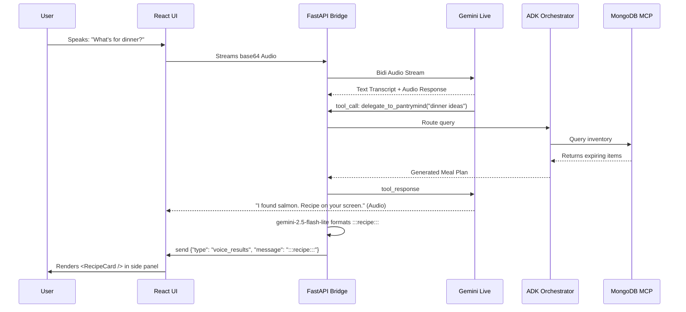

# PantryMind: Voice Agent Architecture

PantryMind features a highly advanced, real-time Voice Agent powered by **Gemini Live Bidi (Bidirectional) WebSocket Streaming**. This document outlines the architecture, data flow, and the custom "Safety Net" engineering required to reliably bridge unstructured voice audio with strict, governed database agents.

---

## 🏛 High-Level Architecture

The Voice Architecture consists of three primary layers:
1. **The Audio Client (React Frontend)**: Captures microphone audio using the Web Audio API, encodes it to base64 PCM, and streams it to the FastAPI backend.
2. **The Voice Bridge (FastAPI `voice_service.py`)**: Acts as a middleman. It maintains a stateful WebSocket connection with the Gemini Live API (`gemini-live-2.5-flash-native-audio`), forwarding audio chunks and managing tool declarations.
3. **The ADK Backend (Google Agent Development Kit)**: The deterministic, governed AI agents (Kitchen, Pantry, Finance) connected to the MongoDB MCP.

---

## 🔄 The Data Flow Lifecycle

### 1. Audio Ingestion & Streaming
- `GlobalVoiceAgent.jsx` requests microphone permissions and records audio chunks.
- Chunks are sent via standard WebSocket to the FastAPI endpoint `/api/voice/stream`.
- `voice_service.py` receives the chunks, wraps them in the Gemini `RealtimeClientEvent` format, and forwards them to Google's servers over a secure Bidi-stream.

### 2. Live Transcription & Audio Response
- Gemini processes the audio and streams back two things simultaneously:
  - **Audio Output**: The spoken response from the AI.
  - **Text Transcripts**: Real-time text of what the user said, and what the AI is saying.
- The FastAPI bridge intercepts these and forwards the audio back to the React client to play through the speakers.

### 3. Tool Calling: `delegate_to_pantrymind`
The Gemini Live model is instructed that it is a *Voice Interface*, not the core brain. It does not have direct access to MongoDB. Instead, it is equipped with a single tool: `delegate_to_pantrymind(query: str)`.

When the user asks something complex (e.g., *"Make a meal with what I have left"*):
1. Gemini halts audio generation and issues a `tool_call` event.
2. `voice_service.py` intercepts this tool call.
3. It takes the `query` string and passes it into the **PantryMind Orchestrator** (the same system powering the text chat).
4. The Orchestrator routes it to the **Kitchen Chef**, which reads the inventory via **MongoDB MCP**, runs the PuLP optimizer, and uses Reflexion to generate a meal plan.
5. The result is passed back to Gemini, which synthesizes a spoken summary: *"I've created a salmon dish, the recipe is on your screen."*

---

## 🛟 The "Dual-Signal Safety Net" (Critical Engineering)

**The Problem:** 
Voice models frequently suffer from ASR (Automatic Speech Recognition) errors. For example, a user saying *"Make me a meal"* might be transcribed as *"Mir ja."* Because the transcript is garbled, the Gemini Live model fails to recognize the intent and **misses the tool call**, responding with *"I didn't catch that."*

**The Solution:**
We implemented a Post-Turn "Safety Net" in `turn_complete` within `voice_service.py`. It uses a **Dual-Signal Approach**:
1. **Signal 1 (Input Transcript)**: Scans the user's raw text for keywords (`inventory`, `recipe`, `dinner`).
2. **Signal 2 (Output Output)**: Scans the AI's *own generated response* for keywords (e.g., if the AI says *"Let me check your pantry"* but failed to call the tool).

If either signal detects a high-probability delegation intent, the backend *forces* a `_direct_delegate_fallback()` execution. 
- The backend silently runs the Orchestrator.
- The structured data is extracted.
- The UI is updated with the results.

This guarantees that even if Gemini Live drops the tool call due to audio artifacting, the user still gets their recipe or inventory list.

---

## 🎨 UI Rendering & Post-Processing

Voice interactions often return massive blocks of text. Reading a recipe aloud is tedious. Therefore, we offload complex data to a **Visual Side Panel**.

1. **Recipe Post-Processor**: When the backend Kitchen Agent generates a meal plan, it is passed through a lightweight `gemini-2.5-flash-lite` formatting step (`_extract_recipe_structured`). This forces the unstructured text into strict `:::recipe:::` blocks.
2. **WebSocket Dispatch**: The FastAPI server sends a JSON payload `{"type": "voice_results", "sender": "PantryMind", "message": "..."}` to the React frontend.
3. **React Rendering**: `GlobalVoiceAgent.jsx` intercepts this. It filters out any "user" chat bubbles to keep the side panel clean. If it detects `:::recipe:::`, it dynamically mounts the `<RecipeCard />` component, allowing the user to view the recipe visually while the Voice Agent speaks the summary.

---

## 📊 Sequence Diagram

